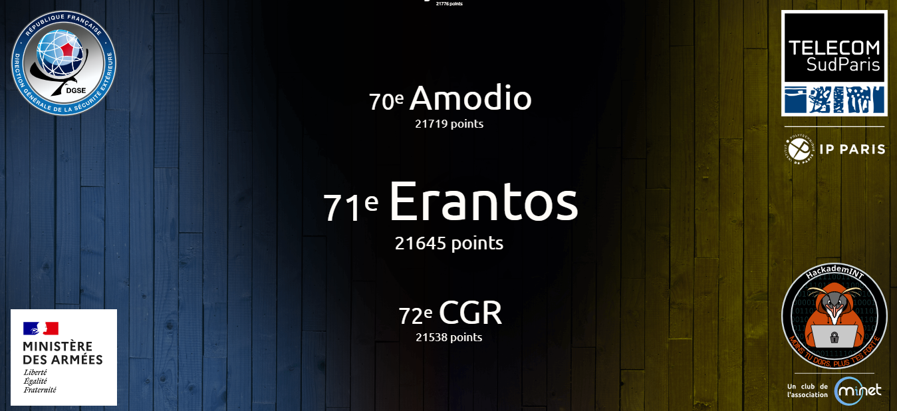

# 404CTF, Edition 2023 - Write Ups

Bienvenue sur ce dépôt où vous trouverez les solutions des challenges que j'ai pu résoudre lors cette édition 2023 du 404CTF.

## Présentation

Le 404CTF-2023 est la deuxième édition du 404CTF,coorganisée par la DGSE, Télécom SudParis, HackademINT, OVHcloud et Viva Technology. L'édition 2023 s'est tenue du 12 mai au 4 juin 2023 et a rassemblé près de 3000 participants autour de la centaine de challenges conçus par HackademINT.

La plupart des challenges ont été rendus public par le club HackademINT ainsi que leur solution [ici](https://github.com/HackademINT/404CTF-2023/tree/main).

## Résultat personnel

**Classement :** 71ème / 2917

**Challenges résolus :** 43 / 102

**Score final :** 21645 points

## Catégories

Cette année, les challenges ont été répartis en 14 catégories :
- [Analyse forensique](./forensic/) - résolus : 2/6
- [Cloud](./cloud/) - résolus : 1/6
- [Cryptanalyse](./crypto/) - résolus : 8/12
- [Divers](./misc/) - résolus : 5/5
- [Exploitation de binaires](./pwn/) - résolus : 1/12
- [Intelligence artificielle](./ia/) - résolus : 2/3
- [Programmation](./prog/) - résolus : 2/3
- [Radiofréquences](./radiofrequences/) - résolus : 1/8
- [Renseignement en sources ouvertes](./osint/) - résolus : 7/15
- [Rétro-ingénierie](./reverse/) - résolus : 2/8
- [Sécurité matérielle](./hardware/) - résolus : 5/6
- [Stéganographie](./stegano/) - résolus : 2/5
- [Web](./web/) - résolus : 2/6
- [Web3](./web3/) - résolus : 3/7

## Challenges 

Tous les challenges ont un score de base de 1000 points, à l'exception des challenges d'introduction ayant un score de 100 points.  
Ce score diminue en fonction du nombre de validation afin de rééquilibrer les challenges selon leur difficulté.  
Le nombre de points d'un challenge ne peut pas descendre en dessous de 200 points. Les challenges d'introduction ne sont pas soumis à ce rééquilibrage.

| Nom | Catégorie | Nombre de points | Nombre de validations | Résolu |
| - | - | - | - | - |
| **Analyse forensique** |
| [Pêche au livre](./forensic/peche%20au%20livre/) | 🟦 Intro | 100 points | 1072 validations | ✔ |
| [Le Mystère du roman d'amour](./forensic/le%20mystere%20du%20roman%20d'amour/) | 🟩 Facile | 200 points | 519 validations | ✔ |
| Les Mystères du cluster de la Comtesse de Ségur [1/2] | 🟧 Moyen | 385 points | 308 validations | ❌ |
| Lettres volatiles | 🟧 Moyen | 757 points | 194 validations | ❌ |
| Note de bas de page | 🟥 Difficile | 954 points | 85 validations | ❌ |
| Le Cracken | 🟪 Extrême | 1000 points | 3 validations | ❌ |
| **Cloud** |
| [Le sot](./cloud/le%20sot/) | 🟦 Intro | 100 points | 332 validations | ✔ |
| Le Cluster de Madame Bovary | 🟩 Facile | 927 points | 107 validations | ❌ |
| Harpagon et le magot | 🟧 Moyen | 973 points | 66 validations | ❌ |
| Les nuages menaçants 1/3 | 🟧 Moyen | 981 points | 56 validations | ❌ |
| Les nuages menaçants 2/3 | 🟧 Moyen | 989 points | 43 validations | ❌ |
| Les nuages menaçants 3/3 | 🟥 Difficile | 997 points | 23 validations | ❌ |
| **Cryptanalyse** |
| [Recette](./crypto/recette/) | 🟦 Intro | 100 points | 588 validations | ✔ |
| [Dessine-moi une courbe elliptique](./crypto/dessine%20moi%20une%20courbe%20elliptique/) | 🟩 Facile | 812 points | 171 validations | ✔ |
| [Le Jour de l'espace](./crypto/jour%20de%20l'espace/) | 🟩 Facile | 885 points | 134 validations | ✔ |
| [Une littérature animalière](./crypto/litterature%20animaliere/) | 🟩 Facile | 1000 points | 2 validations | ✔ |
| [ASCON Marchombre](./crypto/ascon%20marchombre/) | 🟩 Facile | 892 points | 130 validations | ✔ |
| [La Réponse de Voris](./crypto/la%20réponse%20de%20voris/) | 🟧 Moyen | 964 points | 76 validations | ✔ |
| [Oracle cassé](./crypto/oracle%20cassé/) | 🟧 Moyen | 988 points | 45 validations | ✔ |
| L'énigme du mal-aimé | 🟧 Moyen | 1000 points | 7 validations | ❌ |
| Trois | 🟧 Moyen | 998 points | 21 validations | ❌ |
| Dessine et signe | 🟥 Difficile | 1000 points | 9 validations | ❌ |
| [A la fin de l'envoi, je signe !](./crypto/a%20la%20fin%20%20de%20l'envoi%20je%20signe/) | 🟥 Difficile | 997 points | 23 validations | ✔ |
| Là où les nombres n'existent pas | 🟪 Extrême | 1000 points | 9 validations | ❌ |
| **Divers** |
| [Bienvenue](./misc/bienvenue/) | 🟦 Intro | 100 points | 2325 validations | ✔ |
| [Exemple de connexion distante](./misc/exemple%20de%20connexion%20distante/) | 🟦 Intro | 100 points | 1255 validations | ✔ |
| [Discord](./misc/discord/) | 🟦 Intro | 100 points | 962 validations | ✔ |
| [À vos plumes](./misc/a%20vos%20plumes/) | 🟦 Intro | 10 points | 162 validations | ✔ |
| [Désirée Dubois](./misc/desirée%20dubois/) | 🟩 Facile | 958 points | 82 validations | ✔ |
| **Exploitation de binaires** |
| [Je veux la lune !](./pwn/je%20veux%20la%20lune/) | 🟦 Intro | 100 points | 518 validations |
| L'Alchimiste | 🟩 Facile | 908 points | 120 validations | ❌ |
| La Cohue | 🟩 Facile | 943 points | 95 validations | ❌ |
| Cache-cache : le retour | 🟧 Moyen | 988 points | 44 validations | ❌ |
| Une citation pas comme les autres [1/2] | 🟧 Moyen | 998 points | 22 validations | ❌ |
| Une bibliothèque bien remplie | 🟧 Moyen | 998 points | 20 validations | ❌ |
| Un tour de magie | 🟧 Moyen | 988 points | 45 validations | ❌ |
| La feuille blanche | 🟧 Moyen | 999 points | 14 validations | ❌ |
| Une citation pas comme les autres [2/2] | 🟥 Difficile | 999 points | 16 validations | ❌ |
| Protocole de lecture de fichiers simplifié | 🟪 Extrême | 1000 points | 9 validations | ❌ |
| Calculatrice | 🟪 Extrême | 1000 points | 6 validations | ❌ |
| Débordement du Vélocipède Mécanique | 🟪 Extrême | 997 points | 25 validations | ❌ |
| **Intelligence artificielle** |
| [De la poésie](./ia/de%20la%20poesie/) | 🟦 Intro | 100 points | 97 validations | ✔ |
| Notre modèle | 🟩 Facile | 996 points | 26 validations | ❌ |
| [Le Petit Chat](./ia/le%20petit%20chat/) | 🟧 Moyen | 981 points | 56 validations | ✔ |
| **Programmation** |
| [L'inondation](./prog/l'inondation/) | 🟦 Intro | 100 points | 511 validations | ✔ |
| [Des mots, des mots, des mots](./prog/des%20mots/) | 🟥 Difficile | 731 points | 204 validations | ✔ |
| Codecoquillage du Vélocipède Mécanique | 🟪 Extrême | 998 points | 21 validations | ❌ |
| **Radiofréquences** |
| [Navi](./radiofrequences/navi/) | 🟦 Intro | 100 points | 309 validations | ✔ |
| Avez-vous vu les cascades du hérisson ? | 🟩 Facile | 872 points | 141 validations | ❌ |
| Sous son trépas victorieux | 🟧 Moyen | 998 points | 21 validations | ❌ |
| Le Plombier du câble | 🟧 Moyen | 992 points | 38 validations | ❌ |
| Ballistic Missile Submarine | 🟧 Moyen | 972 points | 67 validations | ❌ |
| Gestionnaire de perruche de Sparrman | 🟥 Difficile | 1000 points | 13 validations | ❌ |
| Encore des portes. Un trauma ? | 🟥 Difficile | 1000 points | 5 validations | ❌ |
| Un réseau sans fil en 1844 | 🟪 Extrême | 1000 points | 1 validation | ❌ |
| **Renseignement en sources ouvertes** |
| [Le Tour de France](./osint/le%20tour%20de%20france/) | 🟦 Intro | 100 points | 1054 validations | ✔ |
| [Mentions gastronomiques](./osint/mentions%20gastronomiques/) | 🟩 Facile | 850 points | 153 validations | ✔ |
| Un vol ? | 🟩 Facile | 818 points | 168 validations | ❌ |
| La Quête du sens [1/3] | 🟩 Facile | 958 points | 82 validations | ❌ |
| [Les OSINTables [1/3]](./osint/osintables_1_3/) | 🟩 Facile | 200 points | 478 validations | ✔ |
| [L'âme d'un poète et le coeur d'une femme [1/4]](./osint/l'ame%20d'un%20poete%20et%20le%20coeur%20d'une%20femme%201_4/) | 🟩 Facile | 485 points | 282 validations | ✔ |
| [L'âme d'un poète et le coeur d'une femme [2/4]](./osint/l'ame%20d'un%20poete%20et%20le%20coeur%20d'une%20femme%202_4/) | 🟩 Facile | 673 points | 225 validations | ✔ |
| [L'âme d'un poète et le coeur d'une femme [3/4]](./osint/l'ame%20d'un%20poete%20et%20le%20coeur%20d'une%20femme%203_4/) | 🟩 Facile | 903 points | 123 validations | ✔ |
| La Quête du sens [2/3] | 🟧 Moyen | 977 points | 61 validations | ❌ |
| La Quête du sens [3/3] | 🟧 Moyen | 985 points | 50 validations | ❌ |
| Les OSINTables [2/3] | 🟧 Moyen | 975 points | 63 validations | ❌ |
| [L'âme d'un poète et le coeur d'une femme [4/4]](./osint/l'ame%20d'un%20poete%20et%20le%20coeur%20d'une%20femme%204_4/) | 🟧 Moyen | 919 points | 113 validations | ✔ |
| Il est l'or Monseignor ! | 🟥 Difficile | 968 points | 72 validations | ❌ |
| Les OSINTables [3/3] | 🟪 Extrême | 1000 points | 0 validation | ❌ |
| Chateaubrion Edrabellah : la célèbre figure littéraire française | 🟪 Extrême | 1000 points | 0 validation | ❌ |
| **Rétro-ingénierie** |
| [Le Divin Crackme](./reverse/divin%20crackme/) | 🟦 Intro | 100 points | 508 validations | ✔ |
| L'Inspiration en images | 🟩 Facile | 863 points | 146 validations | ❌ |
| [Encore une mise à jour !](./reverse/encore%20une%20mise%20a%20jour/) | 🟩 Facile | 911 points | 118 validations | ✔ |
| Les Mystères du cluster de la Comtesse de Ségur [2/2] | 🟧 Moyen | 992 points | 37 validations | ❌ |
| Introspection | 🟧 Moyen | 971 points | 68 validations | ❌ |
| Jouer ou ne pas jouer ? | 🟥 Difficile | 1000 points | 7 validations | ❌ |
| Décortique mon Vélocipède Mécanique | 🟪 Extrême | 995 points | 30 validations | ❌ |
| Le Jour du mange poney | 🟪 Extrême | 1000 points | 4 validations | ❌ |
| **Sécurité matérielle** |
| [Un courrier suspect](./hardware/un%20courrier%20suspect/) | 🟦 Intro | 100 points | 336 validations | ✔ |
| [À la trace](./hardware/a%20la%20trace/) | 🟩 Facile | 975 points | 64 validations | ✔ |
| [Un réveil difficile](./hardware/un%20reveil%20difficile/) | 🟩 Facile | 757 points | 194 validations | ✔ |
| [L'Être ou le néant](./hardware/l'etre%20ou%20le%20neant/) | 🟧 Moyen | 995 points | 31 validations | ✔ |
| [0x0418 bTpot](./hardware/0x0418%20bTpot/) | 🟥 Difficile | 1000 points | 5 validations | ✔ |
| Des tetrominos qui choient | 🟥 Difficile | 1000 points | 3 validations | ❌ |
| **Stéganographie** |
| [Odobenus Rosmarus](./stegano/odobenus%20rosmarus/) | 🟦 Intro | 100 points | 573 validations | ✔ |
| [L'Oeuvre](./stegano/l'oeuvre/) | 🟩 Facile | 200 points | 773 validations | ✔ |
| Les Félicitations | 🟩 Facile | 935 points | 101 validations | ❌ |
| En profondeur | 🟧 Moyen | 970 points | 69 validations | ❌ |
| Le Rouge et le vert, avec un soupçon de bleu | 🟥 Difficile | 935 points | 101 validations | ❌ |
| **Web** |
| [Le Loup et le renard](./web/le%20loup%20et%20le%20renard/) | 🟦 Intro | 100 points | 1126 validations | ✔ |
| [L'académie du détail](./web/l'academie%20du%20detail/) | 🟩 Facile | 200 points | 350 validations | ✔ |
| La Vie Française | 🟩 Facile | 968 points | 72 validations | ❌ |
| Fuite en 1791 | 🟧 Moyen | 880 points | 137 validations | ❌ |
| L'Épistolaire moderne | 🟧 Moyen | 980 points | 57 validations | ❌ |
| Chanson d'Inde | 🟥 Difficile | 993 points | 34 validations | ❌ |
| **Web3** |
| [Art](./web3/art/) | 🟦 Intro | 100 points | 201 validations | ✔ |
| [L'Antiquaire, tête en l'air](./web3/antiquaire%20tete%20en%20l'air/) | 🟩 Facile | 861 points | 147 validations | ✔ |
| [La Folie du jeu : descente aux enfers](./web3/la%20folie%20du%20jeu%20:%20descente%20aux%20enfers/) | 🟩 Facile | 960 points | 80 validations | ✔ |
| La Folie du jeu : d'esclave à maître | 🟧 Moyen | 999 points | 16 validations | ❌ |
| La guerre des boutons | 🟧 Moyen | 996 points | 26 validations | ❌ |
| L'Arriviste accompli | 🟧 Moyen | 1000 points | 6 validations | ❌ |
| D'un nihilisme assumé | 🟥 Difficile | 1000 points | 12 validations | ❌ |
