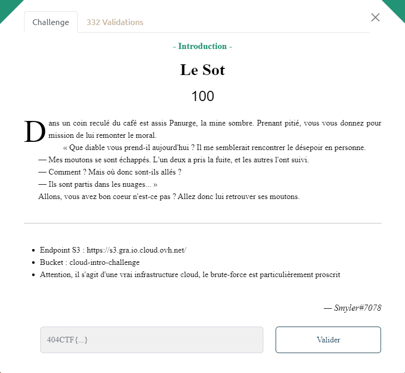
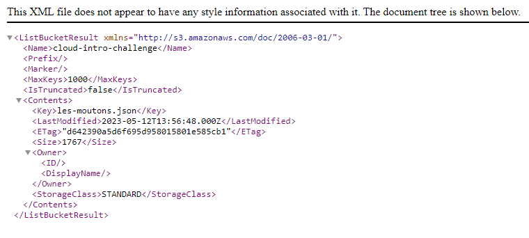

# Write-Up 404-CTF : Le Sot

__Catégorie :__ Cloud - Introduction

**Enoncé :**

**Résolution :**

Ce challenge est une introduction aux technologies du cloud et ne présente pas de difficultés particulières. Un endpoint nous est donné ainsi que le nom du bucket.  
Puisque qu'il s'agit d'un bucket public (pas besoin d'entrer d'identifiants), nous pouvons accéder à son contenu en accédant à l'URL `https://cloud-intro-challenge.s3.gra.io.cloud.ovh.net` (https://\<nom du bucket\>.\<nom de l'endpoint\>)

Un navigateur nous permet d'obtenir la description XML du contenu du bucket. On peut voir que ce bucket contient un fichier `les-moutons.json`. On accède donc à l'URL `https://cloud-intro-challenge.s3.gra.io.cloud.ovh.net/les-moutons.json` pour obtenir le [fichier](./les-moutons.json) dans lequel nous avons le flag.

**Flag :** `404CTF{D35_m0utOns_D4n5_13s_NU@g3s}`

