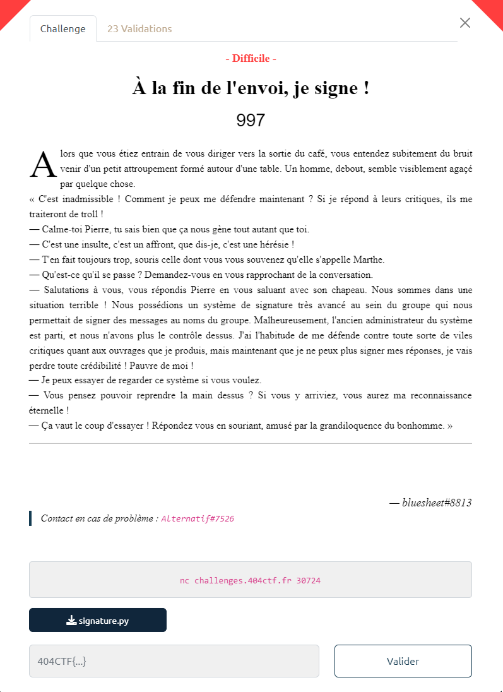

# Write-Up 404-CTF : A la fin de l'envoi, je signe !

__Catégorie :__ Cryptanalyse - Difficile

**Enoncé :**



**Fichiers :** signature.py

**Résolution :**

Dans ce challenge, nous avons à disposition un programme de chiffrement maison. Ce programme nous envoie un premier message ainsi que sa signature et nous propose un challenge : envoyer un message (sous forme hexadécimal) commençant par `gimme flagz?` ainsi que sa signature. Comme nous ne connaissons pas la clé privée générée aléatoirement, il nous faut trouver un moyen d'imiter la signature du programme, à partir de la signature fournie.

En analysant le code et en utilisant le programme, on observe que la clé privée, la signature ainsi que la clé publique sont des listes de 66 hash md5. En particulier, la clé privée `secrets` représente le md5 de 66 entiers aléatoires sur 32 bits et la clé publique représente ces 66 hash hashés 16 fois, toujours avec l'algo md5.

Enfin, pour signer un message, le programme complète le message avec des 0 jusqu'à obtenir une longueur de 256 bits et rajoute une checksum de 8 bits.  
Ensuite, le programme découpe l'ensemble `message + checksum` en blocs de 4 bits et, pour chaque bloc, il hashe `n` fois un hash de la clé privée, avec `n` la valeur du bloc en binaire (si le bloc vaut `1010`, on hashera 10 fois le secret). Comme la clé privée a autant de secrets qu'il y a de bloc dans le message, chaque bloc peut être associé à un secret sans problème.

On detecte assez rapidement un souci dans ce programme : si le bloc vaut `0000` alors nous n'allons pas hasher le secret et il fera parti de la signature.  
De plus, on sait combien de fois sont hashés chaque secret car on connait le message original `SALUT CA VA?`. Le premier bloc vaut `0101` donc 5 opérations de hashage. Le premier bloc de `gimme flagz?` vaut `0110` donc 6. Si on hashe une fois de plus la signature donné par le programme, on obtient une signature valide pour notre message, sans connaitre le secret d'origine.  

Coup de chance (ou très probablement pas...), tous les blocs de `gimme flagz?` sont de valeur supérieure ou égale à ceux de `SALUT CA VA?`. Nous n'avons donc qu'à hasher chaque partie de la signature suffisament de fois pour avoir une signature valide.

Cependant, il reste un dernier point à régler : la checksum. En effet, même si la signature sera valide pour les 64 premiers blocs, la vérification de la checksum ne passera pas. Il faut donc trouver un message qui aurait la même valeur que la checksum initial. Ainsi, nous n'avons pas à modifier la fin de la signature.  
La checksum est calculée en faisant la somme de `16 - <valeur de bloc>` pour chaque bloc, puis ramené entre 0 et 255 grâce à un modulo.
Le message `SALUT CA VA?` a une checksum de 862, soit 94 après modulo.  
`gimme flagz?` a une checksum de 796. Il faut donc ajouter des caractères pour faire diminuer la checksum jusqu'à 606.  
On a `796 - 606 = 190` et `190 = 12 * 15 + 10`. On peut donc ajouter 12 blocs `1111` et un bloc `1010` pour ajuster la checksum et tomber sur la bonne signature.

Il ne manque plus qu'un script pour mettre en oeuvre l'attaque et obtenir le flag : 

```python
# script.py

from pwn import *
import json
from hashlib import md5 as hash

MSG = b"SALUT CA VA?"
PAYLOAD = b'gimme flagz?\xff\xff\xff\xff\xff\xff\xa0'

# From signature.py
def pad_msg(data: bytes, size: int):
    return data + b'\x00' * (size - len(data))

# From signature.py
def convol_hash(data: bytes, power: int):
    acc = data
    for _ in range(power):
        acc = hash(acc).digest()
    return acc

# Compute new secrets
def sign(secrets):
    signature_size = 264
    data_size = signature_size - 8

    padded_msg = pad_msg(MSG, data_size//8)
    padded_payload = pad_msg(PAYLOAD, data_size//8)

    bin_msg = f'{int.from_bytes(padded_msg, "big"):0b}'.zfill(data_size)
    bin_payload = f'{int.from_bytes(padded_payload, "big"):0b}'.zfill(data_size)
    sig = []
    for i in range(0, data_size, 4):
        exp1 = int(bin_msg[i:i+4], 2)
        exp2 = int(bin_payload[i:i+4], 2)
        x = convol_hash(secrets[i//4], exp2 - exp1)
        sig.append(x)

    sig.extend(secrets[-2:])
    return sig

# Main program
conn = remote('challenges.404ctf.fr', 30724)

from_serv = conn.recvuntil(b']}').decode()

data = json.loads(from_serv)

secrets = [bytes.fromhex(s) for s in  data["sig"]]
new_secrets = sign(secrets)
sig = [x.hex() for x in new_secrets]
response = json.dumps({'msg': PAYLOAD.hex(), 'sig': sig})

conn.send(response.encode() + b'\n')

print(conn.recvline())
print(conn.recvline())
print(conn.recvline())

conn.close()
```

**Flag :** `404CTF{Wint3r_i5_c0m1ng}`