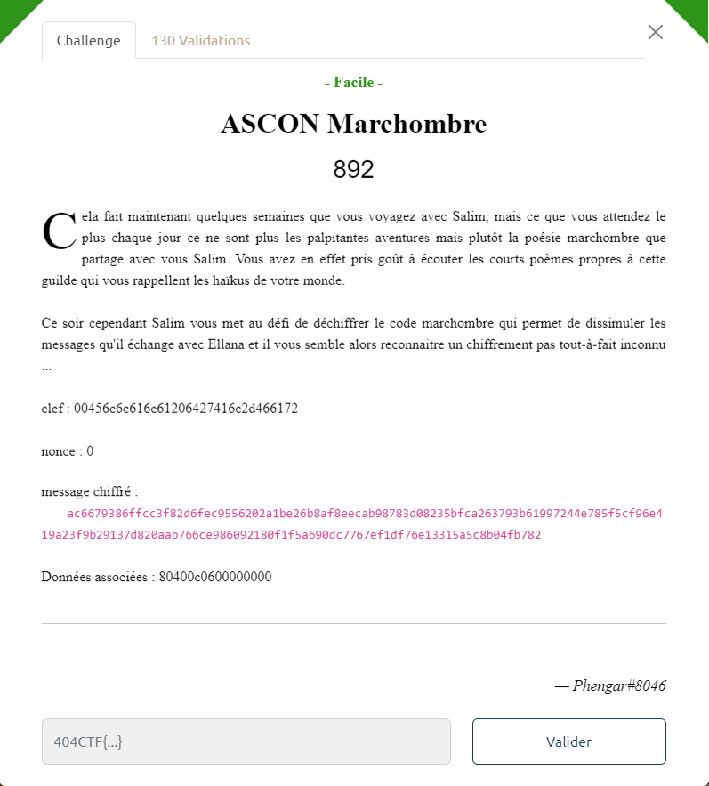

# Write-Up 404-CTF : ASCON Marchombre

__Catégorie :__ Cryptanalyse - Facile

**Enoncé :**



**Résolution :**

Dans ce challenge, nous devons déchiffrer un message à partir d'une clé et d'une nonce qui nous est donné. Ce challenge est assez direct dans sa résolution à partir du moment où l'on connait l'algorithme.

L'énoncé nous donne un gros indice dans le titre. En effet, le chiffrement [Ascon](https://en.wikipedia.org/wiki/Ascon_(cipher)) existe bel et bien. Il existe même une librairie Python pour chiffrer et déchiffrer de l'Ascon. Il ne reste plus qu'à déchiffrer le tout.

```python
# script.py
import ascon

key = bytes.fromhex("00456c6c616e61206427416c2d466172")
nonce = bytes.fromhex(32 * "0")
cipher = bytes.fromhex("ac6679386ffcc3f82d6fec9556202a1be26b8af8eecab98783d08235bfca263793b61997244e785f5cf96e419a23f9b29137d820aab766ce986092180f1f5a690dc7767ef1df76e13315a5c8b04fb782")
iv = bytes.fromhex("80400c0600000000")

print(nonce)
print(len(nonce))
res = ascon.decrypt(key, nonce, iv, cipher, variant="Ascon-128")
print(res.decode('latin'))
```

**Flag :** `404CTF{V3r5_l4_lum1èr3.}`

