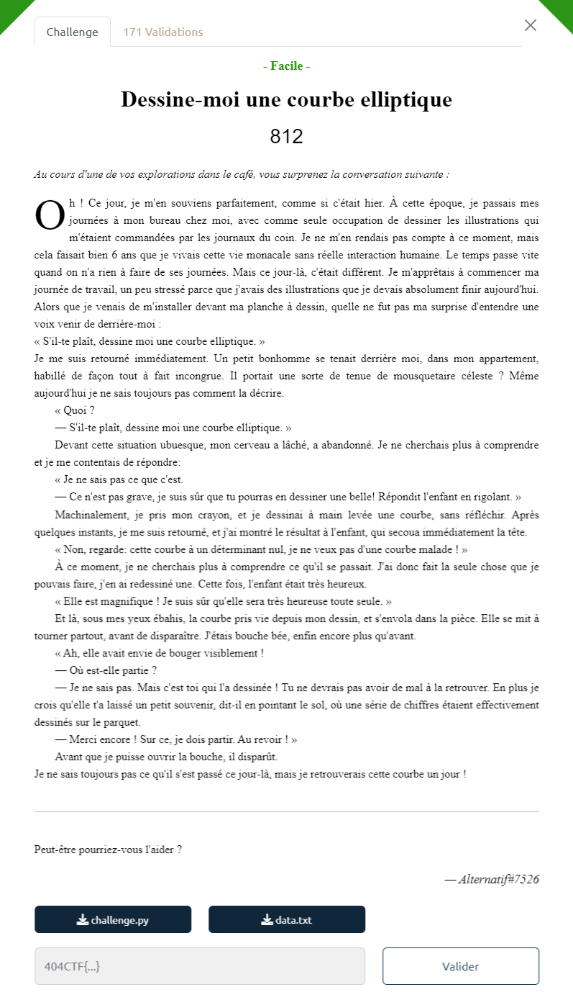

# Write-Up 404-CTF : Littérature animalière

__Catégorie :__ Cryptanalyse - Facile

**Enoncé :**



**Fichiers :** data.txt ; challenge.py

**Résolution :**

Dans ce challenge, deux fichiers nous sont fournis : un script Python faisant quelques opérations de chiffrement sur le flag ainsi que des données affichées par ce programme de chiffrement.  
On voit que le flag est chiffré avec l'algorithme AES en mode CBC, avec un vecteur d'initialisation aléatoire et une clé dépendant des paramètres d'initialisation d'une courbe elliptique.  
Dans `data.txt`, nous avons deux points aléatoires de la courbe elliptique, la charactéristique du corps fini sur lequel est de la courbe, le flag chiffré ainsi que le vecteur d'initialisation.  
L'objectif est clair : retrouver les points d'initialisation `a` et `b` de la courbe pour obtenir la clé de chiffrement utilisé pour l'AES, et donc le flag.

Pour retrouver les paramètres d'initialisation de la courbe, il n'est pas nécessaire de connaitre les propriétés des courbes elliptiques, simplement la forme simplifiée de l'équation de Weierstrass décrivant la courbe :
```math
y^2 = x^3 + ax + b
```
En connaissant deux points `(x1,y1)` et `(x2,y2)` et en les injectant dans l'équation ci-dessus, nous obtenons un système à deux équations, deux inconnus. En le résolvant, nous obtenons les équations suivantes :
```math
a = \frac{y_1^2 - x_1^3 - y_2^2 + x_2^3}{x_1 - x_2}
```
```math
b = y^2 - x^3 - ax
```
Comme p est premier et que `x1 - x2` est non nul, nous pouvons inverser `x1 - x2`. Grâce à ces équations, nous pouvons écrire le script sage suivant :

```python
from Crypto.Cipher import AES
import hashlib

p = 231933770389389338159753408142515592951889415487365399671635245679612352781
K = GF(p)

x1 = K(93808707311515764328749048019429156823177018815962831703088729905542530725)
y1 = K(144188081159786866301184058966215079553216226588404139826447829786378964579)
x2 = K(139273587750511132949199077353388298279458715287916158719683257616077625421) 
y2 = K(30737261732951428402751520492138972590770609126561688808936331585804316784)


inv_x1_x2  = 1 / (x1 - x2)
a = (y1 ** 2 - x1 ** 3 - y2 ** 2 + x2 ** 3) * inv_x1_x2
b = y2 ** 2 - x2 ** 3 - a * x2

iv = bytes.fromhex("00b7822a196b00795078b69fcd91280d")
cipher = bytes.fromhex("8233d04a29befd2efb932b4dbac8d41869e13ecba7e5f13d48128ddd74ea0c7085b4ff402326870313e2f1dfbc9de3f96225ffbe58a87e687665b7d45a41ac22")
key = str(a) + str(b)
aes = AES.new(hashlib.sha1(key.encode()).digest()[:16], AES.MODE_CBC, iv=iv)

print(aes.decrypt(cipher))
```

En l'exécutant, nous obtenons le flag.

**Flag :** `404CTF{70u735_l35_gr4nd35_p3r50nn3s_0nt_d_@b0rd_373_d35_3nf4n7s}`

