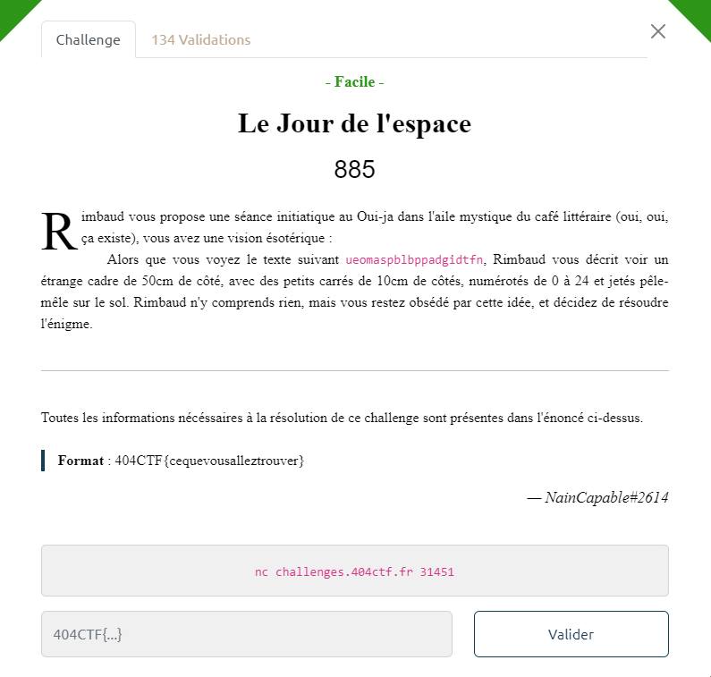

# Write-Up 404-CTF : Littérature animalière

__Catégorie :__ Cryptanalyse - Facile

**Enoncé :**



**Résolution :**

Dans ce challenge, nous avons accès à un oracle de chiffrement ainsi qu'un message chiffré par cet oracle : `ueomaspblbppadgidtfn`. Pour résoudre ce challenge, nous devons analyser le fonctionnement de cet oracle puis déchiffrer le message connu.

En faisant quelques tests, on s'aperçoit vite que la longueur du chiffré est un multiple de 5 (précisément, la longueur du message + un padding pour arriver au prochain multiple de 5).  
On remarque aussi que seul les minuscules de `a` à `y` sont acceptés, soit 25 caractères.  
De plus, en ajoutant des `a` à notre message, le chiffré ne change pas.  
Enfin, le chiffrement se fait par bloc de 5. Le chiffré des 5 premiers caractères ne dépend que des 5 premiers caractères, etc...

```
$ a
> aaaaa

$ b
> jlfnt

$ baa
> jlfnt

$ baaaabaaaa
> jlfntjlfnt
```

Il faut donc comprendre comment se fait le chiffrement d'un bloc de 5 caractères. Pour cela, on essaie de chiffrer des petits messages et détecter un éventuel pattern

```
$ a
> aaaaa

$ b
> jlfnt

$ c
> swkbn
```
En remplaçant chaque lettre par sa position dans l'alphabet (et en partant de 0), on obtient les correspondances suivantes :
- aaaaa -> [0 ; 0 ; 0 ; 0 ; 0]
- jlfnt -> [9 ; 11 ; 5 ; 13 ; 19]
- swkbn -> [18 ; 22 ; 10 ; 1 (26 % 25) ; 13 (38 % 25)]

Nous observons qu'en chiffrant la lettre 0 (`a`), nous avons le chiffré C = 0 * L avec L =  [9 ; 11 ; 5 ; 13 ; 19]. Pour la lettre `b`, C = 1 * L, pour `c`, C = (2 * L) % 25, etc...
On observe d'ailleurs le même pattern pour des messages comme `aa`, `ab`, `ac` mais avec L différent. Enfin, le chiffré de `bb` est la somme des chiffré de `b` et `ab` (le tout modulo 25).

Nous avons donc affaire à une multiplication de matrice M * A = C avec M un vecteur ligne de longueur 5, A une matrice 5x5 et C un vecteur ligne de longueur 5 aussi.

On retrouve la matrice A en chiffrant les messages unitaires `baaaa`, `abaaa`, `aabaa`, `aaaba` et `aaaab`.

        |  9, 11,  5, 13, 19 |  
        |  4,  0,  6, 14, 21 |  
    A = | 18,  2,  7, 15, 22 |  
        | 20,  1, 10, 16, 23 |  
        |  8,  3, 12, 17, 24 |  

En connaissant le chiffré C, nous n'avons plus qu'à résoudre le système pour obtenir le message M.

```python
# script.sage
cipher = "ueomaspblbppadgidtfn"

R = Integers(25)
M = matrix(R, [[9, 11,  5, 13, 19], [4,  0,  6, 14, 21], [18,  2,  7, 15, 22], [20,  1, 10, 16, 23], [8,  3, 12, 17, 24]])

def encode(w):
    if (len(w) % 5):
        return
    arr = [ord(i) - 97 for i in list(w)]
    return matrix(R, arr)

def decode(m):
    l = list(m[0])
    return ''.join([chr(int(i) + 97) for i in l])

def encode_msg(m):
    return decode(encode(m) * M)

def decode_msg(m):
    y = encode(m)
    x = M.solve_left(y)
    return decode(x)

msg = []
for i in range(4):
    chunk = cipher[5*i: 5*(i+1)]
    msg.append(decode_msg(chunk))

print(f"404CTF{{{''.join(msg)[:-1]}}}")
```
On obtient le clair `barjavelmaassassinea` mais on doit retirer la dernière lettre `a` car il s'agit du padding. L'oracle nous permet de vérifier cette hypothèse avant de flag.

**Flag :** `404CTF{barjavelmaassassine}`