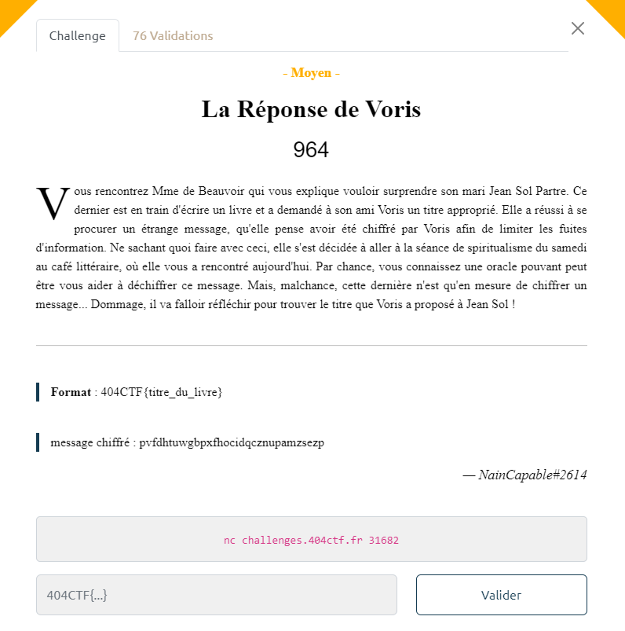

# Write-Up 404-CTF : La Réponse de Voris

__Catégorie :__ Cryptanalyse - Moyen

**Enoncé :**



**Résolution :**

Dans ce challenge, nous avons affaire à un oracle de chiffrement sur un serveur distant, ainsi qu'un message chiffré grâce à cet oracle. Nous devons déchiffrer le message obtenu en tentant de comprendre comment fonctionne l'oracle.

On essaie différentes combinaisons afin de trouver un pattern dans le chiffrement. On voit que le chiffre est de la même taille que le clair. De plus, on remarque un pattern indirect, par rapport à une base, le chiffré de `aaa...aaa`.

On essaie d'analyser le fonctionnement pour une taille de message fixe, 4 par exemple.
```
$ aaaa 
> qgiw (base)

$ aaab
$ rhjx (lettres décalées de 1)

$ aaba
> riky (première lettre décalée de 1, les autres de 2)

$ abaa
> rilz (première lettre décalée de 1, deuxième de 2, les autres de 3)

$ baaa
> rila (première lettre décalée de 1, deuxième de 2, troisième de 3 et quatrième de 4)

$ caaa
> skoe (première lettre décalée de 2, deuxième de 4, troisième de 6 et quatrième de 8)

$ cbaa
> tmrh (première lettre décalée de 3, deuxième de 6, troisième de 9 et quatrième de 11)
```

Donc, à partir du chiffré `C_a` de `aaa...aaa` et du décalage entre les lettres d'un chiffré `C` et `C_a`, on peut retrouver le chiffré.

Précisément, on calcule le tableau des différences ([3, 6, 9, 11] pour `cbaa`) puis on le parcours en marche arrière, en prenant en compte 2 cases. La différence entre les deux cases nous indique la première lettre : `c` (car a=0 et b=1).  
Ensuite, on met à jour le tableau en soustrayant `diff * i` à la i-ème case du tableau. On obtient alors [1, 2, 3, 3].
On répète le process en ne prenant que les 3 premiers éléments du tableau. `diff = 1` donne la lettre `b` et ainsi de suite jusqu'à arriver à un tableau de taille 1. Le dernier chiffre correspond à la dernière lettre du clair.

Un script python nous permet de faire ça pour un message de longueur 31 :

```python
# script.py
BASE = "gvshnmijdwalablggmejiqvrhkixhns" # Chiffrement de "a" * len(msg)

CIPHER = "pvfdhtuwgbpxfhocidqcznupamzsezp"

def decrypt(base, cipher):
    if (len(cipher) != len(base)):
        print("Erreur : cipher et base doivent être de la même longueur")
        return
    base_n = [ord(c) - 97 for c in base]
    cipher_n = [ord(c) - 97 for c in cipher]
    diff = [(j - i) % 26  for i, j in zip(base_n, cipher_n)]
    dcode = ""

    for i in range(len(diff) - 1):
        d = diff[::-1][i]
        d_prev = diff[::-1][i+1]
        letter_code = (d - d_prev) % 26
        diff = [(c - letter_code * (i + 1))%26 for i, c in enumerate(diff)]
        dcode += chr(letter_code + 97)
    dcode += chr(diff[0] + 97)
    return dcode

msg = decrypt(BASE, CIPHER)
print(f"404CTF{{{msg}}}")
```

**Flag :** `404CTF{lenclumedesjourneesensoleillees}`

**PS :** Je n'ai pas compris l'intégralité du chiffrement lors du CTF mais seulement un partie suffisante pour résoudre le challenge. Le [write-up de N04H](https://github.com/N04H2601/404CTF2023/tree/main/Cryptanalyse/La%20Réponse%20de%20Voris) explique le chiffrement plus en détail.