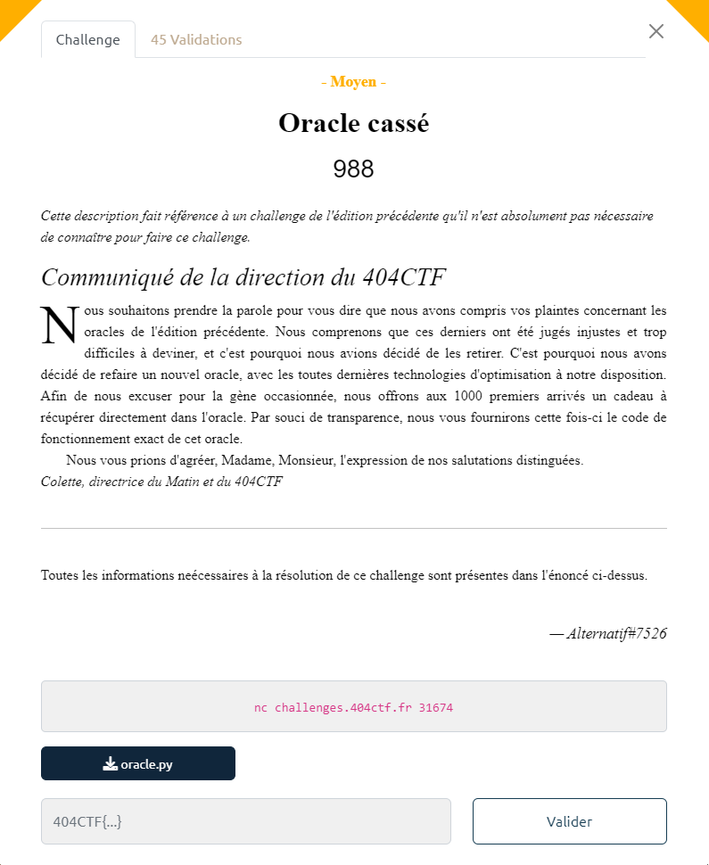

# Write-Up 404-CTF : Oracle cassé

__Catégorie :__ Cryptanalyse - Moyen

**Enoncé :**



**Fichiers :** oracle.py

**Résolution :**

Dans ce challenge, nous avons accès à un oracle à distance ainsi qu'à son code source. En se connectant à l'oracle, celui-ci nous affiche un message de bienvenue, ainsi qu'un "bon-cadeau" à utiliser dans l'oracle et un numéro d'initialisation. Ensuite, nous pouvons lui envoyer des messages que l'oracle va nous signer.  
Après un rapide coup d'oeil au code, nous voyons qu'il s'agit d'un oracle utilisant le chiffrement RSA. Le "bon-cadeau" est le flag chiffré et le numéro d'initialisation est le nombre `n`. Le but sera donc de déchiffrer le message donné au début de l'échange.

En regardant plus précisément l'opération de déchiffrement, on voit que l'oracle utilise l'optimisation [RSA-CRT](https://www.di-mgt.com.au/crt_rsa.html), qui permet de rendre l'opération de signature /  de déchiffrement plus rapide. 

La première chose à tenter, donc, est de déchiffrer le "bon-cadeau" grâce à l'oracle comme suggéré. Malheureusement pour nous, le message obtenu n'est pas un flag.  
Pour éclaircir ce problème, on demander à l'oracle de signer un message connu, par exemple M=2, puis vérifier la validité de la signature grâce à l'exposant public `e`.  
Or, on voit que la signature est invalide. Dans mon cas, j'ai obtenu les résultats suivants :
```math
n = 0x7dc94076e80dded36b5e6e38dc7918a3196d1a3bce51a72fe87e3ac6ead04ba8f4a4752bbd6b0a9d4ed551dc30b7fae034d2b5cebf0feb1e27b8ec5d4c1c10bf5f8a91b68f8bf44932036eb4a6b198b576354fb7610883ec8a3a235f94132958fb8430691a3d5323bc97ee75c4928b68fa04107bf4294ad2f6a3a0000100c5b1842b3770c26cdbb634e496253c1b67709c112ac7024f6a64e6ebba3819458ba91c21927c388c9e4d597c72d5d0d7cf92814d2cf13e29aa94e834dc1c2544ed8d673016a5daf7513f83efb83907089d18553fa5139c71773c7ac2db254c7652275e1ee26e1ab0299576e463d22e5290444500fdad7426684a918b9922412767fd

M = 2

S = M^d = 4831173495936626701760074691929614264978648058066006639534253446452753195971861908092741319236238232012242682927229216797436528558690827415943520033248478815057770712938896368296103356867522976291064921854524581066591990463355213530056949511566215902625858646004704385705424114757177629877760987310558687587054943203463259834660830695059810875997083008891390028720212410286328682346541165692852032662275429543918636073342526217509587910569232867890111826999171016396667369776312782185572277210925423635666339010073039139958118413151759965690085680774619691574780918183783150711384559505864286222431397594244403098473

M' = S^e = 3211133976525810127712710522426138439370109770993563552577083837643472669296551053453400629195073534207511312053553631906572015179630896104726705666847474042728856983881376010588247647355204506755568309585039032748265359852753641698448635861324527390768020436468544059386451873171370642337871621441024584602571598644310890196941651575947937249943136753757085934897760650837391512357701005919787210990556932017628174750267869185611862637211741974976882451591711389778239673978161287737996685587516628260027706567614569328105289166502776055037897318869424969719431924431744879907672126858758310315864065051964780238170 \neq 2
```

Cette vérification indique clairement une erreur dans l'algorithme de signature utilisé par l'oracle. Or, il existe une attaque en faute possible sur les RSA-CRT lorsque celui-ci renvoie une mauvaise signature (à cause d'une mauvaise implémentation ou d'une perturbation lors d'un calcul). Ici, il s'agit du calcul de `u = pow(p, -1, q)`, une bonne implémentation aurait été `u = pow(q, -1, p)`.

Comme on connait le message original ainsi que la signature erronée (et donc le message erroné), on peut déterminer les entiers `p` et `q` de l'oracle grâce à la différence entre les deux signatures et son pgcd avec `n` ([Vulnérabilité découverte par Lenstra](https://link.springer.com/content/pdf/10.1007/s001459900055.pdf)).

Il ne reste plus qu'à scripter cette attaque avec un script sage.
```python
# script.sage

from Crypto.Util.number import long_to_bytes, bytes_to_long

cipher = 5557465788212352285937550525057676649146548009137933612533631970896971775511777034485242942045483067282177556540779236047634203119043633164058141368392127353355966518669470571941535603539646470864479295356093317498641947778346196854534410345433774730029893934329356995822305208957002289796257916216886730913278016556810871596571820232941298150657472900577859070095549189368384644015734443638806535297430614870877243520145709439992373540120661350720163802218691038885158396291340654089234881327134669031862988900952563729050327188951223017925633210416581767650201238681166487831005788062712130442136993093969433773324

m = 2
e = 65537
n = bytes_to_long(bytes.fromhex("7dc94076e80dded36b5e6e38dc7918a3196d1a3bce51a72fe87e3ac6ead04ba8f4a4752bbd6b0a9d4ed551dc30b7fae034d2b5cebf0feb1e27b8ec5d4c1c10bf5f8a91b68f8bf44932036eb4a6b198b576354fb7610883ec8a3a235f94132958fb8430691a3d5323bc97ee75c4928b68fa04107bf4294ad2f6a3a0000100c5b1842b3770c26cdbb634e496253c1b67709c112ac7024f6a64e6ebba3819458ba91c21927c388c9e4d597c72d5d0d7cf92814d2cf13e29aa94e834dc1c2544ed8d673016a5daf7513f83efb83907089d18553fa5139c71773c7ac2db254c7652275e1ee26e1ab0299576e463d22e5290444500fdad7426684a918b9922412767fd"))
s = 4831173495936626701760074691929614264978648058066006639534253446452753195971861908092741319236238232012242682927229216797436528558690827415943520033248478815057770712938896368296103356867522976291064921854524581066591990463355213530056949511566215902625858646004704385705424114757177629877760987310558687587054943203463259834660830695059810875997083008891390028720212410286328682346541165692852032662275429543918636073342526217509587910569232867890111826999171016396667369776312782185572277210925423635666339010073039139958118413151759965690085680774619691574780918183783150711384559505864286222431397594244403098473

p = gcd(s ** e - m, n)
q = n / p
phi_n = (p-1) * (q-1)
d = inverse_mod(e, phi_n)

decoded = pow(cipher, d, n)

print(long_to_bytes(decoded).decode())
```

**Flag :** `404CTF{Un_0r4cl3_vr41m3n7_c4553_c3773_f015}`
