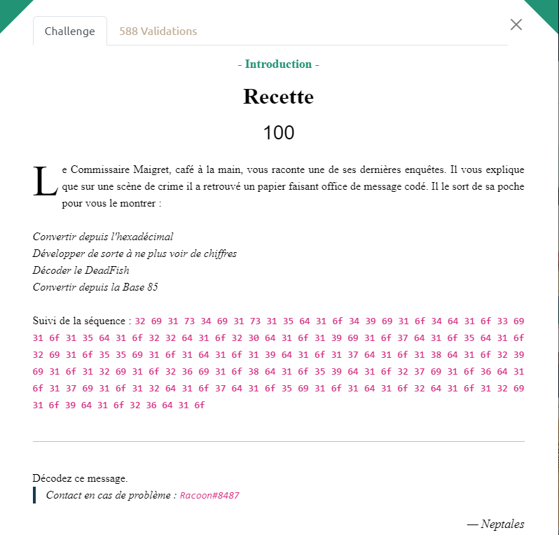

# Write-Up 404-CTF : Recette

__Catégorie :__ Cryptanalyse - Introduction

**Enoncé :**



**Résolution :**

Ce challenge est une introduction à la cryptographie. On nous donne une suite de caractère hexadécimal et des étapes afin de déchiffrer le message. Le challenge est assez explicite et nous pouvons nous en sortir avec de simple fonctions Python.

_Etape 1 : Décoder l'hexadécimal_
```python
# Step 1 : Hex to str
secret = "32 69 31 73 34 69 31 73 31 35 64 31 6f 34 39 69 31 6f 34 64 31 6f 33 69 31 6f 31 35 64 31 6f 32 32 64 31 6f 32 30 64 31 6f 31 39 69 31 6f 37 64 31 6f 35 64 31 6f 32 69 31 6f 35 35 69 31 6f 31 64 31 6f 31 39 64 31 6f 31 37 64 31 6f 31 38 64 31 6f 32 39 69 31 6f 31 32 69 31 6f 32 36 69 31 6f 38 64 31 6f 35 39 64 31 6f 32 37 69 31 6f 36 64 31 6f 31 37 69 31 6f 31 32 64 31 6f 37 64 31 6f 35 69 31 6f 31 64 31 6f 32 64 31 6f 31 32 69 31 6f 39 64 31 6f 32 36 64 31 6f"
secret_hex = secret.replace(' ', '')

secret_str = bytes.fromhex(secret_hex).decode('utf-8')
print(secret_str)
```
On obtient la chaine suivante : `2i1s4i1s15d1o49i1o4d1o3i1o15d1o22d1o20d1o19i1o7d1o5d1o2i1o55i1o1d1o19d1o17d1o18d1o29i1o12i1o26i1o8d1o59d1o27i1o6d1o17i1o12d1o7d1o5i1o1d1o2d1o12i1o9d1o26d1o`

_Etape 2 : Développer pour ne plus avoir de chiffres_

Avec la chaine ci-dessus, on comprend qu'il faut remplacer les couples (chiffre, lettre) par le nombre de lettres correspondantes. Par exemple, `2i` devient `ii` et `1s` devient `s`
```python
# Step 2 : Develop ('2i' becomes 'ii')
def spliter_cell(s):
    for (i, c) in enumerate(s):
        if c in ['i', 'd', 's', 'o']:
            return (s[:i+1], s[i+1:])
    return (s, [])

def spliter(s, res):
    t1, t2 = spliter_cell(s)
    res.append(t1)
    if len(t2) > 0:
        return spliter(t2, res)
    else:
        return res

def develop(s):
    c = s[-1]
    i = int(s[:-1])
    return c * i

secret_dvp = ''.join(develop(s) for s in spliter(secret_str, []))
print(secret_dvp)
```

Après développement, nous obtenons la chaine de caractère suivante : `iisiiiisdddddddddddddddoiiiiiiiiiiiiiiiiiiiiiiiiiiiiiiiiiiiiiiiiiiiiiiiiioddddoiiiodddddddddddddddoddddddddddddddddddddddoddddddddddddddddddddoiiiiiiiiiiiiiiiiiiiodddddddodddddoiioiiiiiiiiiiiiiiiiiiiiiiiiiiiiiiiiiiiiiiiiiiiiiiiiiiiiiiiododddddddddddddddddddodddddddddddddddddoddddddddddddddddddoiiiiiiiiiiiiiiiiiiiiiiiiiiiiioiiiiiiiiiiiioiiiiiiiiiiiiiiiiiiiiiiiiiioddddddddodddddddddddddddddddddddddddddddddddddddddddddddddddddddddddoiiiiiiiiiiiiiiiiiiiiiiiiiiioddddddoiiiiiiiiiiiiiiiiioddddddddddddodddddddoiiiiiododdoiiiiiiiiiiiiodddddddddoddddddddddddddddddddddddddo`

_Etape 3 : Décoder le DeadFish_

Voilà une instruction bien étonnante lorsque nous ne sommes pas familier avec les langages ésotériques mais wikipédia (ou plutôt [esolangs.org](https://esolangs.org/wiki/Deadfish) dans ce cas) est notre ami.  
On apprend qu'il n'y a que 4 instructions en DeadFish (increment, decrement, square, output) qui nous permettent ici de calculer une liste de nombres.  
Une version légèrement modifiée de l'implémentation Python sur esolangs fera l'affaire pour ce challenge.
```python
# Step 3 : Interpret deadfish
def interpretDeadFish(code):
    a=0
    res = []
    for c in code:
        if a==256 or a<0:
            a=0
        if c=='i':
            a+=1
        elif c=='d':
            a-=1
        elif c=='o':
            res.append(a)
        elif c=='s':
            a*=a
    return res

secret_interpreted = "".join(chr(c) for c in interpretDeadFish(secret_dvp))
print(secret_interpreted)
```
Ce code nous permet d'obtenir la chaine `1b^aR<(;4/1hgTC1NZtl1LFWKDIHFRI/`, tout comme le site [Dcode](https://www.dcode.fr/langage-deadfish).

_Etape 4 : Décoder la base85_

Cette dernière étape est tout aussi explicite que la première, avec une légère difficulté supplémentaire en Python. Pour décoder de la base85, nous devons utiliser la librairie base64 et nous avons le choix entre deux fonctions : `a85decode` (pour Ascii85) et `b85decode` (pour base85). Les deux ont un fonctionnement identiques mais n'utilisent pas le même jeu de caractères pour l'encodage. Après test, seul `a85decode` fonctionne dans notre cas et nous permet d'avoir le flag. Le site [Dcode](https://www.dcode.fr/code-ascii-85) nous permettait aussi d'obtenir le flag, sans la distinction entre Ascii85 et Base85.

```python
import base64

# Step 4 : base85 decode
flag = base64.a85decode(secret_interpreted)
print(flag.decode())
```

**Flag :** `404CTF{M4igr3t_D3_c4naRd}`