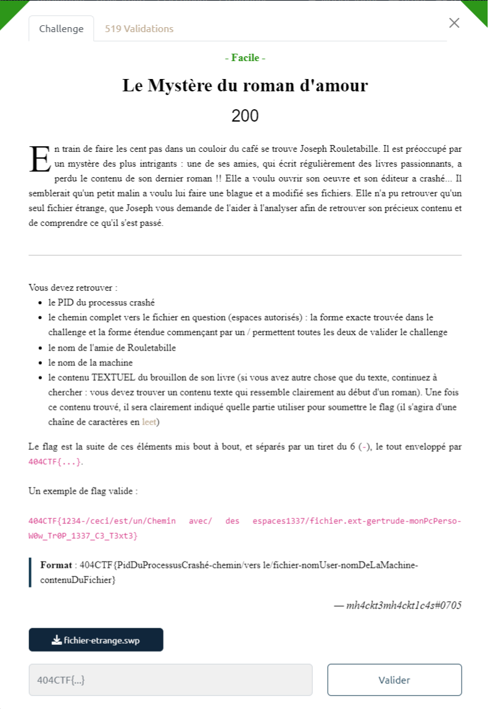
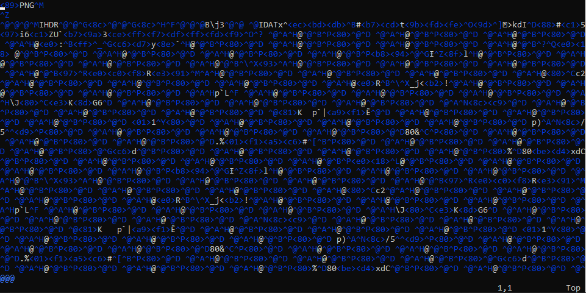
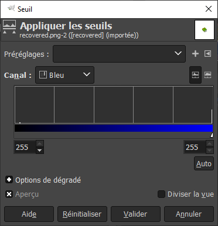
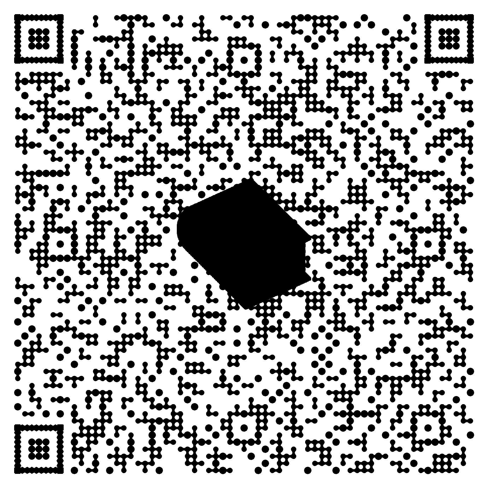

# Write-Up 404-CTF : Le Mystère du roman d'amour

__Catégorie :__ Analyse forensique - Facile

**Enoncé :**



**Fichiers :** fichier-etrange.swp

**Résolution :**

Le challenge nous propose d'analyser un fichier `.swp`. Après une petite recherche, on apprend que les fichiers `.swp` sont des fichiers temporaires créés par Vi pour stocker les modifications apportées à un fichier avant sauvegarde (utile en cas de crash).

La commance `file` confirme ceci et nous apporte un grand nombre d'informations utile à la résolution de ce challenge.

```
$ file fichier-etrange.swp
> fichier-etrange.swp: Vim swap file, version 7.4, pid 168, user jaqueline, host aime_ecrire, file ~jaqueline/Documents/Livres/404 Histoires d'Amour pour les bibliophiles au coeur d'artichaut/brouillon.txt
```

Nous avons donc :
- PID : `168`
- Chemin complet : `~jaqueline/Documents/Livres/404 Histoires d'Amour pour les bibliophiles au coeur d'artichaut/brouillon.txt`
- Nom de l'ami : `jaqueline`
- Nom de la machine : `aime_ecrire`

Il nous reste plus qu'à obtenir le contenu textuel du fichier. Pour cela, nous allons directement utiliser Vim et regarder le contenu du fichier swap.

```
$ vim -r fichier-etrange.swp
```


On remarque une chose étonnante : le contenu du fichier débute par le header d'un PNG. En revanche, l'énoncé précise bien que nous devons trouver le début d'un roman. Nous devons donc aller plus loin en sauvegardant cette image.
```bash
# Dans l'éditeur vim
:w recovered.png
:q!
```

Nous obtenons l'image suivante :


Enfin, pour obtenir le contenu du roman, nous devons faire un peu de stéganographie. Grâce à GIMP et son outil `Couleurs > Seuil`, nous pouvons accentuer des petits changements dans l'image afin de les faire apparaitre.  
Ici, en ne prenant que le canal bleu, avec un seuil de 255, nous faisons appraitre un QR code derrière le livre.



Un lecteur de QR code en ligne comme https://products.aspose.app/barcode/recognize/qr# nous permet d'obtenir le contenu du roman :

```
Il était une fois, dans un village rempli d'amour, deux amoureux qui s'aimaient...

Bien joué ! Notre écrivaine va pouvoir reprendre son chef-d'oeuvre grâce à vous !
Voici ce que vous devez rentrer dans la partie "contenu du fichier" du flag : 3n_V01L4_Un_Dr0l3_D3_R0m4N
```

**Flag :** `404CTF{168-~jaqueline/Documents/Livres/404 Histoires d'Amour pour les bibliophiles au coeur d'artichaut/brouillon.txt-jaqueline-aime_ecrire-3n_V01L4_Un_Dr0l3_D3_R0m4N}`
