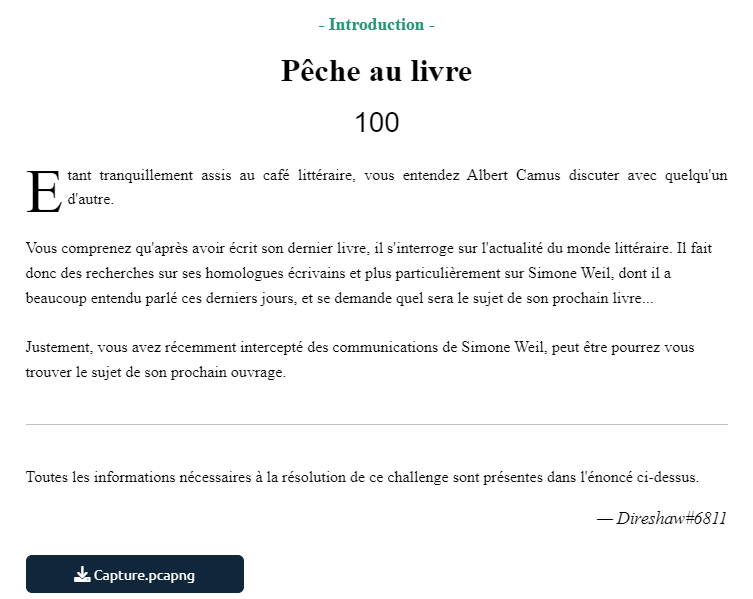
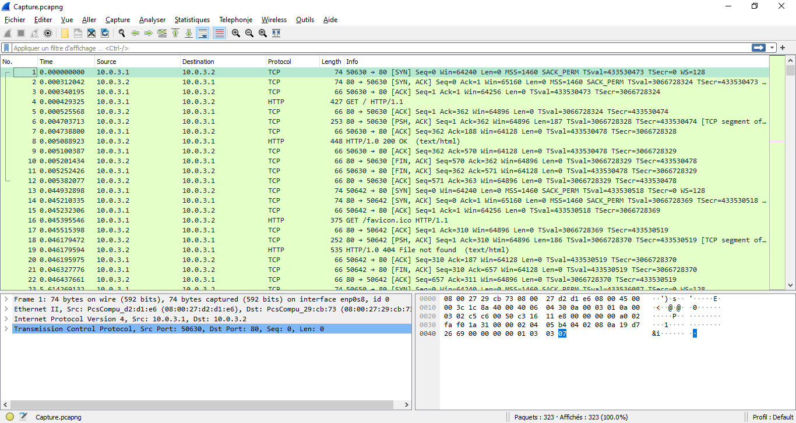
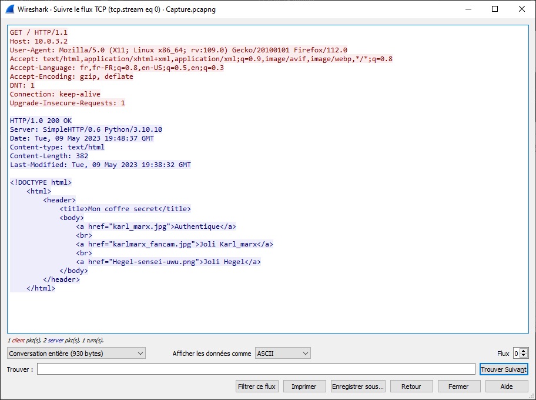

# Write-Up 404-CTF : Pêche au livre

__Catégorie :__ Analyse forensique - Introduction

**Enoncé :**

**Fichiers :** Capture.pcapng

**Résolution :**

Dans ce challenge, nous avons à disposition une capture réseau. Nous l'ouvrons avec Wireshark.

Il s'agit principalement de flux TCP contenant des requêtes HTTP. En analysant le premier flux TCP, on voit qu'une requête `GET /` est effectuée et qu'une page HTML est contenu dans la réponse.

Cette page web contient plusieurs images qui sont récupérées dans les requêtes suivantes.

Nous allons tenter de récupérer les fichiers renvoyées en réponse aux requêtes HTTP. Wireshark nous permet de faire cette extraction de manière quasi-automatique avec ces deux étapes :

- Clic droit sur un paquet TCP > Préférences de protocole > Transmission Control Protocol > Cocher "Allow subdissector to reassemble TCP streams"
- Fichier > Exporter Objets > HTTP puis "Tout enregistrer"

Le flag se trouve dans l'image "Hegel-sensei-uwu.png".

**Flag :** `404CTF{345Y_W1r35h4rK}`
