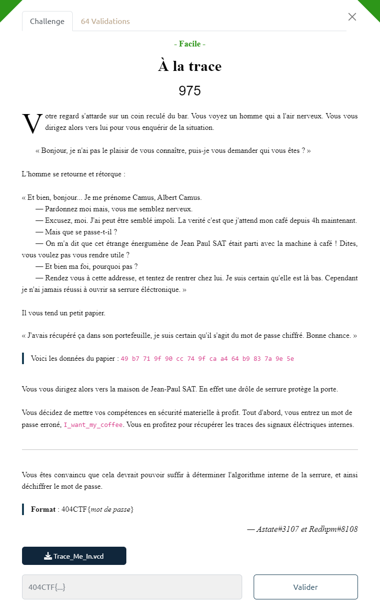
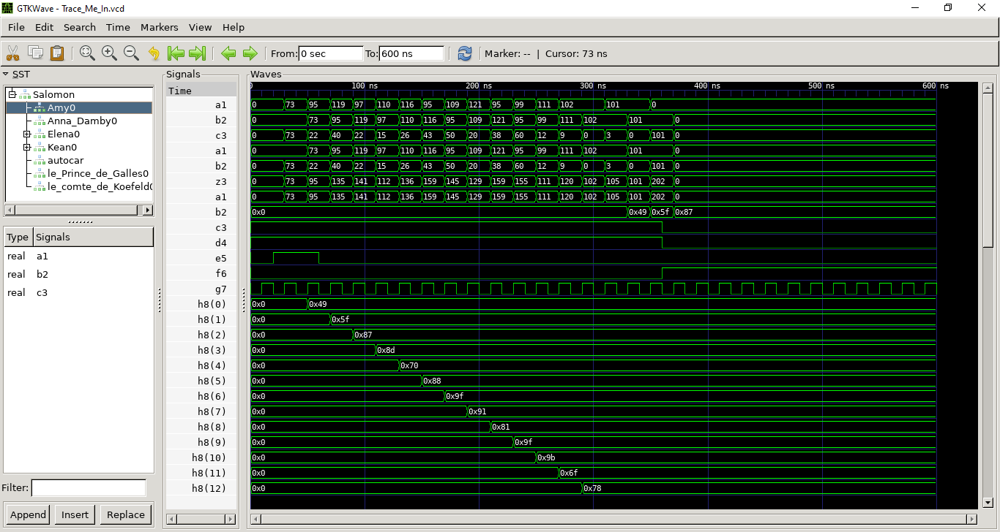

# Write-Up 404-CTF : À la trace

__Catégorie :__ Sécurité matérielle - Facile

**Enoncé :**



**Fichiers :** Trace_Me_In.vcd

**Résolution :**

Dans ce challenge, nous devons déchiffrer un message chiffré par un appareil électronique dont nous avons une trace de fonctionnement pour une chaine de caractère.

L'entrée `I_want_my_coffee` nous donne les signaux suivants :



Pour résoudre ce challenge, nous devons donc comprendre comment notre message est chiffré, puis inverser le chiffrement sur le message `49 b7 71 9f 90 cc 74 9f ca a4 64 b9 83 7a 9e 5e` pour retrouver le mot de passe.

En analysant les signaux, on remarque que le premier signal `a1` (module `Amy_0`) représente notre entrée en hexadécimal.  
On voit aussi que le déroulé des opérations se fait en 2 parties, avec un changement autour de 350ns. Certains signaux changent durant la première partie (probablement lecture et chiffrement du mot de passe) et d'autres signaux, notamment le `b2` du module `Elena0` ne changent que durant la seconde partie, là où les précédents signaux arrêtent de changer. Il s'agit probablement de la phase de vérification.

Nous avons aussi un indice supplémentaire. Le signal `b2` commence par `0x49`, comme le vrai mot de passe chiffré. Ensuite, lorsqu'il passe à `0x5f` (différent de `0xb7`), on peut voir des signaux passer à `0` comme `c3` et `d4` d'autres passer à `1` comme `f6`. Puis, plus rien ne se passe : la vérification à échouer.  
D'ailleurs, le chiffré de `I_want_my_coffee` est stocké dans les 16 signaux `h8`.

Maintenant que nous avons repéré le signal final chiffré, il reste à savoir comment nous l'avons obtenu. Pour cela, il suffit de regarder les 6 premiers signaux.
En effet, `0x49 0x5f 0x87 ...` correspond en décimal à `73 95 135 ...` donc au signal `z3` du module `Anna_Damby0`.  
Ce signal correspond à la somme des deux entiers `a1` et `b2` du module. L'entrée `a1` correspond au mot de passe en clair, décalé temporellement d'un cycle d'horloge, et l'entrée `b2` correspond à la sortie du module `Amy`.  
Le module `Amy`, quant à lui, fait un XOR de ces deux entrée `a1` et `b2` avec `a1` le mot de passe et `b2` le même mot de passe mais décalé d'un cycle d'horloge.  
En résumé, nous avons le chiffrement suivant :
```math
c_0 = m_0
```
```math
\forall i \geq 1, c_i = m_{i-1} + (m_{i-1} \oplus m_i)
```
On peut inverser les opérations pour obtenir la méthode de déchiffrement :
```math
m_0 = c_0
```
```math
\forall i \geq 1, m_i = (c_{i} - m_{i-1}) \oplus m_{i-1}
```
Ce déchiffrement peut s'implémenter simplement avec un script Python, qui nous permet d'obtenir le flag.

```python
# script.py
cipher = ["49", "b7", "71", "9f", "90", "cc", "74", "9f", "ca", "a4", "64", "b9", "83", "7a", "9e", "5e"]
M2 = [0] # Padded password
M = [] # Password

cipher_int = [int.from_bytes(bytes.fromhex(c), "little") for c in cipher]

for i in range(len(cipher_int)):
    ci = cipher_int[i]
    mi_1 = M2[i]
    mi = (ci - mi_1) ^ mi_1
    M.append(mi)
    M2.append(mi)

pwd = "".join(chr(n) for n in M)
print(f"404CTF{{{pwd}}}")
```

**Flag :** `404CTF{I'm_n0t_4Dd1ct^^}`