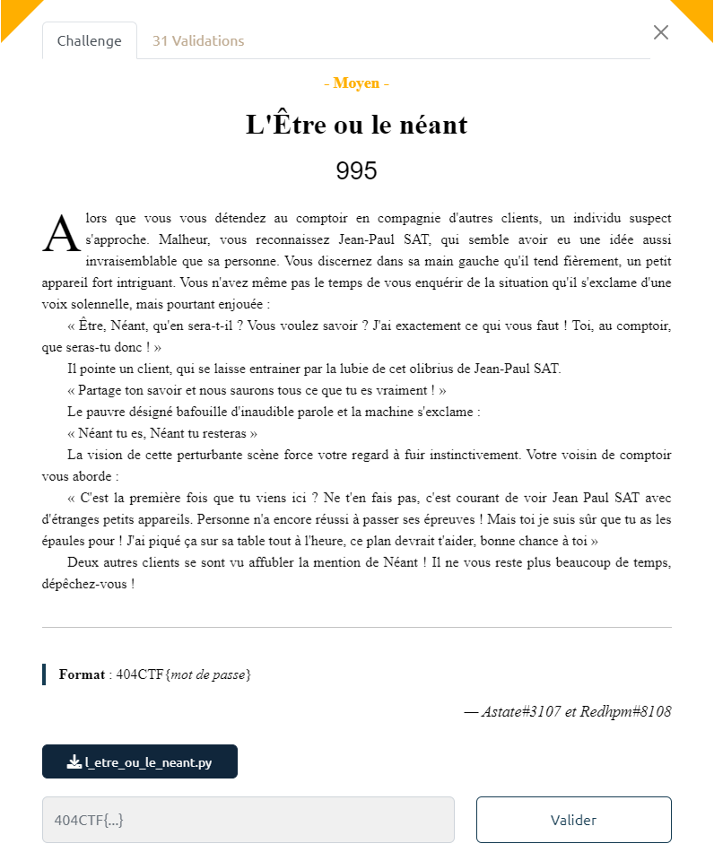

# Write-Up 404-CTF : L'Être ou le néant

__Catégorie :__ Sécurité matérielle - Moyen

**Enoncé :**



**Fichiers :** l_etre_ou_le_neant.py

**Résolution :**

Dans ce challenge, nous devons analyser un fichier Python utilisant la librairie `myhdl`. Cette librairie permet de produire un code similaire à celui d'un HDL (Hardware Description Language) et de l'exécuter avec un interpréteur Python.

Un HDL est un langage de programmation permettant de décrire le comportement de composants électronique. Contrairement à un langage "traditionnel" compilé qui va produire un code en langage machine, un HDL va produire l'équivalent d'un schéma électronique. Le code ne s'exécute pas instruction par instruction mais de manière parallèle.

Pour en revenir à ce challenge, le programme demande à l'utilisateur un mot de passe. Si ce mot de passe fait 17 caractères, alors les 17 caractères sont transformés en entier sur 8 bits, puis réparti en 8 entiers sur 17 bits dans la variable `bus` (bit de poids faible de `bus[i]` correspond à `attempt[0]`, etc...). Chacun des 8 entiers de `bus` est ensuite passé dans un bloc de logique combinatoire renvoyant 0 ou 1 selon l'entier entré.

La logique de validation s'effectue dans la fonction `time_to_see`. A chaque front montant d'horloge, le résultat du bloc `i` est stocké dans le bit `i` du signal `little_bigger_box`. La fonction `time_to_see` vérifie ensuite que `little_bigger_box` vaut 255, soit que chacun des bits est mis à `1`.  
Pour résoudre ce challenge, cela revient à résoudre les équations correspondant à chacun des blocs.

Personnellement, j'ai tenté d'écrire un script Python pour résoudre ces équations mais sans succès. Comme il n'y a "que" `8 * 2^17 = 1 048 576` possibilités, j'ai plutôt écrit un script qui simule l'exécution d'un bloc pour un entier, sans la librairie myhdl. Le bruteforce est ici envisageable au vue du nombre abordable de possibilité, mais ne l'aurait pas été si le mot de passe aurait fait 5-10 caractères de plus.  
Une solution plus élégante et attendue pour ce challenge est d'utiliser le solveur d'équation Z3 (que je ne connaissais pas lors du CTF).

Le script Python suivant permet donc de récupérer le flag en parsant et en exécutant le code des bloc et en bruteforçant l'entrée (temps d'exécution sur mon PC : 3m 55s)

```python
import re
import time
from tqdm import tqdm

block7 = """
    F0 = XOR(b[9], b[16], t[0])
    F1 = OR(b[0], t[0], t[1])
    F2 = AND(b[14], b[15], t[2])
    F3 = NOT(t[2], t[3])
    F4 = AND(b[5], t[3], t[4])
    F5 = AND(b[7], b[11], t[5])
    F6 = AND(t[4], t[5], t[6])
    F7 = NOT(t[6], t[7])
    F8 = XOR(b[3], t[7], t[8])
    F9 = AND(b[4], b[8], t[9])
    F10 = OR(t[8], t[9], t[10])
    F11 = NOT(t[10], t[11])
    F12 = XOR(t[1], t[11], t[12])
    F13 = OR(b[10], b[2], t[13])
    F14 = OR(t[13], b[13], t[14])
    F15 = OR(b[8], b[2], t[15])
    F16 = OR(b[12], b[5], t[16])
    F17 = OR(t[16], b[12], t[17])
    F18 = OR(t[15], t[17], t[18])
    F19 = OR(t[14], t[18], t[19])
    F20 = NOT(t[19], t[20])
    F21 = OR(t[12], t[20], t[21])
    F22 = NOT(t[21], t[22])
    F23 = OR(b[14], b[4], t[23])
    F24 = OR(b[7], b[1], t[24])
    F25 = OR(t[23], t[24], t[25])
    F26 = OR(b[16], b[3], t[26])
    F27 = OR(b[15], b[0], t[27])
    F28 = OR(t[26], t[27], t[28])
    F29 = OR(t[25], t[28], t[29])
    F30 = OR(b[9], b[6], t[30])
    F31 = OR(b[13], b[1], t[31])
    F32 = OR(b[11], t[31], t[32])
    F33 = OR(t[30], t[32], t[33])
    F34 = OR(t[29], t[33], t[34])
    F35 = OR(b[13], b[0], t[35])
    F36 = OR(b[15], b[4], t[36])
    F37 = OR(b[6], t[36], t[37])
    F38 = OR(b[16], b[1], t[38])
    F39 = OR(t[37], t[38], t[39])
    F40 = OR(t[39], b[6], t[40])
    F41 = OR(t[35], t[40], t[41])
    F42 = OR(b[11], b[3], t[42])
    F43 = OR(b[7], t[42], t[43])
    F44 = OR(b[14], b[10], t[44])
    F45 = OR(b[9], t[44], t[45])
    F46 = OR(t[43], t[45], t[46])
    F47 = OR(t[41], t[46], t[47])
    F48 = AND(t[34], t[47], t[48])
    F49 = OR(t[22], t[48], t[49])
    F50 = NOT(t[49], t[50])

    @always_comb
    def core():
        z.next = t[50]
"""

block6 = """
    F0 = NOT(b[10], t[0])
    F1 = NOT(b[16], t[1])
    F2 = NOT(b[6], t[2])
    F3 = AND(t[1], t[2], t[3])
    F4 = AND(t[0], t[3], t[4])
    F5 = NOT(b[8], t[5])
    F6 = AND(t[5], b[3], t[6])
    F7 = AND(t[4], t[6], t[7])
    F8 = NOT(b[4], t[8])
    F9 = NOT(b[13], t[9])
    F10 = AND(b[15], t[9], t[10])
    F11 = NOT(b[7], t[11])
    F12 = AND(t[10], t[11], t[12])
    F13 = AND(b[12], b[0], t[13])
    F14 = AND(t[12], t[13], t[14])
    F15 = AND(t[8], t[14], t[15])
    F16 = AND(t[7], t[15], t[16])
    F17 = NOT(b[3], t[17])
    F18 = OR(b[4], t[17], t[18])
    F19 = NOT(b[0], t[19])
    F20 = OR(b[8], t[19], t[20])
    F21 = OR(t[18], t[20], t[21])
    F22 = OR(b[13], b[7], t[22])
    F23 = OR(b[10], t[22], t[23])
    F24 = OR(t[23], b[8], t[24])
    F25 = OR(t[21], t[24], t[25])
    F26 = NOT(b[12], t[26])
    F27 = OR(b[16], t[26], t[27])
    F28 = OR(t[27], b[6], t[28])
    F29 = NOT(b[15], t[29])
    F30 = OR(t[29], b[10], t[30])
    F31 = OR(t[28], t[30], t[31])
    F32 = OR(t[25], t[31], t[32])
    F33 = NOT(t[32], t[33])
    F34 = OR(t[16], t[33], t[34])
    F35 = NOT(t[34], t[35])
    F36 = NOT(b[3], t[36])
    F37 = OR(b[8], t[36], t[37])
    F38 = OR(b[6], b[4], t[38])
    F39 = NOT(b[15], t[39])
    F40 = OR(t[39], b[7], t[40])
    F41 = NOT(b[12], t[41])
    F42 = NOT(b[0], t[42])
    F43 = OR(t[41], t[42], t[43])
    F44 = OR(t[40], t[43], t[44])
    F45 = OR(t[38], t[44], t[45])
    F46 = OR(t[37], t[45], t[46])
    F47 = OR(b[16], b[10], t[47])
    F48 = OR(b[13], b[5], t[48])
    F49 = OR(t[47], t[48], t[49])
    F50 = OR(t[46], t[49], t[50])
    F51 = AND(t[35], t[50], t[51])
    F52 = NOT(t[51], t[52])
    F53 = NOT(b[2], t[53])
    F54 = AND(t[53], b[1], t[54])
    F55 = XOR(b[13], b[14], t[55])
    F56 = OR(t[54], t[55], t[56])
    F57 = NOT(b[11], t[57])
    F58 = NOT(b[9], t[58])
    F59 = OR(t[57], t[58], t[59])
    F60 = OR(t[59], b[6], t[60])
    F61 = NOT(b[9], t[61])
    F62 = NOT(b[11], t[62])
    F63 = OR(t[62], b[7], t[63])
    F64 = OR(t[61], t[63], t[64])
    F65 = AND(t[60], t[64], t[65])
    F66 = NOT(t[65], t[66])
    F67 = AND(t[56], t[66], t[67])
    F68 = NOT(t[67], t[68])
    F69 = XOR(b[4], b[9], t[69])
    F70 = AND(b[3], t[69], t[70])
    F71 = NOT(t[70], t[71])
    F72 = OR(t[68], t[71], t[72])
    F73 = AND(b[12], b[16], t[73])
    F74 = NOT(t[73], t[74])
    F75 = OR(b[2], t[74], t[75])
    F76 = NOT(t[75], t[76])
    F77 = AND(b[1], b[11], t[77])
    F78 = NOT(b[14], t[78])
    F79 = NOT(b[5], t[79])
    F80 = AND(t[78], t[79], t[80])
    F81 = AND(t[80], b[15], t[81])
    F82 = AND(t[77], t[81], t[82])
    F83 = OR(t[76], t[82], t[83])
    F84 = NOT(t[83], t[84])
    F85 = OR(t[72], t[84], t[85])
    F86 = NOT(t[85], t[86])
    F87 = AND(t[52], t[86], t[87])

    @always_comb
    def core():
        z.next = t[87]
"""

block5 = """
    F0 = OR(b[10], b[13], t[0])
    F1 = NOT(t[0], t[1])
    F2 = OR(b[14], b[16], t[2])
    F3 = AND(b[12], t[2], t[3])
    F4 = NOT(t[3], t[4])
    F5 = OR(t[1], t[4], t[5])
    F6 = AND(b[5], t[5], t[6])
    F7 = NOT(t[6], t[7])
    F8 = AND(b[7], b[9], t[8])
    F9 = NOT(t[8], t[9])
    F10 = AND(t[7], t[9], t[10])
    F11 = NOT(t[10], t[11])
    F12 = AND(b[0], t[11], t[12])
    F13 = OR(b[4], b[8], t[13])
    F14 = OR(t[13], b[6], t[14])
    F15 = NOT(t[14], t[15])
    F16 = AND(t[12], t[15], t[16])
    F17 = NOT(t[16], t[17])
    F18 = OR(t[17], b[3], t[18])
    F19 = AND(b[11], b[3], t[19])
    F20 = AND(b[4], b[1], t[20])
    F21 = AND(t[19], t[20], t[21])
    F22 = AND(b[13], b[9], t[22])
    F23 = AND(b[14], b[2], t[23])
    F24 = AND(t[22], t[23], t[24])
    F25 = AND(b[7], t[24], t[25])
    F26 = AND(t[21], t[25], t[26])
    F27 = AND(b[4], b[3], t[27])
    F28 = AND(b[13], b[7], t[28])
    F29 = AND(t[28], b[1], t[29])
    F30 = AND(t[27], t[29], t[30])
    F31 = AND(b[14], b[2], t[31])
    F32 = AND(b[11], t[31], t[32])
    F33 = AND(b[9], t[32], t[33])
    F34 = AND(t[33], b[11], t[34])
    F35 = AND(t[30], t[34], t[35])
    F36 = OR(t[26], t[35], t[36])
    F37 = NOT(t[36], t[37])
    F38 = AND(t[18], t[37], t[38])
    F39 = NOT(t[38], t[39])
    F40 = AND(b[12], b[6], t[40])
    F41 = AND(b[10], b[5], t[41])
    F42 = AND(t[40], t[41], t[42])
    F43 = AND(b[8], b[1], t[43])
    F44 = AND(t[42], t[43], t[44])
    F45 = NOT(b[0], t[45])
    F46 = AND(b[16], t[45], t[46])
    F47 = AND(b[15], t[46], t[47])
    F48 = AND(t[47], b[15], t[48])
    F49 = AND(t[44], t[48], t[49])
    F50 = AND(t[39], t[49], t[50])

    @always_comb
    def core():
        z.next = t[50]
"""

block4 = """
    F0 = OR(b[8], b[15], t[0])
    F1 = NOT(t[0], t[1])
    F2 = AND(b[7], t[1], t[2])
    F3 = NOT(t[2], t[3])
    F4 = OR(b[0], t[3], t[4])
    F5 = NOT(t[4], t[5])
    F6 = NOT(b[12], t[6])
    F7 = AND(t[6], b[4], t[7])
    F8 = AND(t[7], b[13], t[8])
    F9 = NOT(b[0], t[9])
    F10 = AND(b[2], t[9], t[10])
    F11 = NOT(b[5], t[11])
    F12 = AND(t[11], b[14], t[12])
    F13 = AND(t[10], t[12], t[13])
    F14 = OR(b[12], t[13], t[14])
    F15 = NOT(t[14], t[15])
    F16 = XOR(t[8], t[15], t[16])
    F17 = OR(t[5], t[16], t[17])
    F18 = OR(b[2], b[16], t[18])
    F19 = NOT(t[18], t[19])
    F20 = AND(b[3], b[11], t[20])
    F21 = OR(t[19], t[20], t[21])
    F22 = NOT(t[21], t[22])
    F23 = AND(b[15], b[3], t[23])
    F24 = AND(b[15], b[10], t[24])
    F25 = OR(t[23], t[24], t[25])
    F26 = NOT(t[25], t[26])
    F27 = OR(b[6], b[9], t[27])
    F28 = AND(t[26], t[27], t[28])
    F29 = OR(t[28], b[5], t[29])
    F30 = OR(t[22], t[29], t[30])
    F31 = NOT(t[30], t[31])
    F32 = AND(t[17], t[31], t[32])
    F33 = NOT(t[32], t[33])
    F34 = NOT(b[9], t[34])
    F35 = NOT(b[7], t[35])
    F36 = OR(t[34], t[35], t[36])
    F37 = NOT(b[8], t[37])
    F38 = NOT(b[11], t[38])
    F39 = OR(t[38], b[6], t[39])
    F40 = OR(t[37], t[39], t[40])
    F41 = OR(t[36], t[40], t[41])
    F42 = NOT(b[10], t[42])
    F43 = NOT(b[13], t[43])
    F44 = NOT(b[4], t[44])
    F45 = OR(t[43], t[44], t[45])
    F46 = OR(t[42], t[45], t[46])
    F47 = OR(t[41], t[46], t[47])
    F48 = NOT(b[16], t[48])
    F49 = OR(t[48], b[1], t[49])
    F50 = OR(t[47], t[49], t[50])
    F51 = OR(t[33], t[50], t[51])
    F52 = NOT(t[51], t[52])

    @always_comb
    def core():
        z.next = t[52]
"""

block3 = """
    F0 = OR(b[8], b[0], t[0])
    F1 = OR(b[8], b[13], t[1])
    F2 = AND(t[0], t[1], t[2])
    F3 = OR(b[15], b[8], t[3])
    F4 = OR(b[14], t[3], t[4])
    F5 = OR(b[11], t[4], t[5])
    F6 = OR(b[15], b[14], t[6])
    F7 = OR(t[6], b[11], t[7])
    F8 = OR(t[7], b[9], t[8])
    F9 = AND(t[5], t[8], t[9])
    F10 = OR(t[2], t[9], t[10])
    F11 = OR(b[10], b[14], t[11])
    F12 = NOT(t[11], t[12])
    F13 = OR(b[5], t[12], t[13])
    F14 = AND(t[10], t[13], t[14])
    F15 = NOT(b[16], t[15])
    F16 = OR(t[15], b[0], t[16])
    F17 = OR(b[10], t[16], t[17])
    F18 = NOT(b[1], t[18])
    F19 = OR(t[18], b[4], t[19])
    F20 = OR(t[17], t[19], t[20])
    F21 = OR(b[7], b[6], t[21])
    F22 = OR(t[21], b[11], t[22])
    F23 = OR(b[3], t[22], t[23])
    F24 = OR(t[20], t[23], t[24])
    F25 = OR(t[14], t[24], t[25])
    F26 = NOT(t[25], t[26])
    F27 = NOT(b[2], t[27])
    F28 = AND(b[5], b[1], t[28])
    F29 = AND(t[27], t[28], t[29])
    F30 = OR(b[9], b[2], t[30])
    F31 = OR(t[30], b[12], t[31])
    F32 = OR(b[4], b[7], t[32])
    F33 = AND(t[32], b[16], t[33])
    F34 = OR(t[31], t[33], t[34])
    F35 = OR(b[12], b[6], t[35])
    F36 = OR(b[13], b[15], t[36])
    F37 = OR(t[35], t[36], t[37])
    F38 = OR(t[34], t[37], t[38])
    F39 = NOT(t[38], t[39])
    F40 = OR(t[39], b[3], t[40])
    F41 = AND(t[29], t[40], t[41])
    F42 = AND(t[26], t[41], t[42])

    @always_comb
    def core():
        z.next = t[42]
"""

block2 = """
    F0 = NOT(b[3], t[0])
    F1 = AND(b[9], t[0], t[1])
    F2 = AND(b[4], b[8], t[2])
    F3 = AND(t[1], t[2], t[3])
    F4 = OR(b[0], t[3], t[4])
    F5 = NOT(b[3], t[5])
    F6 = AND(b[4], b[7], t[6])
    F7 = AND(t[5], t[6], t[7])
    F8 = AND(t[7], b[13], t[8])
    F9 = XOR(b[9], b[10], t[9])
    F10 = AND(t[8], t[9], t[10])
    F11 = OR(t[4], t[10], t[11])
    F12 = OR(b[0], b[6], t[12])
    F13 = XOR(b[12], b[16], t[13])
    F14 = OR(t[13], b[15], t[14])
    F15 = NOT(t[14], t[15])
    F16 = OR(t[12], t[15], t[16])
    F17 = XOR(t[11], t[16], t[17])
    F18 = NOT(b[11], t[18])
    F19 = AND(t[18], b[7], t[19])
    F20 = AND(t[19], b[5], t[20])
    F21 = AND(b[1], t[20], t[21])
    F22 = AND(t[17], t[21], t[22])
    F23 = NOT(t[22], t[23])
    F24 = NOT(b[13], t[24])
    F25 = OR(t[24], b[6], t[25])
    F26 = OR(b[10], t[25], t[26])
    F27 = NOT(b[16], t[27])
    F28 = NOT(b[5], t[28])
    F29 = OR(t[27], t[28], t[29])
    F30 = OR(b[14], t[29], t[30])
    F31 = OR(t[26], t[30], t[31])
    F32 = NOT(b[12], t[32])
    F33 = NOT(b[15], t[33])
    F34 = NOT(b[8], t[34])
    F35 = OR(t[33], t[34], t[35])
    F36 = OR(t[32], t[35], t[36])
    F37 = OR(t[36], b[2], t[37])
    F38 = OR(t[31], t[37], t[38])
    F39 = NOT(b[13], t[39])
    F40 = NOT(b[5], t[40])
    F41 = OR(t[39], t[40], t[41])
    F42 = OR(b[10], t[41], t[42])
    F43 = NOT(b[12], t[43])
    F44 = NOT(b[8], t[44])
    F45 = OR(t[43], t[44], t[45])
    F46 = OR(t[45], b[2], t[46])
    F47 = OR(t[42], t[46], t[47])
    F48 = OR(b[14], b[6], t[48])
    F49 = NOT(b[15], t[49])
    F50 = NOT(b[16], t[50])
    F51 = OR(t[50], b[14], t[51])
    F52 = OR(t[49], t[51], t[52])
    F53 = OR(t[48], t[52], t[53])
    F54 = OR(t[47], t[53], t[54])
    F55 = AND(t[38], t[54], t[55])
    F56 = NOT(t[55], t[56])
    F57 = AND(b[3], b[11], t[57])
    F58 = AND(t[57], b[4], t[58])
    F59 = OR(t[56], t[58], t[59])
    F60 = NOT(t[59], t[60])
    F61 = OR(t[23], t[60], t[61])
    F62 = NOT(t[61], t[62])
    F63 = NOT(b[10], t[63])
    F64 = AND(t[63], b[5], t[64])
    F65 = AND(b[8], b[7], t[65])
    F66 = NOT(b[2], t[66])
    F67 = AND(t[65], t[66], t[67])
    F68 = AND(t[64], t[67], t[68])
    F69 = NOT(b[0], t[69])
    F70 = AND(b[9], t[69], t[70])
    F71 = AND(b[4], t[70], t[71])
    F72 = AND(t[68], t[71], t[72])
    F73 = NOT(b[14], t[73])
    F74 = NOT(b[11], t[74])
    F75 = AND(t[73], t[74], t[75])
    F76 = NOT(b[3], t[76])
    F77 = AND(t[75], t[76], t[77])
    F78 = NOT(b[6], t[78])
    F79 = AND(b[16], t[78], t[79])
    F80 = AND(b[15], t[79], t[80])
    F81 = AND(b[13], t[80], t[81])
    F82 = AND(b[12], b[1], t[82])
    F83 = AND(t[81], t[82], t[83])
    F84 = AND(t[77], t[83], t[84])
    F85 = AND(t[72], t[84], t[85])
    F86 = OR(t[62], t[85], t[86])

    @always_comb
    def core():
        z.next = t[86]
"""

block1 = """
    F0 = NOT(b[12], t[0])
    F1 = OR(b[15], b[5], t[1])
    F2 = OR(t[0], t[1], t[2])
    F3 = OR(t[2], b[4], t[3])
    F4 = NOT(b[11], t[4])
    F5 = OR(t[4], b[6], t[5])
    F6 = NOT(b[16], t[6])
    F7 = OR(t[6], b[13], t[7])
    F8 = NOT(b[3], t[8])
    F9 = OR(t[7], t[8], t[9])
    F10 = OR(b[9], t[9], t[10])
    F11 = OR(t[5], t[10], t[11])
    F12 = OR(t[3], t[11], t[12])
    F13 = OR(t[12], b[0], t[13])
    F14 = OR(b[11], b[14], t[14])
    F15 = AND(b[8], t[14], t[15])
    F16 = NOT(t[15], t[16])
    F17 = AND(t[13], t[16], t[17])
    F18 = NOT(t[17], t[18])
    F19 = OR(b[2], b[1], t[19])
    F20 = OR(b[10], b[2], t[20])
    F21 = OR(b[8], t[20], t[21])
    F22 = OR(t[19], t[21], t[22])
    F23 = OR(b[10], b[1], t[23])
    F24 = OR(b[2], t[23], t[24])
    F25 = OR(b[8], b[7], t[25])
    F26 = OR(t[24], t[25], t[26])
    F27 = OR(b[10], b[1], t[27])
    F28 = OR(b[8], b[9], t[28])
    F29 = OR(b[2], t[28], t[29])
    F30 = OR(t[27], t[29], t[30])
    F31 = AND(t[26], t[30], t[31])
    F32 = AND(t[22], t[31], t[32])
    F33 = NOT(b[7], t[33])
    F34 = NOT(b[14], t[34])
    F35 = AND(t[34], b[3], t[35])
    F36 = AND(t[33], t[35], t[36])
    F37 = OR(b[13], b[16], t[37])
    F38 = AND(t[37], b[15], t[38])
    F39 = NOT(t[38], t[39])
    F40 = XOR(b[12], t[39], t[40])
    F41 = OR(t[36], t[40], t[41])
    F42 = NOT(t[41], t[42])
    F43 = OR(b[4], b[10], t[43])
    F44 = NOT(t[43], t[44])
    F45 = XOR(t[44], b[6], t[45])
    F46 = AND(t[42], t[45], t[46])
    F47 = OR(t[32], t[46], t[47])
    F48 = NOT(t[47], t[48])
    F49 = AND(t[18], t[48], t[49])
    F50 = NOT(t[49], t[50])
    F51 = OR(b[15], b[9], t[51])
    F52 = OR(t[51], b[0], t[52])
    F53 = NOT(b[16], t[53])
    F54 = NOT(b[3], t[54])
    F55 = OR(t[53], t[54], t[55])
    F56 = OR(b[13], t[55], t[56])
    F57 = OR(b[7], t[56], t[57])
    F58 = OR(b[8], b[1], t[58])
    F59 = OR(b[6], t[58], t[59])
    F60 = OR(t[57], t[59], t[60])
    F61 = OR(t[52], t[60], t[61])
    F62 = NOT(b[11], t[62])
    F63 = OR(t[62], b[5], t[63])
    F64 = NOT(b[12], t[64])
    F65 = OR(t[64], b[10], t[65])
    F66 = OR(b[14], b[2], t[66])
    F67 = OR(t[65], t[66], t[67])
    F68 = OR(t[63], t[67], t[68])
    F69 = OR(b[4], b[5], t[69])
    F70 = OR(t[68], t[69], t[70])
    F71 = OR(t[61], t[70], t[71])
    F72 = AND(t[50], t[71], t[72])
    F73 = NOT(t[72], t[73])

    @always_comb
    def core():
        z.next = t[73]
"""

block0 = """
    F0 = NOT(b[8], t[0])
    F1 = AND(t[0], b[4], t[1])
    F2 = NOT(b[13], t[2])
    F3 = NOT(b[1], t[3])
    F4 = AND(t[2], t[3], t[4])
    F5 = AND(t[1], t[4], t[5])
    F6 = NOT(b[9], t[6])
    F7 = NOT(b[3], t[7])
    F8 = AND(t[6], t[7], t[8])
    F9 = NOT(b[5], t[9])
    F10 = NOT(b[2], t[10])
    F11 = AND(t[9], t[10], t[11])
    F12 = AND(t[8], t[11], t[12])
    F13 = NOT(b[15], t[13])
    F14 = NOT(b[12], t[14])
    F15 = AND(t[13], t[14], t[15])
    F16 = AND(t[15], b[0], t[16])
    F17 = AND(t[12], t[16], t[17])
    F18 = AND(t[5], t[17], t[18])
    F19 = AND(b[14], b[15], t[19])
    F20 = NOT(t[19], t[20])
    F21 = AND(b[9], t[20], t[21])
    F22 = OR(b[1], t[21], t[22])
    F23 = NOT(t[22], t[23])
    F24 = AND(b[5], b[7], t[24])
    F25 = NOT(t[24], t[25])
    F26 = AND(b[11], b[16], t[26])
    F27 = NOT(t[26], t[27])
    F28 = OR(b[6], t[27], t[28])
    F29 = NOT(t[28], t[29])
    F30 = XOR(t[25], t[29], t[30])
    F31 = OR(t[23], t[30], t[31])
    F32 = AND(b[0], b[10], t[32])
    F33 = OR(t[32], b[12], t[33])
    F34 = OR(b[2], t[33], t[34])
    F35 = NOT(b[16], t[35])
    F36 = NOT(b[11], t[36])
    F37 = OR(t[35], t[36], t[37])
    F38 = NOT(b[14], t[38])
    F39 = OR(t[38], b[6], t[39])
    F40 = OR(t[37], t[39], t[40])
    F41 = NOT(b[7], t[41])
    F42 = NOT(b[10], t[42])
    F43 = OR(t[42], b[3], t[43])
    F44 = OR(t[41], t[43], t[44])
    F45 = OR(t[40], t[44], t[45])
    F46 = AND(b[8], b[13], t[46])
    F47 = AND(b[4], t[46], t[47])
    F48 = NOT(t[47], t[48])
    F49 = AND(t[45], t[48], t[49])
    F50 = NOT(t[49], t[50])
    F51 = AND(t[34], t[50], t[51])
    F52 = NOT(t[51], t[52])
    F53 = AND(t[31], t[52], t[53])
    F54 = NOT(t[53], t[54])
    F55 = AND(t[18], t[54], t[55])

    @always_comb
    def core():
        z.next = t[55]
"""

def exec_code(code, input):
    max = int(re.search(r"z\.next = t\[(\d+)\]", code).group(1))
    t = [None] * (max + 1)

    for i in range(len(input)):
        if (input[i] != None):
            code = re.sub(r"b\[" + str(i) + r"\]", str(input[i]), code) 

    # Code execution
    for i in range(len(t)):
        line = re.search(r"F" + str(i) + r" = ((OR|XOR|NOT|AND)\((0|1), (t\[\d+\]|0|1)(, (t\[\d+\]|0|1))?\))", code)
        opcode = line.group(2)
        op1 = bool(int(line.group(3)))
        if opcode == "NOT":
            res = int(not op1)
            t[i] = res
        else:
            op2 = bool(int(line.group(4)))
            if opcode == 'AND':
                res = int(op1 and op2)
            elif opcode == 'OR':
                res = int(op1 or op2)
            elif opcode == 'XOR':
                res = int(op1 ^ op2)
            t[i] = res
        code = re.sub(r"t\[" + str(i) + r"\]", str(t[i]), code)
    return t[max]

def bruteforce_code(code):
    for idx_b in tqdm(range(2 ** 17), leave=False):
        b = [int(bit) for bit in '{0:0>17b}'.format(idx_b)]

        if(exec_code(code, b) == 1):
            return b
    return [None] * 17

start_time = time.time()
blocks = [block0, block1, block2, block3, block4, block5, block6, block7]
bs = [None] * 8

# Get correct input signal by bruteforce (2^17 possibilities)
for i, blk in tqdm(enumerate(blocks), total=8, leave=False):
    bs[i] = bruteforce_code(blk)

# Rearrange correct inputs
bs_t = []
for i in range(17):
    tmp = []
    for j in range(8):
        tmp.append(bs[j][i])
    bs_t.append(tmp[::-1])

# Transform bits to int then to string
to_int = []
for b in bs_t:
    to_int.append(int("".join(str(bit) for bit in b), 2))

flag = "".join(chr(i) for i in to_int)

print(f"404CTF{{{flag}}}")

end_time = time.time()
print(f"Found in : {round(end_time - start_time, 1)} s")
```

**Flag :** `404CTF{Al0r5, 54t1sf41t?}`