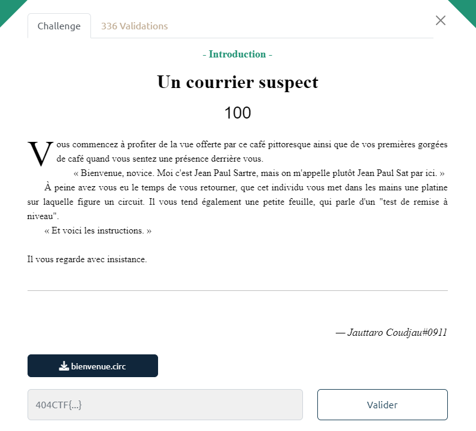
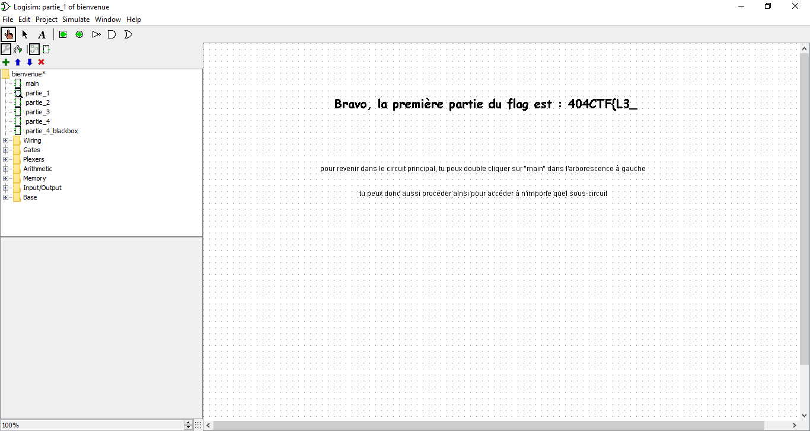
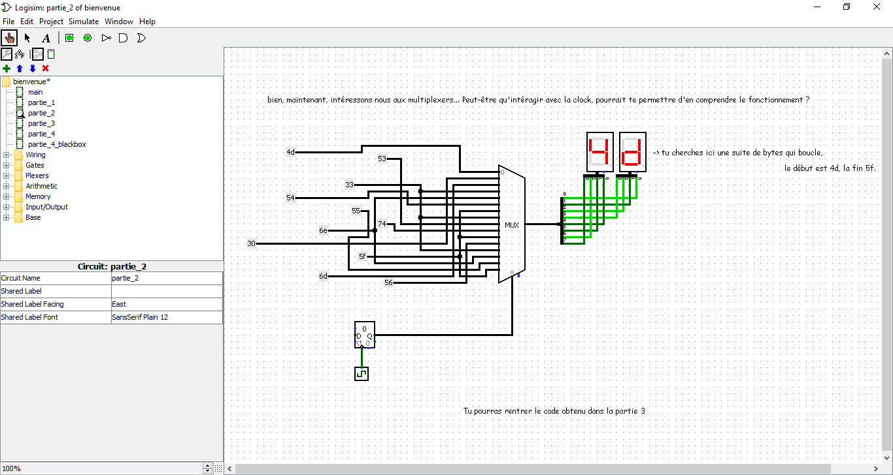
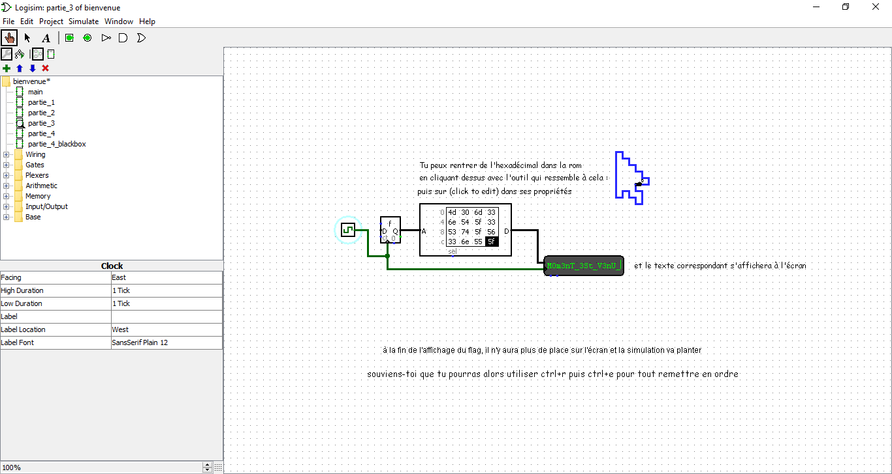
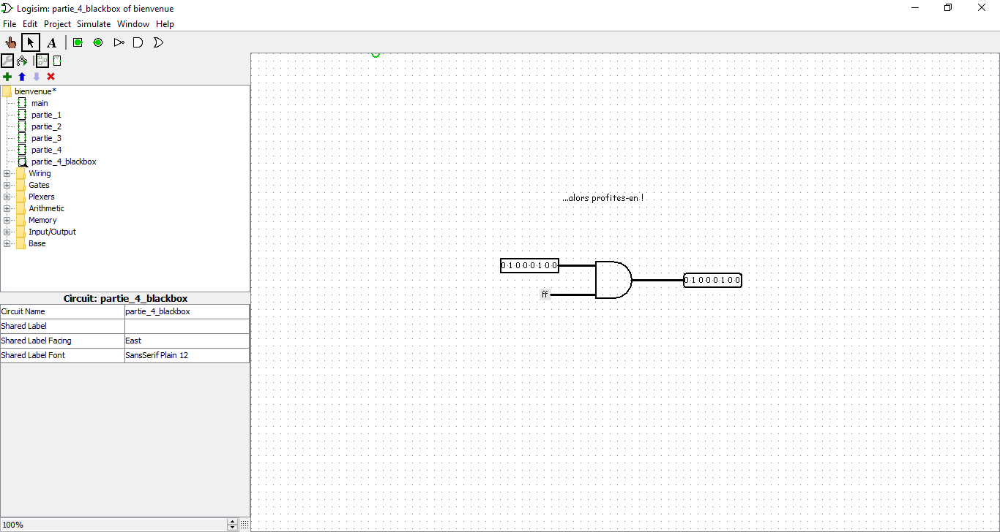

# Write-Up 404-CTF : Un courrier suspect

__Catégorie :__ Sécurité matérielle - Introduction

**Enoncé :**

**Fichiers :** bienvenue.circ

**Résolution :**

Ce challenge nous propose une petite introduction à la sécurité matérielle et notamment au logiciel [Logisim](http://www.cburch.com/logisim/) permettant de créer et simuler des circuits électroniques.

Le challenge est assez simple et se décompose en 4 parties :
- La première nous donne directement un morceau du flag : `404CTF{L3_` 

- La seconde partie nous présente un multiplexer, un composant électronique permettant de choisir entre plusieurs entrées. En cliquant sur l'horloge un nombre de fois assez important pour boucler, on obtient le code suivant : `4d 30 6d 33 6e 54 5f 33 53 74 5f 56 33 6e 55 5f`

- La partie 3 nous propose cette fois de rentrer un code hexa dans un bloc pour produire un texte. En rentrant le code obtenu partie 2, on obtient une autre partie du flag : `M0m3nT_3St_V3nU_`

- La partie 4 nous propose aussi un multiplexer sauf que celui-ci n'a pas l'air de fonctionner. En effet, après celui-ci est placé une blackbox, composé juste d'une porte AND entre 0 et la sortie du multiplexer. En changeant la valeur 0 par 255, la porte AND n'a plus d'effet sur la sortie du multiplexer (laisser 0 et changer par un OR marche aussi).  
Grâce à ce changement, on obtient un nouveau code : `44 33 5f 35 34 6d 75 73 33 72 7d 00`, qu'on peut mettre dans le composant partie 3 pour avoir la dernière partie du flag `D3_54mus3r}`

**Flag :** `404CTF{L3_M0m3nT_3St_V3nU_D3_54mus3r}`