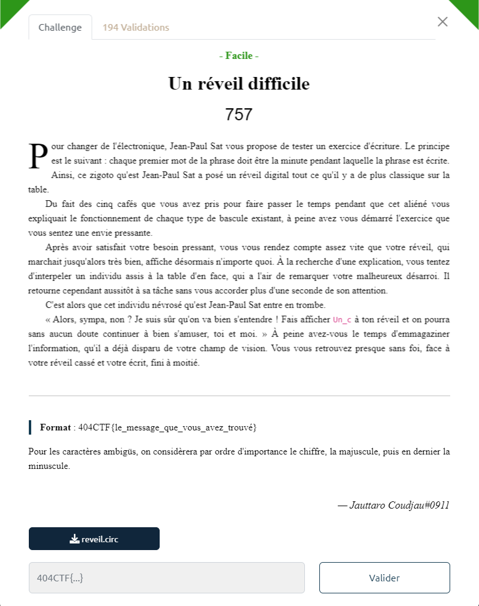
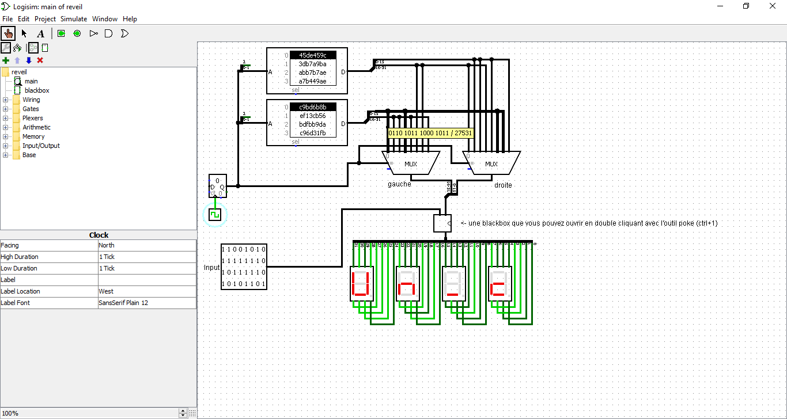

# Write-Up 404-CTF : Un réveil difficile

__Catégorie :__ Sécurité matérielle - Facile

**Enoncé :**

**Fichiers :** reveil.circ

**Résolution :**

Dans ce challenge, nous avons un fichier Logisim composé d'un module `main` ainsi que d'une blackbox. Le fonctionnement est assez simple : nous avons un compteur qui va sélectionner une entrée pour 2 multiplexers, qui vont générer une sortie de 16 bits chacun. Les deux sorties sont concaténées en un nombre de 32 bits, lui même chiffré par la blackbox avant d'être affiché sur 4 afficheurs 7 segments.

Sur la gauche, on peut voir la seconde entrée de la blackbox, un nombre sur 32 bits, correspondant à une clé de chiffrement.  
Sans même entrer dans les détails de la blackbox (composé uniquement de NAND), on voit que chaque bit de la clé ne modifie qu'un et un seul segment d'un afficheur.  
Or on sait que le flag commence par `Un_c` d'après l'énoncé. Donc, en plaçant le compteur sur 0, on a plus qu'à bruteforcer la clé de chiffrement, bit par bit, pour afficher `Un_c` sur l'affichage (max 32 changements, ça devrait le faire).

Une fois la clé trouvée, il ne reste plus qu'à dérouler la simulation pour afficher le reste du flag.

**Flag :** `404CTF{Un_cH1FFrA9e_A55e2_bi3n_d3PreCie}`