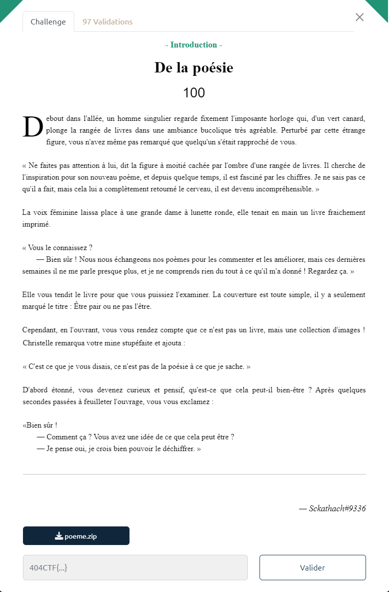
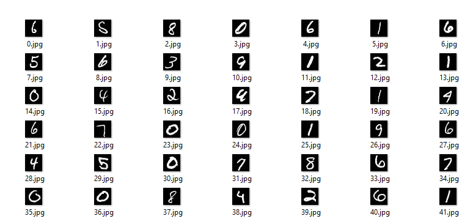

# Write-Up 404-CTF : De la poésie

__Catégorie :__ Intelligence artificielle - Introduction

**Enoncé :**



**Fichiers :** poeme.zip

**Résolution :**

Ce challenge nous propose une petite introduction à l'intelligence artificielle. L'archive fournie contient 6536 images avec un chiffre sur chacune d'entre elles.


Ces images ont toutes une résolution de 28x28 pixels, sont en noir et blanc et rappelle le jeu de données du MNIST pour entrainer des intelligences artificielles à reconnaitre des chiffres (c'est le cas d'école classique).

Le but de ce challenge est donc d'entrainer un réseau de neurones sur le dataset du MNIST afin de reconnaitre le chiffre sur chacune des images. Personnellement, j'avais déjà eu l'occasion de créer ce type de modèle dans le cadre de mes études, à partir du réseau Squeezenet (mais plein d'autres tutos existent pour créer ce genre de modèle). Voilà le script d'entrainement (entrainement d'environ 20 minutes sur une WSL sur un PC sans GPU dédié).

```python
# train.py

import tensorflow as tf

# Load and prepare MNIST dataset
mnist = tf.keras.datasets.mnist

# Normalize dataset
(x_train, y_train) , (x_test, y_test) = mnist.load_data()
x_train = x_train / 255.0
x_test = x_test / 255.0


# Model definition
def fire(x, squeeze, expand):
  y = tf.keras.layers.Conv2D(filters=squeeze, kernel_size=1, padding='same', activation='relu')(x)
  y1 = tf.keras.layers.Conv2D(filters=expand//2, kernel_size=1, padding='same', activation='relu')(y)
  y3 = tf.keras.layers.Conv2D(filters=expand//2, kernel_size=3, padding='same', activation='relu')(y)
  return tf.keras.layers.concatenate([y1, y3])

def fire_module(squeeze, expand):
  return lambda x: fire(x, squeeze, expand)

x = tf.keras.layers.Input(shape=[28, 28, 1])

y = tf.keras.layers.Conv2D(kernel_size=3, filters=32, padding='same', activation='relu')(x)
y = fire_module(24, 48)(y)
y = tf.keras.layers.MaxPooling2D(pool_size=2)(y)
y = fire_module(24, 48)(y)
y = tf.keras.layers.MaxPooling2D(pool_size=2)(y)
y = fire_module(24, 48)(y)
y = tf.keras.layers.GlobalAveragePooling2D()(y)
y = tf.keras.layers.Dense(10, activation='softmax')(y)

model = tf.keras.Model(x, y)

loss_fn = tf.keras.losses.SparseCategoricalCrossentropy()

model.compile(
    optimizer='adam',
    loss= loss_fn,
    metrics=['accuracy']
)

model.summary()

# Adjust model parameters to minimize the loss and train it
model.fit(x_train, y_train, epochs=10)

# Evaluate model performance and save
model.evaluate(x_test, y_test, verbose=1)
model.save("squeezenet_mnist.h5")
```

Le modèle que j'ai obtenu a une précision d'environ 98.5% ce qui est assez correct pour ce challenge.

Maintenant que nous avons le modèle [squeezenet_mnist.h5](./squeezenet_mnist.h5), nous pouvons l'utiliser sur les 6536 images fournies. Un autre vrai challenge aurait été de déterminer le chiffre sur chaque image à la main, mais cette méthode sera probablement encore plus longue que d'entrainer un modèle 👀

Un script Python nous permet de charger le modèle et de déterminer le chiffre présent sur chaque image.

```python
# script.py

from PIL import Image
import tensorflow as tf
import numpy as np

model = tf.keras.models.load_model("squeezenet_mnist.h5")

# Predictions
res = ""
for i in range(6536):
    img = np.array([np.array(Image.open(f"images/{i}.jpg"))])
    predictions = model(img)
    prediction = np.argmax(predictions)
    res += str(prediction)

with open('decoded.txt', "w") as f:
    f.write(res)
```

Après plus de 2 minutes de prédictions, nous obtenons grâce à modèle un fichier texte contenant tous les chiffres présents dans l'image. Cependant, il nous reste une dernière étape avant d'avoir le flag, étape plus proche de la stéganographie.  
L'indication se trouve dans l'énoncé, notamment dans le titre du livre : `Être pair ou ne pas l'être`.  
L'idée ici est donc de remplacer chaque nombre pair par 0 et chaque nombre impair par 1, regrouper les 0 et 1 par paquet de 8 et les transformer en caractères selon la table ascii.  
Bien sûr, on automatise la tâche avec un script Python, encore une fois :
```python
# decode.py
import sys

sys.set_int_max_str_digits(7000)

res = ""
with open('decoded.txt', "r") as f:
    res=f.readline()

poeme = []

for i in range(817): # 
    chunck = res[i*8:(i+1)*8]
    binstr = "".join(str(int(c) % 2) for c in chunck)
    poeme.append(int(binstr, 2))

poeme_bytes = bytes(poeme)
print("".join(chr(c) for c in poeme_bytes))
```

Bingo ! Le script nous renvoie bien un texte :
```
Et2e pair ou ne pas lettre

L’(omme, dont la vie entière
Est de 96 a.s,
Dort le 1/3 de sa carrière,
C'est juste 32 ans.Ajoutons pour maladies,
Procès, voyages, acci`ents
Au moins 1/4 de la vie,
C'ast Encore 2 foé3 12 ans.

Par jour 2 heures d'études
O5 de travaux - fonp 8 ans,
Noirs chagrins, inquiétudes
Pour le dou`le vont 16 als.Pour affaires qu'on projetTe
1/2-heure, - encore 2 ans.
5/4 d'heures de toilette
Barbe et baetera - 7`anq.

Par jour pour manger et boire
2 font bien 8 ans.
Cela porte le mémoire
Jusqu'à 95 ans.Rdste encore 1 a. po5r faire
Ce qu'oi3eaux font au printemps.
Par jour l'homm% a donc sur 4erre
1/4 d'heure de bon temps.
Juste assez pour déposEr le $rapeau sur le 404CTF :
404CTF{D#_L4_p03S1e_qU3lqU3_@3u_C0nT3mp0r4in3}

oème original : Le ñuart d'heure de bon tempr Nicolas Boileau
```

On remarque cependant des problèmes dû aux imprécisions du modèle. Cependant, on a pu repérer le flag ainsi que ça position. Il n'y a plus qu'à faire des ajustements à la main pour obtenir le flag.

**Flag :** `404CTF{d3_L4_p03S1e_qU3lqU3_P3u_C0nT3mp0r4in3}`

PS : J'ai vachement galéré pour flag à cause du premier D (`1000100`) qui était en fait un d (`1100100`). Heureusement qu'il était au début...