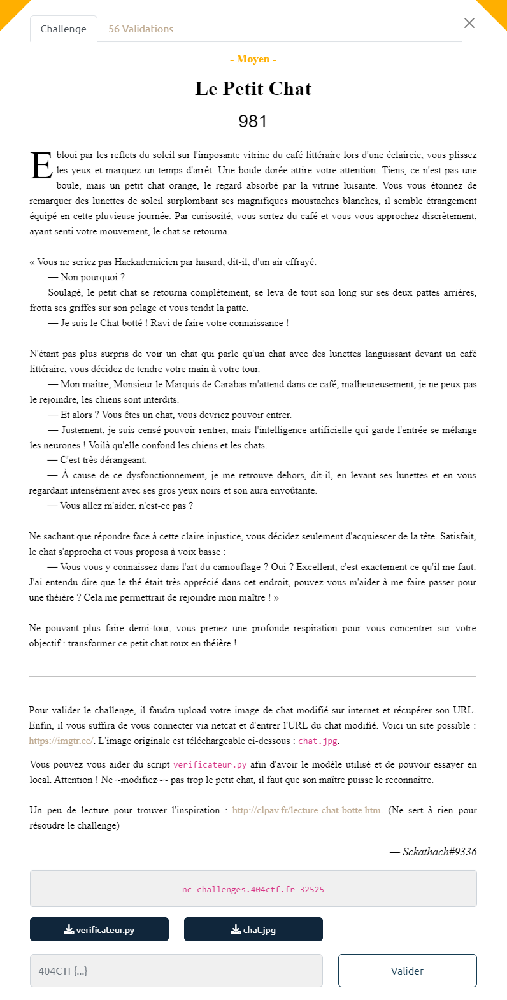
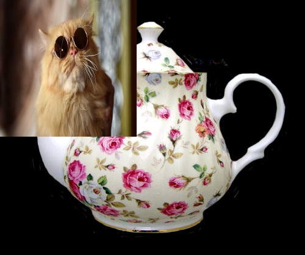

# Write-Up 404-CTF : Le Petit Chat

__Catégorie :__ Intelligence artificielle - Moyen

**Enoncé :**

**Fichiers :** `verificateur.py`, `chat.jpg`

**Résolution :**

Ce challenge est probablement un des challenges les plus fun que j'ai eu à faire dans ce CTF.  

Pour réussir, nous devons "simplement" transformer un chat en théière aux yeux d'une intelligence artificielle... sans trop modifier le chat d'origine.  
On nous fournit à la fois l'image de chat à transformer mais aussi le programme Python de vérification.

En se baladant dans le programme de vérification, nous voyons bien 2 parties : 
- Une partie IA qui vérifie si l'image est une théière en se basant sur un modèle ResNet50
- Une partie qui vérifie si le chat n'a pas été trop modifié : l'image modifié est comparé au chat pixel par pixel et la distance entre pixel ne doit pas dépasser 70

Pour réussir à passer le système de surveillance, nous devons mettre en place une "adversarial attack par descente de gradient", attaque permettant de modifier très légèrement une image sans que cela soit visible à l'oeil nu mais qui fera échouer une IA.  
Enfin ça, c'est d'après le créateur du challenge...  
En pratique, le script `verificateur.py` a un autre problème : la partie IA prend l'image en entier mais la partie vérification du chat ne regarde que les 224x224 premiers pixels de l'image, correspondant à la taille original du chat.

Du coup, il suffit simplement de prendre une grosse image de théière et y déposer le chat en haut à gauche pour duper l'algorithme.  
Elle est pas belle ma théière ?

**Flag :** `404CTF{qU3l_M4n1f1qu3_the13R3_0r4ng3}`