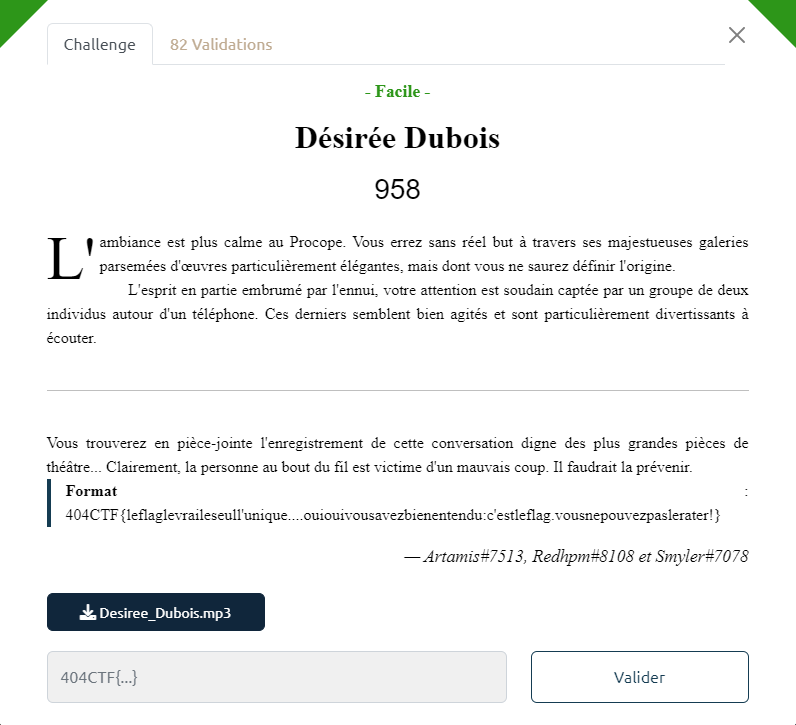
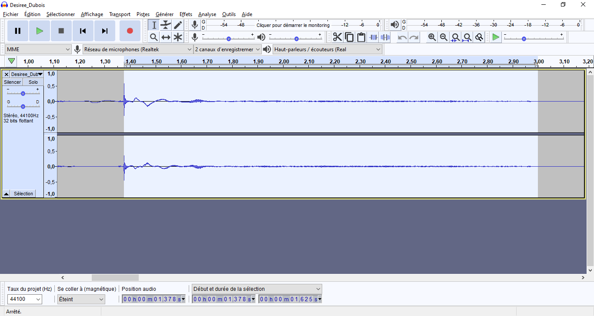

# Write-Up 404-CTF : Désirée Dubois

__Catégorie :__ Divers - Facile

**Enoncé :**



**Fichiers :** Desiree_Dubois.mp3

**Résolution :**

Dans ce challenge, nous avons accès à l'enregistrement audio d'une conversation entre 2 personnes. Ces deux personnes sont en train de monter un mauvais coup contre M. Désirée Dubois. Il faudrait le prévenir ... mais comment ?

Ce challenge donne clairement peu d'indications sur comment il peut être résolu, ainsi que sur le format du flag. Aussi, le fait que ça soit un challenge divers nous indique seulement qu'il s'agit d'un truc tordu, ne pouvant être mis dans aucune autre catégorie 😀

Une analyse classique du fichier avec des outils de stégano ne donne absolument rien, il faut donc s'intéresser au contenu même de la conversation. On entend deux personnes en train de discuter ensemble avant de taper un numéro de téléphone, puis appeler le fameux Désirée Dubois. Et si le numéro de téléphone a été tapé sur un téléphone à cadran, ce n'est pas par hasard.

En effet, chaque chiffre du numéro va produire un son de longueur différent, 1 étant le plus court et 0 le plus long. Donc, en utilisant un logiciel comme Audacity, nous pouvons retrouver le numéro de téléphone de M. Dubois.



On mesure les temps suivants (le début est relatif à mon découpage de l'enregistrement):
```
 Début  | Durée
--------|-------
 01.36s | 1,62s
 04.08s | 0,91s
 05.95s | 0,97s 
 07.92s | 1,38s
 10.12s | 0,49s
 11.80s | 1,66s
 14.36s | 1,00s
 16.02s | 0,60s
 17.87s | 0.96s
 19.79s | 0.88s
```
En supposant que le plus court (0.49s) correspond à 1 et le plus long (1,66s) correspond au 0 comme sur un vrai téléphone à cadran. En estimant que le temps pour chaque chiffre augmente de manière linéaire, on a 0.13s entre chaque chiffre, donnant le tableau de correspondance suivant :

| 1 | 2 | 3 | 4 | 5 | 6 | 7 | 8 | 9 | 0 |
|---|---|---|---|---|---|---|---|---|---|
| 0.49 | 0.62 | 0.75 | 0.88 | 1.01 | 1.14 | 1.27 | 1.40 | 1.53 | 1.66 |

Cette table correspond assez bien aux temps mesurés. En associant chaque temps à son numéro, on retrouve le numéro suivant : `04 58 10 52 54`.

Mais ce n'est pas terminé ! Après avoir tenté de rentrer le numéro de téléphone comme flag sous différent format, j'ai finalement essayer d'appeler directement le numéro de téléphone, comme le suggère l'énoncé, pour prévenir Désirée Dubois.

Et ma surprise fût totale lorsqu'il décrocha ! Bon, il s'agissait d'un message enregistré avec la voix de Désirée Dubois qui te disant de "rentrer juste le flag, sans espaces et en minuscules dans le format habituel et ça devrait fonctionner"...


**Flag :** `404CTF{justeleflag}`