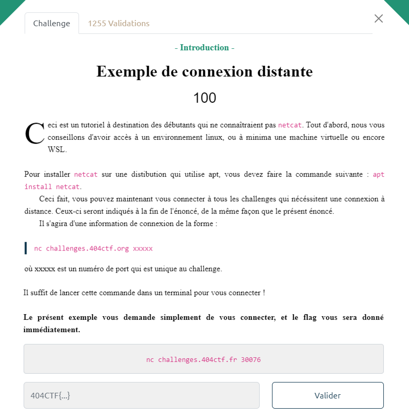

# Write-Up 404-CTF : Exemple de connexion distante

__Catégorie :__ Divers - Introduction

**Enoncé :**

**Résolution :**

Ce challenge a pour vocation à nous présenter les connexions distantes. En effet, certains challenges demandent de se connecter pour obtenir un flag. En entrant `nc challenges.404ctf.fr 30076` dans un terminal, on obtient le flag.

**Flag :** `404CTF{I_<3_nc}`