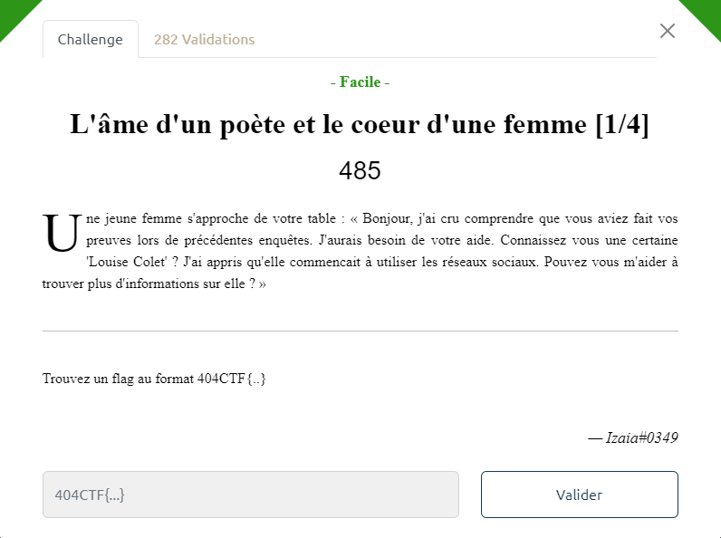
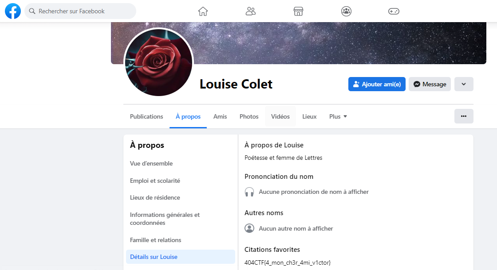

# Write-Up 404-CTF : L'âme d'un poète et le coeur d'une femme [1/4]

__Catégorie :__ Renseignement en sources ouvertes - Facile

**Enoncé :**

**Résolution :**

Dans ce challenge, nous devons trouver des informations sur une certaine Louise Collet s'étant lancé sur les réseaux sociaux assez récemment.

Mon premier réflexe a été d'aller chercher son nom sur Facebook et, après avoir regardé 2-3 profils, j'ai pu trouver celui correspondant au challenge du CTF.

**Flag :** `404CTF{4_mon_ch3r_4mi_v1ctor}`