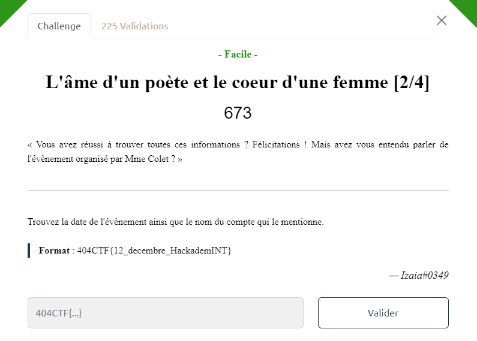
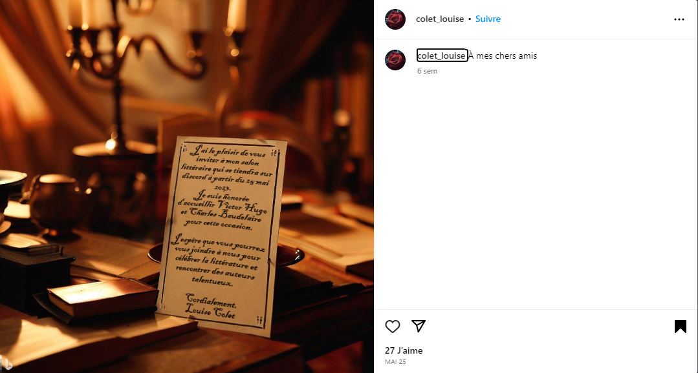

# Write-Up 404-CTF : L'âme d'un poète et le coeur d'une femme [2/4]

__Catégorie :__ Renseignement en sources ouvertes - Facile

**Enoncé :**

**Résolution :**

Dans cette seconde partie, nous devons retrouver la date d'un évènement organisé par Louise Colet et le compte qui le mentionne. Le profil Facebook trouvé en première partie n'aide pas vraiment à l'enquête et des recherches comme "évènements louise colet" sur Internet ne sont pas plus fructueuse.

C'est en recherchant Louise Colet sur d'autres réseaux sociaux que ma recherche à porter ces fruits. C'est en cherchant sur Instagram que j'ai pu retrouver Louise Colet, avec un post dédié à l'évènement.

**Flag :** `404CTF{25_mai_colet_louise}`