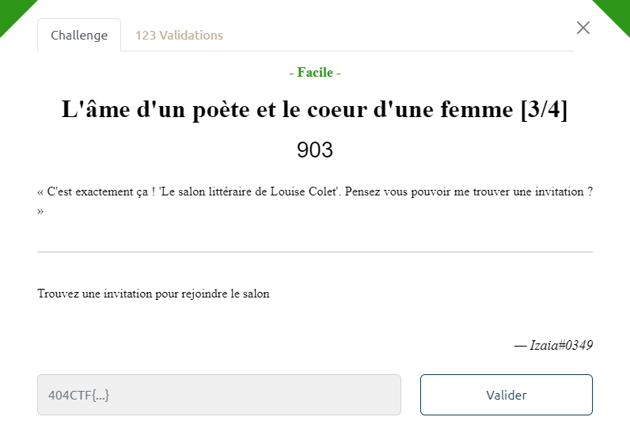
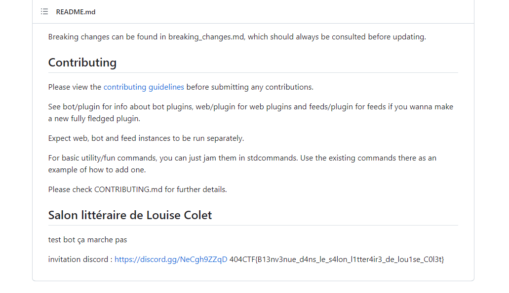

# Write-Up 404-CTF : L'âme d'un poète et le coeur d'une femme [3/4]

__Catégorie :__ Renseignement en sources ouvertes - Facile

**Enoncé :**

**Résolution :**

Pour cette troisième partie, nous devons trouver une invitation vers le salon de Louise Colet, organisé sur un serveur Discord.  

Comme pour les parties précédentes, ni le profil Facebook, ni le profil Instagram ne donne plus d'informations sur ce salon. De plus, les recherches Google "salon louise colet 25 mai" ne donnent absolument rien, sauf éventuellement des liens vers de vrais évènements, mais ce n'est pas ce qu'on recherche.

Cependant, une bonne pratique en OSINT est de savoir varier ses outils. En particulier, changer de navigateur et de moteur de recherche permet d'avoir des résultats beaucoup moins bien référencés sur Google mais parfois beaucoup plus pertinents.

Après un bon nombre de recherche en tout genre sur Google, la solution est venue toute seule en utilisant Yahoo! (et oui, comme quoi tout est possible). Une simple recherche "louise colet salon litteraire" m'a permis de tomber sur un [dépôt GitHub](https://github.com/LouiseRevoil/Salon-litteraire-de-Louise-Colet) contenant le code d'un bot Discord ainsi que le lien du serveur et un flag.

**Flag :** `404CTF{B13nv3nue_d4ns_le_s4lon_l1tter4ir3_de_lou1se_C0l3t}`