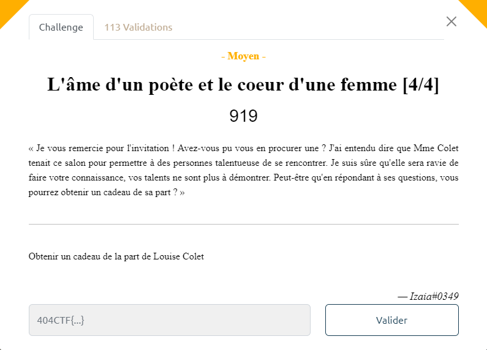
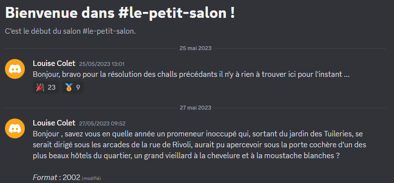
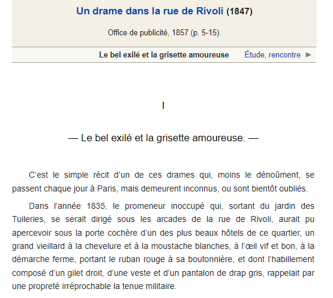
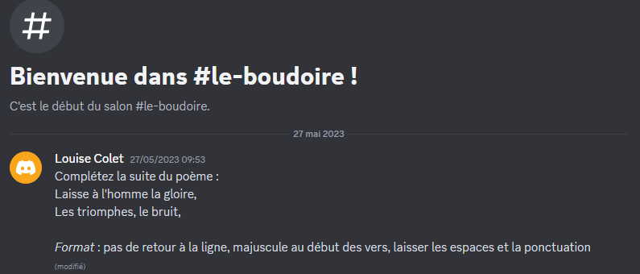
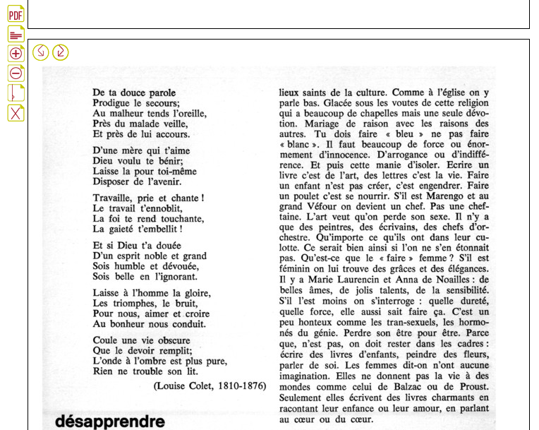
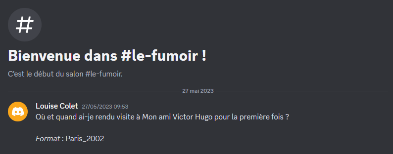
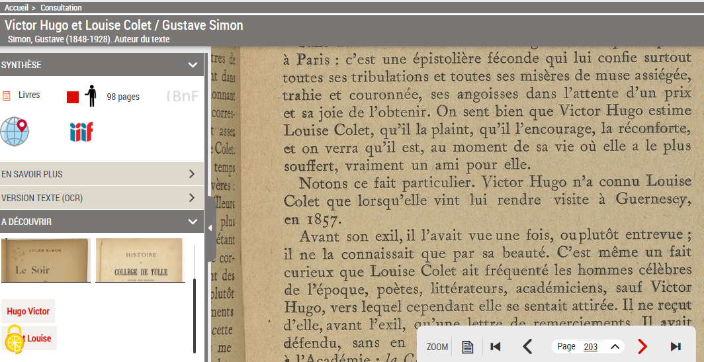
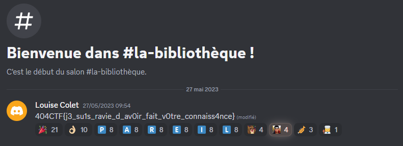

# Write-Up 404-CTF : L'âme d'un poète et le coeur d'une femme [4/4]

__Catégorie :__ Renseignement en sources ouvertes - Moyen

**Enoncé :**

**Résolution :**

Dernier challenge de cette série ! Cette fois, nous avons rejoint le serveur Discord de Louise Colet, le fameux "salon littéraire" dans lequel nous avons accès à 3 salons.  
Le but sera de répondre à différentes questions afin d'obtenir le flag.

Première étape : accéder aux questions. Il suffit de lire le message de bienvue lorsque vous arrivez sur le serveur Discord (c'est simple, mais on peut facilement perdre beaucoup de temps si on lit trop vite ce genre de message 🙃)

Après être entré dans "le-petit-salon", Louise Colet nous pose la première question :

Pour répondre à cette question, il suffit de la taper quasi mot pour mot sur Internet afin d'avoir la réponse. Il s'agit d'un extrait du livre "Un drame dans la rue de Rivoli", disponible sur Wikisource.

Réponse : `1835`

La seconde question se trouve dans "le-boudoire" :

Même méthode que précédemment. En tapant le début du poème, on tombe sur le poème "L'anticréation" de Louise Colet.

Il ne reste plus qu'à compléter le poème comme demandé : `Pour nous, aimer et croire Au bonheur nous conduit.`

La dernière question se trouve dans "le-fumoir" :

Pour trouver la réponse à cette question, il faut chercher un peu plus. En recherchant "victor hugo louise colet" sur Google, on tombe assez facilement sur un recueil de correspondance entre Louise Colet et Victor Hugo ([site de la BNF](https://gallica.bnf.fr/ark:/12148/bpt6k8572147)).

En lisant ce recueil, on tombe sur l'info recherché à la troisième page :

Réponse : `Guernesey_1857`

Et c'est en répondant à cette dernière question que nous pouvons accéder au salon "la-bibliothèque" avec le flag.

**Flag :** `404CTF{j3_su1s_ravie_d_av0ir_fait_v0tre_connaiss4nce}`