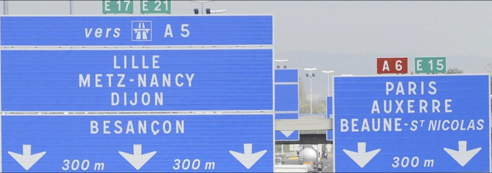

# Write-Up 404-CTF : Le Tour de France

__Catégorie :__ Renseignement en sources ouvertes - Introduction

**Enoncé :**

**Fichiers :** Le_Tour_de_France.png

**Résolution :**

Dans ce challenge d'introduction à l'OSINT, nous avons à notre disposition la photo d'un panneau d'autoroute et nous devons retrouver les coordonnées GPS de l'endroit où a été prise la photo, précises au centième.

Il peut être assez tentant de commencer par regarder où se croise l'A6 et les routes E15, E17 et E21, mais la tâche est plus difficile qu'il n'y parait et ne nous permet pas de géolocaliser précisément l'endroit.

Cependant, nous avons une information bien plus intéressante : nous sommes à 300m de la sortie qui mène à Beaune St-Nicolas. Le nom n'étant pas connu, il s'agit forcément d'une commune dont tu ne vois pas le nom sur un panneau d'autoroute, à moins d'être vraiment à côté.

Il ne reste plus qu'à repérer l'A6 à côté de Beaunes St-Nicolas, se positionner dans le sens allant à Paris et naviguer dans la Street View pour retrouver le bon point de vue.

**Flag :** `404CTF{47.02,4.87}`