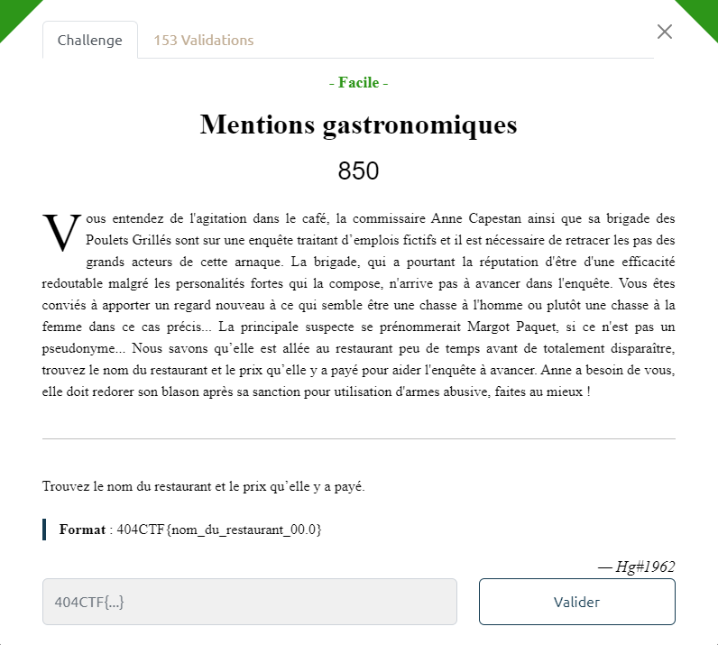
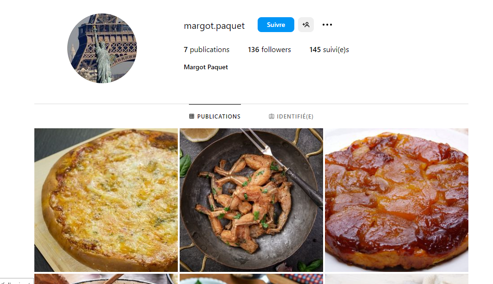
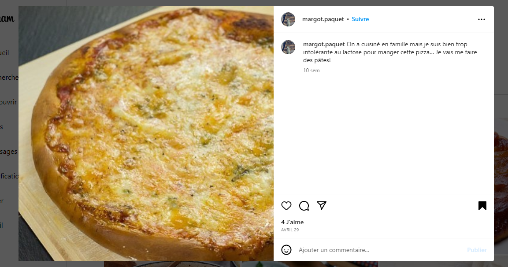
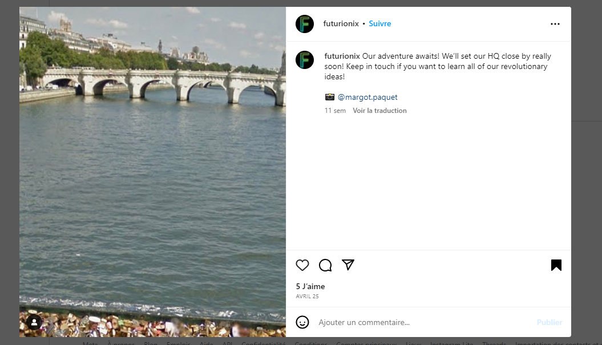
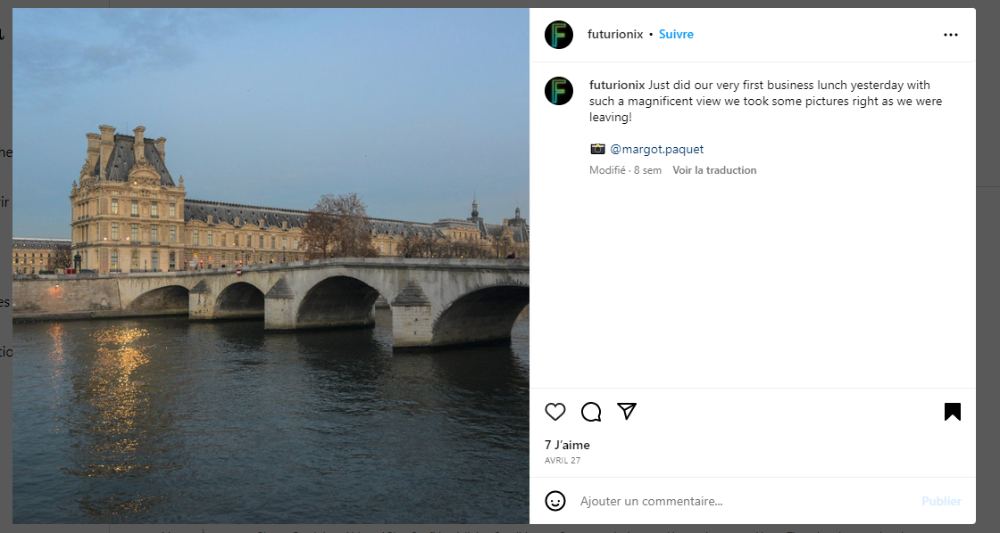
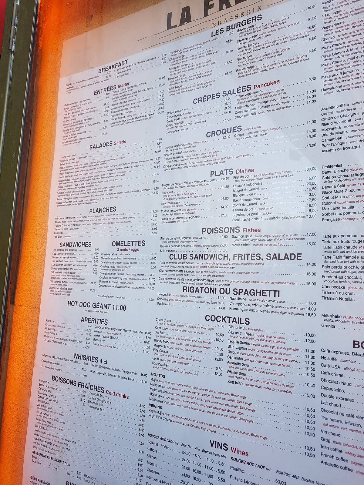

# Write-Up 404-CTF : Mentions gastronomiques

__Catégorie :__ Renseignement en sources ouvertes - Facile

**Enoncé :**

**Résolution :**

Dans ce challenge d'OSINT, nous devons nous renseigner sur une certaine Margot Paquet. Nous devons retrouver le nom du restaurant dans lequel elle a mangé ainsi que le prix payé pour ce repas.  
Cependant, nous n'avons que son nom, plutôt banal, ce qui en fait une maigre piste pour démarrer.

Dans ce genre de situations, j'ai commencé par rechercher les profils correspondant à Margot Paquet sur différents réseaux sociaux. C'est sur Instagram que mes recherches ont portées leurs fruits.

Ce profil n'a pas beaucoup de publications, toute date de moins d'un mois avant l'ouverture du CTF et certaines ne semblent clairement pas se prendre au sérieux (typique d'un compte créé pour un CTF).

Voilà une première piste. De plus, toutes les publications semblent parler de nourriture, donc en plein dans le thème du challenge.  
En fouillant un peu plus dans le profil, on peut voir que Margot est mentionné dans une autre publication d'un certain `futurionix`.

On y apprend que Margot et futurionix sont en train de monter une affaire, mais ce n'est pas le plus intéressant. Dans un autre poste, futurionix publie une photo de la vue qu'il avait en sortie de restaurant après un repas avec sa nouvelle collaboratrice, toujours en mentionnant Margot dans le poste.

Une recherche par image sur Google Images nous permet de retrouver le Pont Royal à Paris, avec vue sur l'école du Louvre.  
Grâce à Google Maps, on arrive donc à retrouver le restaurant le plus proche de l'endroit où a été prise la photo. Il s'agit du restaurant la Frégate.  
Il ne reste plus qu'à retrouver le prix payé. D'après son compte Instagram, elle adore prendre un boeuf bourguignon au restaurant si celui-ci est à moins de 15€. Aussi, on apprend qu'elle a mangé de la tarte tatin le jour où elle est allée au restaurant (le 26 avril).

Il ne reste plus qu'à trouver les prix exacts de ces plats sur Internet, tâche la plus difficile du challenge, à mon avis, notamment pour trouver le boeuf bourguignon à moins de 15€ ([disponible ici](https://fr.restaurantguru.com/Le-Fregate-Paris/menu)).

Finalement, en croisant plusieurs sites et après un grand nombre d'essais, on finit par trouver que le prix payé est de 24€ : 13.50€ pour le boeuf bourguignon, 9.50€ pour la tarte tatin.

**Flag :** `404CTF{la_fregate_24.0}`