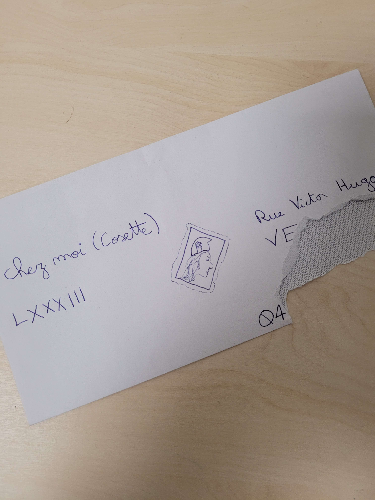

# Write-Up 404-CTF : Les OSINTables [1/3]

__Catégorie :__ Renseignement en sources ouvertes - Facile

**Enoncé :**

**Fichier :** photo.jpg

**Résolution :**

Dans ce challenge d'OSINT, nous devons retrouver l'adresse postale de Cosette à partir d'une photo d'enveloppe qu'elle a elle même envoyée.  
Malheureusement, cette enveloppe est déchirée et il manque une partie de l'adresse.

On observe plusieurs informations intéressantes sur cette enveloppe :
- Un nom de rue : "Rue Victor Hugo"
- Le chiffre 83 en chiffre romain
- Les chiffres 04
- Un début de ce qui peut être un nom de ville : VE

L'adresse est donc probablement le 83 rue Victor Hugo puisque 04 rue Victor Hugo n'est pas un numéro commun pour une adresse (seul le 4 est présent en général).  
Par contre, le 04 est probablement le début d'un code postal ou d'un numéro de téléphone. Il ne reste plus qu'à trouver la ville.  

En recherchant "83 rue Victor Hugo ve" sur Google Maps, on voit plusieurs possibilités, mais aucune dans les Alpes-de-Haute-Provence (04).  
On trouve cependant la commune de Vergèze dans le Gard, dont l'indicatif téléphonique est bien le 04.

**Flag :** `404CTF{83_rue_victor_hugo_vergeze}`