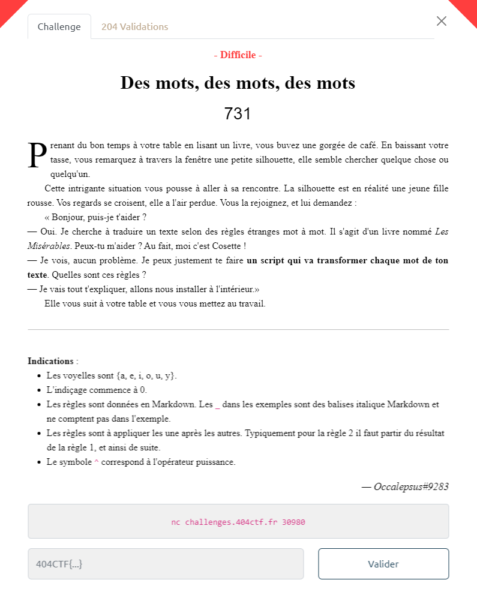

# Write-Up 404-CTF : Des mots, des mots, des mots

__Catégorie :__ Programmation - Difficile

**Enoncé :**



**Résolution :**

Dans ce challenge de programmation, nous avons accès à un serveur nous envoyant des mots et auquel nous devons renvoyer les mots traduits selon certaines règles.

Pour chaque règle, nous avons le droit à un exemple pour bien comprendre. Les règles sont au nombre de 4 (5 si on compte la règle 0 qui consiste à ne rien faire).  
Bien évidemment, il inenvisageable de traduire tout cela à la main et le serveur s'attend à une réponse rapide.  
Pour chaque règle, on peut implémenter un script Python pour traduire le mot donné.

Règle 0 : _ne rien faire_

```python
# Regle 0 : Aucune modification
def regle0(s):
    return s
```

Règle 1 : _Inverser les lettres_

```python
# Regle 1 : Inverser les lettres
def regle1(s):
    return s[::-1]
```

Règle 2 : _Echanger des lettres en fonction du nombre de lettres dans le mot_

```python
# Regle 2 :
# - Si le mot a un nombre de lettres pair, echanger la 1ere et la 2e partie du mot obtenu
# - Sinon, enlever toutes les lettres du mot correspondant a la lettre centrale
def regle2(s):
    if len(s) % 2:
        c = s[(len(s) - 1) // 2]
        return s.replace(c, '')
    else:
        mid = len(s) // 2
        return s[mid:] + s[:mid]
```

Règle 3 : _Décaler les lettres du **mot original** dans un sens selon le nombre de lettre dans le mot obtenu après règle 2_

```python
CONSONNES = "BCDFGHJKLMNPQRSTVWXZbcdfghjklmnpqrstvwxz"

# Regle 3 :
# _Si le mot a 3 lettres ou plus_ :

# - Si la 3e lettre du mot obtenu est une consonne, "decaler" les voyelles vers la gauche dans le mot original,
#   puis reappliquer les regles 1 et 2.
# - Sinon : la meme chose mais les decaler vers la droite.
def regle3(s, orig):
    if len(s) > 2:
        if s[2] in CONSONNES:
            return regle2(regle1(shift_vowels(orig, 1)))
        else:
            return regle2(regle1(shift_vowels(orig, -1)))
    return s
```

Règle 4 : _Une règle assez compliqué à expliquer en quelques mots mais assez bien décrite pour être facile à implémenter avec des petites fonctions utilitaires_

```python
VOWELS = "AEIOUYaeiouy"

# Find the vowel preceding a given consonant
def find_vowel_before(c):
    for v in VOWELS[::-1]:
        if ord(c) > ord(v):
            return v

# `s = SOMME{i=n-1 -> 0}(a{i}*2^(n-i)*Id(l{i} est une voyelle))`
def sum_buf_n(buf, n):
    s = 0
    for i in range(n-1, -1, -1):
        s += ord(buf[i]) * pow(2, n-i) * (1 if buf[i] in VOWELS else 0)
    return s

# Insert c in buf at index n
def insert_at(c, buf, n):
    return buf[:n] + [chr(c)] + buf[n:]

# Invert key value in a dict
def invert_dict(d):
    new_d = {}
    for k, v in d.items():
        try:
            new_d[v].append(k)
        except:
            new_d[v] = [k]
    return new_d
            
# Count letters in a word
def count_letters(s):
    d = {}
    for c in s:
        try:
            d[c] += 1
        except:
            d[c] = 1
    return invert_dict(d)

# trier le mot par ordre decroissant d'occurrences des caracteres, puis par ordre croissant en code ASCII pour les egalites
def sort_regle4(s):
    res = ""
    d = count_letters(s)
    keys = list(d.keys())
    keys.sort()
    keys.reverse()
    for k in keys:
        vals = d[k]
        vals.sort()
        for v in vals:
            res += k*v
    return res

# Regle 4 :
# - Pour `n` allant de 0 a la fin du mot, si le caractere `c` a la position `n` du mot est une consonne (majuscule ou minuscule),
#   inserer en position `n+1` le caractere de code ASCII `a = ((vp + s) % 95) + 32`, ou `vp` est le code ASCII de la voyelle
#   precedant la consonne `c` dans l'alphabet (si `c = 'F'`, `vp = 'E'`), et `s = SOMME{i=n-1 -> 0}(a{i}*2^(n-i)*Id(l{i} est une voyelle))`,
#   ou `a{i}` est le code ASCII de la `i`-ieme lettre du mot, `Id(x)` vaut `1` si `x` est vrai, `0` sinon, et `l{i}` la `i`-ieme lettre du mot.
#   Attention a bien appliquer cette regle aussi sur les caracteres inseres au mot._
#   futur => f&ut\ur@
#   Enfin, trier le mot par ordre decroissant d'occurrences des caracteres, puis par ordre croissant en code ASCII pour les egalites
#   patate => aattep
def regle4(s):
    buffer = list(s)
    l = len(buffer)
    n = 0
    while n < l:
        c = buffer[n]
        if c in CONSONNES:
            vp = ord(find_vowel_before(c))
            sum = sum_buf_n(buffer, n)
            a = ((vp + sum) % 95) + 32
            buffer = insert_at(a, buffer, n+1)
        n += 1
        l = len(buffer)

    return sort_regle4(''.join(buffer))
```

Une fois toutes ces règles implémentées, il ne reste plus qu'à mettre le tout bout à bout et se connecter au serveur pour résoudre le challenge et obtenir le flag.

```python
# Apply 4 rules on a single word
def apply_rules(s):
    r1 = regle1(s)
    r2 = regle2(r1)
    r3 = regle3(r2, s)
    r4 = regle4(r3)
    return(r4)

# Apply 4 rules on every word of a sentence
def apply_rules_sentence(st):
    ws = st.split(' ')
    trs = []
    for s in ws:
        tr = apply_rules(s)
        trs.append(tr)
    return ' '.join(trs)

conn = remote('challenges.404ctf.fr', 30980)

# Get next msg
def getNextStep():
    rules = conn.recvuntil(b": {")
    print(rules.decode())
    buf = conn.recvuntil(b'}')
    return buf[:-1].decode()

# Send msg
def send_msg(s):
    conn.send(s.encode() + b'\n')

# Tuto
send_msg(regle0(getNextStep()))
send_msg(regle1(getNextStep()))
send_msg(regle2(regle1(getNextStep())))
w = getNextStep()
send_msg(regle3(regle2(regle1(w)),w))
w = getNextStep()
send_msg(apply_rules(w))

# Real challenge
s = getNextStep()
msg = apply_rules_sentence(s)
send_msg(msg)

# Print flag
print(conn.recvline().decode())
print(conn.recvline().decode())
print(conn.recvline().decode())

conn.close()
```

**Flag :** `404CTF{:T]cdeikm_)W_doprsu_nt_;adei}`

PS : La règle 3 est vraiment plus galère à comprendre qu'il n'y parait lorsqu'on a pas la solution. Je ne suis clairement pas le seul à mettre fait avoir.


