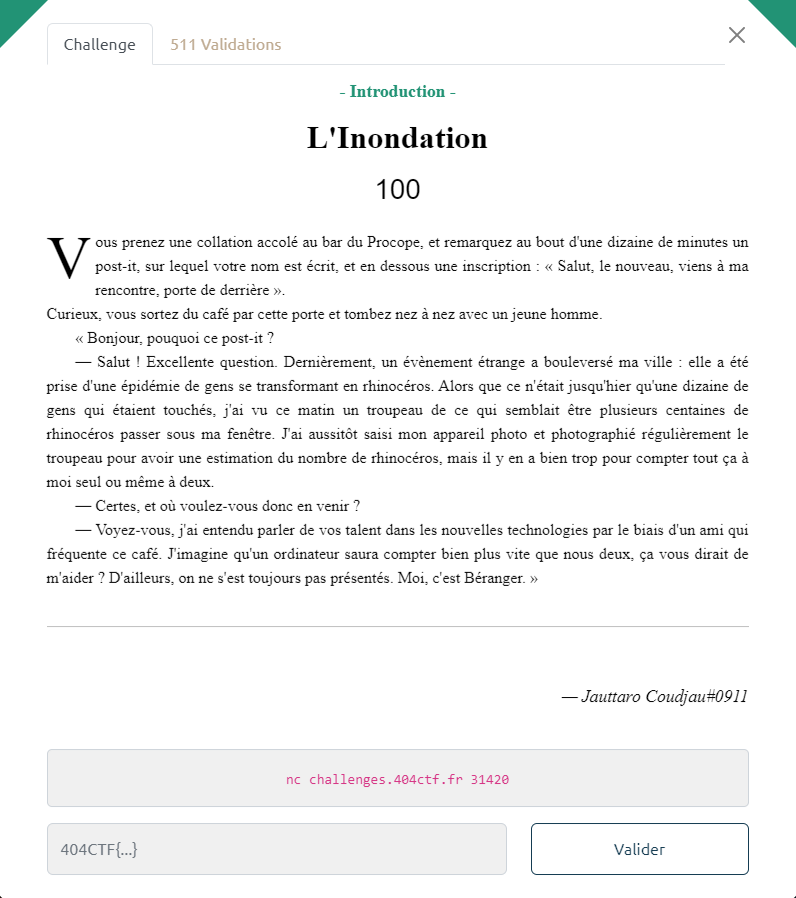

# Write-Up 404-CTF : L'inondation

__Catégorie :__ Programmation - Introduction

**Enoncé :**



**Résolution :**

Dans ce challenge d'introduction à la programmation, nous devons compter le nombre de rhinocéros dans une image, et ce le plus rapidement possible.  
Cependant, pas de difficulté particulière. Il s'agit d'images en caractères ASCII. Les rhinocéros sont représentés par la chaîne de caractères ``~c`°^)``.  

```
« Allez, vite, il y a une pile de photos assez importante à traiter,
comptes-moi le nombre de rhinos par photo. »
     ~c`°^)               ~c`°^)          ~c`°^)                                    ~c`°^)
                                                                 ~c`°^) ~c`°^)
  ~c`°^)                                                                   ~c`°^)       ~c`°^)
      ~c`°^) ~c`°^)        ~c`°^)        ~c`°^) ~c`°^)         ~c`°^)       ~c`°^)
 ~c`°^)        ~c`°^)                                                                 ~c`°^)
   ~c`°^)        ~c`°^)                                                   ~c`°^)
                           ~c`°^)                  ~c`°^)                ~c`°^)
~c`°^)         ~c`°^)       ~c`°^)     ~c`°^)                ~c`°^)                       ~c`°^)
                ~c`°^)                           ~c`°^)        ~c`°^)
                          ~c`°^)     ~c`°^)        ~c`°^)                             ~c`°^)
              ~c`°^)                                                      ~c`°^)         ~c`°^)
                           ~c`°^)         ~c`°^)              ~c`°^)         ~c`°^) ~c`°^)
 ~c`°^)                       ~c`°^)              ~c`°^)         ~c`°^)             ~c`°^)
                  ~c`°^)              ~c`°^)         ~c`°^) ~c`°^)                   ~c`°^)
            ~c`°^)        ~c`°^)         ~c`°^)             ~c`°^)       ~c`°^)       ~c`°^)
~c`°^)        ~c`°^)                ~c`°^)      ~c`°^)       ~c`°^)       ~c`°^)
  ~c`°^)                ~c`°^)                   ~c`°^)       ~c`°^)                    ~c`°^)
                                                  ~c`°^)                               ~c`°^)
~c`°^)      ~c`°^)       ~c`°^)                                                           ~c`°^)
             ~c`°^)       ~c`°^)    ~c`°^)                     ~c`°^)         ~c`°^)     ~c`°^)
              ~c`°^)    ~c`°^)                                    ~c`°^)     ~c`°^)    ~c`°^)
  ~c`°^)                    ~c`°^)     ~c`°^)         ~c`°^)     ~c`°^)                 ~c`°^)
~c`°^)                                                         ~c`°^)       ~c`°^)
    ~c`°^)     ~c`°^)         ~c`°^)               ~c`°^)                             ~c`°^)
                                       ~c`°^)                  ~c`°^)     ~c`°^)     ~c`°^)
      ~c`°^)     ~c`°^)                                       ~c`°^)                 ~c`°^)
               ~c`°^)       ~c`°^)                ~c`°^)                 ~c`°^)
                ~c`°^)                                       ~c`°^)                       ~c`°^)
    ~c`°^)                ~c`°^)     ~c`°^)                                   ~c`°^)
   ~c`°^)                ~c`°^)                                                        ~c`°^)
                         ~c`°^)                       ~c`°^)               ~c`°^)
 ~c`°^)      ~c`°^)      ~c`°^)                   ~c`°^)                     ~c`°^)  ~c`°^)
Combien de rhinocéros comptez-vous dans cette image ?
Votre réponse :
```

Il y a 100 images comme celle-ci à traiter. Il ne reste plus qu'à faire un simple script Python pour résoudre le problème et obtenir le flag.

```python
# script.py
import pwn

rhino = b'~c`\xc2\xb0^)'
conn = pwn.remote('challenges.404ctf.fr',31420)

for i in range(100):
    buf = conn.recvuntil(b'>')
    num_rhino = len(buf.split(rhino)) - 1
    conn.send(str(num_rhino) + '\n')

print(conn.recvuntil(b'marqu\xc3\xa9 '))
print(conn.recvline())

conn.close()
```

**Flag :** `404CTF{4h,_l3s_P0uvo1rs_d3_l'iNforM4tiqu3!}`