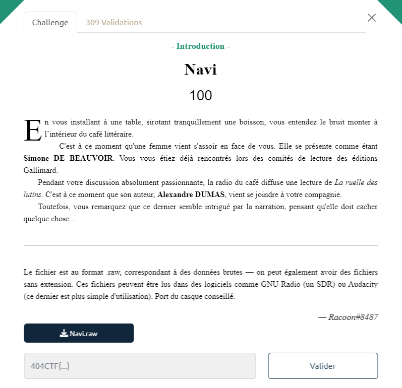

# Write-Up 404-CTF : Navi

__Catégorie :__ Radiofréquences - Introduction

**Enoncé :**



**Résolution :**

Dans ce challenge, nous devons trouver le flag dans un fichier `navi.raw`. L'énoncé nous suggère de l'ouvrir avec Audacity.

Dans Audacity, nous avons accès à un enregistrement audio qui semble accéléré.  
Dans la rubrique `"Effets > Changer vitesse"`, on peut ralentir ou accélérer l'extrait audio.


En divisant la vitesse par 2, on obtient un enregistrement audio compréhensible. Il s'agit d'une version audio de "La ruelle des lutins" par Alexandre Dumas.  
Cependant, on entend assez rapidement une voix étrange, ralentie et incompréhensible en arrière plan.  
D'ailleurs, on entendait déjà cette fois ralentie dans l'enregistrement à vitesse originale.

Pour essayer de comprendre la voix, on revient en vitesse original puis on accélère même l'enregistrement par 1,5. Ensuite, pour rendre la voix compréhensible, on essaie d'inverser le sens de l'enregistrement.

Ces modifications nous donne bien une voix qui, vers 1:50 nous dit `"La solution est en hexadécimal : ..."`.  
Pour rendre les caractères plus compréhensible, on peut réduire les aigus de 30dB (deux fois si nécessaire), ce qui nous permet d'obtenir une chaine de caractère hexa.  

Il ne reste plus qu'à la décoder avec un script pour avoir le flag.
```python
# script.py
solution = "34 30 34 43 54 46 7b 31 74 72 30 5f 34 55 78 5f 52 34 64 31 30 2d 66 52 33 71 55 33 4e 63 33 35 7d"
print(bytes.fromhex(solution.replace(' ', '')))
```

**Flag :** `404CTF{1tr0_4Ux_R4d10-fR3qU3Nc35}`