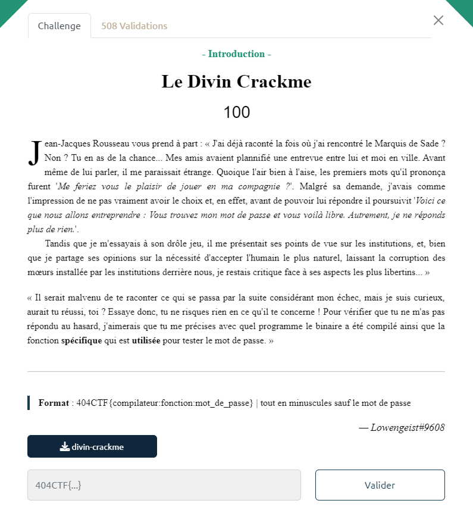
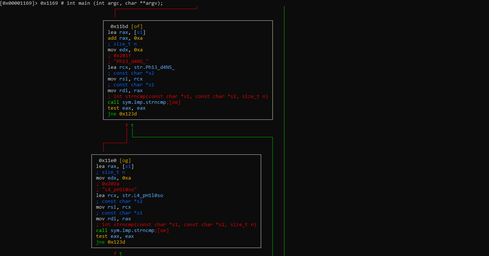

# Write-Up 404-CTF : Le Divin Crackme

__Catégorie :__ Rétro-ingénierie - Introduction

**Enoncé :**



**Fichiers :** divin-crackme

**Résolution :**

Dans cette introduction à la rétroingénierie, nous devons trouver trois informations concernant un exécutable qui nous est donné. Nous devons retrouver le compilateur, la fonction utilisée pour vérifier le mot de passe ainsi que le mot de passe.

Pour le compilateur, il suffit d'aller voir dans la section `.comment` du binaire grâce à la commande `objdump`.
```
$ objdump -s --section .comment divin-crackme

divin-crackme:     file format elf64-x86-64

Contents of section .comment:
 0000 4743433a 20284465 6269616e 2031322e  GCC: (Debian 12.
 0010 322e302d 31342920 31322e32 2e3000    2.0-14) 12.2.0.
```

On voit que le programme a été compilé en utilisant `gcc` sur Debian 12.

Pour le reste, il faut utiliser un outil d'analyse de code. J'aime personnelement utiliser radare2 pour comprendre un peu mieux un programme inconnu.  
On ouvre donc radare2 et on exécute la suite de commande `aaaa`, `afl`, `s main` et `VVV` qui permettent d'analyser le code, de lister les fonctions, d'aller à la fonction `main` et d'afficher le flow d'exécution de la fonction.



Le code est assez simple. Il vérifie d'abord si le mot de passe entré fait 30 caractères. Si c'est le cas, il vérifie ensuite que les caractères 10 à 20 sont égaux à la chaîne `Ph13_d4N5_` grâce à la fonction `strncmp`.
Si c'est validé, le programme vérifie ensuite que les 10 premiers caractères sont égaux à `L4_pH1l0so` puis que les derniers soient égaux à `l3_Cr4cKm3`, et ce toujours avec la fonction `strncmp`.

Le mot de passe final est donc `L4_pH1l0soPh13_d4N5_l3_Cr4cKm3`. Nous n'avons plus qu'à remettre les infos dans l'ordre pour obtenir le flag.

**Flag :** `404CTF{gcc:strncmp:L4_pH1l0soPh13_d4N5_l3_Cr4cKm3}`