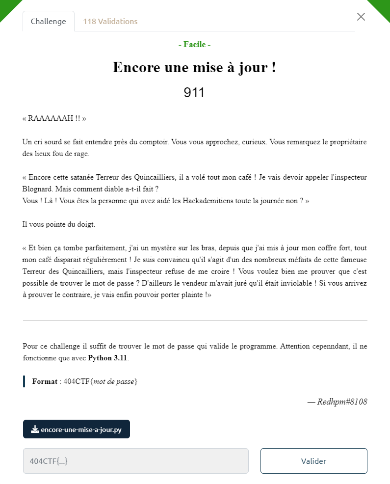

# Write-Up 404-CTF : Encore une mise à jour !

__Catégorie :__ Rétro-ingénierie - Facile

**Enoncé :**



**Fichiers :** encore-une-mise-a-jour.py

**Résolution :**

Dans ce challenge, nous devons analyser un code python utilisant des nouveautés de la version 3.11.  
Le code présenté est plutôt simple : le programme demande à l'utilisateur d'entrer un mot de passe. Si celui-ci fait 48 caractères et qu'il passe la fonction `check()` 10 fois, nous pouvons utiliser le flag en tant que mot de passe.  
La fonction `check()`, quant à elle, est une suite de 64 équations et nous devons en passer exactement 32. Les équations ont toutes le même format : `dumas[i] + dumas[i+1] + cody * dumas[i+2] == n` ou `dumas[i] + cody *dumas[i+1] + dumas[i+2] == n` avec `i` un multiple de 3, compris entre 0 et 45 inclus.

Avec un print en début de fonction check, on voit que la variable `cody` a la valeur 518. Malheureusement, il y a trop d'équations pour avoir un mot de passe unique. Il faut rajouter d'autres contraintes.  
Dans mon cas, je suis parti du constat que `dumas[i]` devait être un caractère ascii imprimable, donc sa valeur numérique comprise entre 33 et 126.

Il ne reste plus qu'à résoudre les équations avec ces contraintes.  
Dans un premier temps, je créé un dictionnaire python dont les clés sont les équations (sans dumas[i]) et les valeurs sont les résultats.

```python
my_dict = {
    "518 * p[37] + p[38]" : 25556,
    "518 * p[4] + p[5]" : 19862,
    "518 * p[22] + p[23]" : 39570,
    "p[1] + 518 * p[2]" : 35329,
    "p[7] + 518 * p[8]" : 67347,
    "p[4] + 518 * p[5]" : 100914,
    "518 * p[4] + p[5] " : 49274,
    "518 * p[7] + p[8]" : 61221,
    "p[37] + 518 * p[38]" : 64773,
    "p[10] + 518 * p[11]" : 49360,
    "518 * p[10] + p[11]" : 18857,
    "518 * p[10] + p[11] " : 46721,
    "p[16] + 518 * p[17]" : 58164,
    "p[16] + 518 * p[17] " : 144852,
    "p[13] + 518 * p[14]" : 147438,
    "p[13] + 518 * p[14] " : 59202,
    "518 * p[46] + p[47]" : 39501,
    "518 * p[13] + p[14]" : 25080,
    "518 * p[16] + p[17]" : 27661,
    "p[19] + 518 * p[20]" : 135810,
    "518 * p[16] + p[17] " : 68683,
    "518 * p[13] + p[14] " : 62232,
    "518 * p[25] + p[26]" : 66114,
    "518 * p[28] + p[29]" : 25071,
    "518 * p[7] + p[8] " : 152553,
    "p[7] + 518 * p[8] " : 27099,
    "p[22] + 518 * p[23]" : 54563,
    "518 * p[46] + p[47] " : 98325,
    "p[40] + 518 * p[41]" : 115125,
    "518 * p[25] + p[26] " : 26640,
    "p[22] + 518 * p[23] " : 135833,
    "p[40] + 518 * p[41] " : 46239,
    "p[1] + 518 * p[2] " : 87961,
    "p[28] + 518 * p[29]" : 144847,
    "p[31] + 518 * p[32]" : 35402,
    "p[28] + 518 * p[29] " : 58159,
    "p[4] + 518 * p[5] " : 40542,
    "518 * p[1] + p[2]" : 42776,
    "518 * p[31] + p[32]" : 57633,
    "518 * p[43] + p[44]" : 26019,
    "p[19] + 518 * p[20] " : 54540,
    "518 * p[19] + p[20] " : 51438,
    "518 * p[22] + p[23] " : 98394,
    "p[25] + 518 * p[26]" : 51973,
    "p[25] + 518 * p[26] " : 129373,
    "p[31] + 518 * p[32] " : 88034,
    "518 * p[1] + p[2] " : 17234,
    "518 * p[31] + p[32] " : 143547,
    "518 * p[34] + p[35]" : 43078,
    "p[34] + 518 * p[35]" : 42770,
    "518 * p[34] + p[35] " : 107320,
    "p[37] + 518 * p[38] " : 26073,
    "p[34] + 518 * p[35] " : 17228,
    "518 * p[40] + p[41]" : 27627,
    "518 * p[40] + p[41] " : 68649,
    "518 * p[28] + p[29] " : 62223,
    "518 * p[43] + p[44] " : 64719,
    "p[46] + 518 * p[47]" : 29161,
    "p[43] + 518 * p[44]" : 35842,
    "518 * p[37] + p[38] " : 63482,
    "p[43] + 518 * p[44] " : 89248,
    "p[46] + 518 * p[47] " : 72505
}
```


Ensuite, on utilise le fait que pour chaque équation `33 <= dumas[i] <= 126` et que `dumas[i+1] = (n - dumas[i] - dumas[i+2]) / 518` (l'autre format d'équation marche aussi).

Ainsi, on a donc 
```
(n - 252) / 518 <= dumas[i+1] <= (n - 66) / 518
```
Pour un `n` donné, on peut s'assurer qu'il y a au plus un seul entier entre ces deux limites. Si cet entier existe, il s'agit de `dumas[i+1]`, sinon l'équation n'est pas soluble.

On répète le process pour chaque opération, ce qui nous permet de commencer à remplir un tableau password.

```python
from math import floor
import re

password = [None] * 48

def interval(k, n):
    a = (n-252)/518
    b = (n-66)/518
    res = re.search(r'.*518 \* (p\[(\d+)\]).*', k)
    i = int(res.group(2))
    
    if(floor(a) != floor(b)):
        c = floor(b)
        t = (n, chr(c), n - 518 * c)
        if(password[i] != None):
            password[i].append(t)
        else:
            password[i] = [t]

for k in my_dict:
    interval(k, my_dict[k])
```

La fonction `interval()` ci-dessus remplit la case correspondante du tableau `password` avec un triplet `(n ; dumas[i] ; n - 518 * dumas[i])`, utilisé dans la suite du programme.  
A ce stade, nous avons le password suivant :
```
[None, [(17234, '!', 140)], [(35329, 'D', 105)], None, [(19862, '&', 178)], [(40542, 'N', 138)], None, [(61221, 'v', 97)], [(27099, '4', 163)], None, [(18857, '$', 209), (46721, 'Z', 101)], [(49360, '_', 150)], None, [(25080, '0', 216), (62232, 'x', 72)], [(59202, 'r', 150)], None, [(27661, '5', 207)], [(58164, 'p', 148)], None, [(51438, 'c', 156)], [(135810, 'Ć', 94), (54540, 'i', 150)], None, [(39570, 'L', 202)], [(54563, 'i', 173), (135833, 'Ć', 117)], None, [(26640, '3', 222)], [(51973, 'd', 173)], None, [(25071, '0', 207)], [(58159, 'p', 143)], None, [(57633, 'o', 135)], [(35402, 'D', 178)], None, [(43078, 'S', 84), (107320, 'Ï', 94)], [(17228, '!', 134)], None, [(25556, '1', 174)], [(26073, '2', 173)], None, [(27627, '5', 173)], [(115125, 'Þ', 129), (46239, 'Y', 137)], None, [(26019, '2', 119)], [(35842, 'E', 100), (89248, '¬', 152)], None, [(39501, 'L', 133)], [(29161, '8', 153)]]
```

Pour chaque triplet `(dumas[i], dumas[i+1], dumas[i+2])`, nous avons `dumas[i] = None` ainsi qu'une ou deux solutions possibles pour les deux autres membres.  
Si nous n'avons qu'une solution possible, on en déduit facilement `dumas[i]`.  
Si `dumas[i+1]` n'a qu'une solution et `dumas[i+2]` en a deux, il suffit de choisir celle fonctionnant avec `dumas[i+1]` et en déduire `dumas[i]`.  Même chose si `dumas[i+1]` possède deux solutions et `dumas[i+2]` n'en a qu'une.  
Heureusement, nous n'avons aucun cas avec deux solutions possibles pour chaque.

Il suffit d'écrire un script implémentant la logique ci-dessus pour obtenir le flag :

```python
for i in range(0,48,3):
    i_1 = i+1
    i_2 = i+2
    if(len(password[i_1]) == 1 and len(password[i_2]) == 1):
        (n1, c1, r1) = password[i_1][0]
        (n2, c2, r2) = password[i_2][0]
        password[i] = chr(r1 - ord(c2))
        password[i_1] = c1
        password[i_2] = c2
    elif (len(password[i_1]) == 1):
        (n1, c1, r1) = password[i_1][0]
        [(n21, c21, r21), (n22, c22, r22)] = password[i_2]
        opt1 = r1 - ord(c21)
        opt2 = r1 - ord(c22)

        if (opt1 > opt2):
            password[i] = chr(opt1)
            password[i_1] = c1
            password[i_2] = c21
        else:
            password[i] = chr(opt2)
            password[i_1] = c1
            password[i_2] = c22
    elif (len(password[i_2]) == 1):
        [(n11, c11, r11), (n12, c12, r12)] = password[i_1]
        (n2, c2, r2) = password[i_2][0]
        opt1 = r2 - ord(c11)
        opt2 = r2 - ord(c12)
        if (opt1 >= 33 and opt1 <= 125):
            password[i] = chr(opt1)
            password[i_1] = c11
            password[i_2] = c2
        else:
            password[i] = chr(opt2)
            password[i_1] = c12
            password[i_2] = c2
        
str_pwd = "".join(password)
print(f"404CTF{{{str_pwd}}} ")
```

**Flag :** `404CTF{H!Dd&N-v4r$_f0r_5p3ciaLiz3d_0pCoD3S!|12T5Y22EML8}`

PS : Ma solution est assez "faite maison" et se base sur certaines suppositions. Une [solution attendue](https://github.com/HackademINT/404CTF-2023/tree/main/RetroIngenierie/encore-une-mise-a-jour) était d'utiliser un script Z3 (outil que je ne connaissais pas au moment du CTF) pour résoudre les équations. De plus, il y a une subtilité avec la version 3.11 de Python et qui permet de faire changer la variable `cody` au milieu du script, validant d'autres équations avec le même mot de passe.