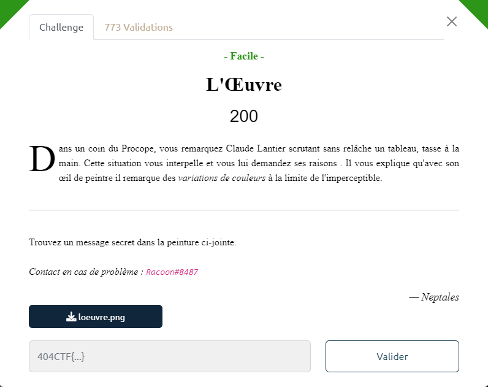
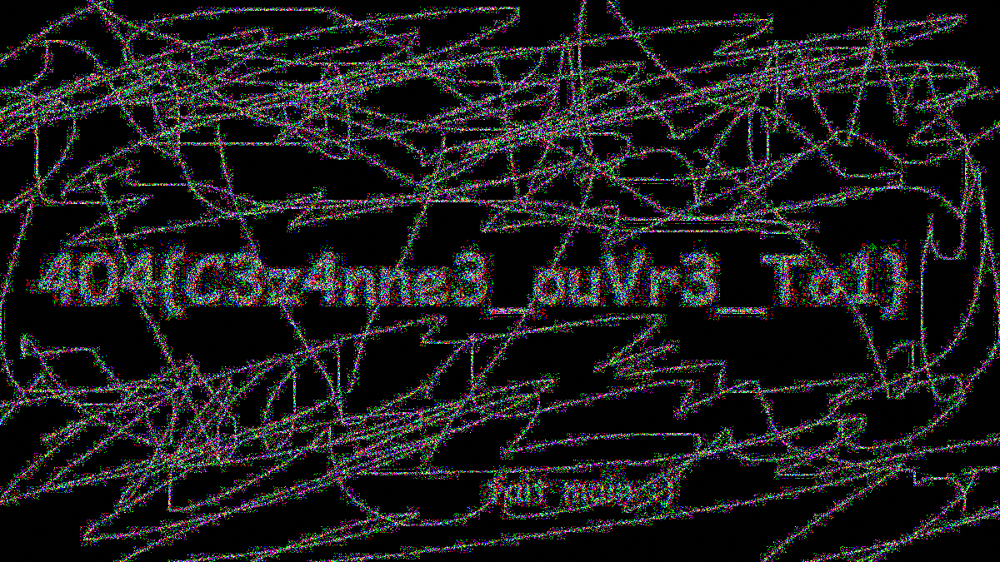

# Write-Up 404-CTF : L'Oeuvre

__Catégorie :__ Stéganographie - Facile

**Enoncé :**



**Fichiers :** loeuvre.png

**Résolution :**

Dans ce challenge de stegano, nous avons une image dans laquelle nous devons trouver une information.


Il s'agit ici d'une image caché dans une autre dans les bits de poids faibles. Mais ici, il ne s'agit pas de mettre bout à bout les bits de poids faibles mais plutôt de trouver l'image d'origine et de la soustraire à l'image donnée pour récupérer l'image cachée.

Pour récupérer l'image d'origine, il suffit de faire une recherche Google par images et de récupérer une qui fait la même résolution.  
Une fois l'image récupérée, il n'y a plus qu'à la soustraire pour obtenir le flag.

```python
from PIL import Image
import numpy as np

img_ctf = Image.open('./loeuvre.png')
img_original = Image.open('./original.png')

ctf_arr = np.array(img_ctf)
orig_arr = np.array(img_original)

diff_array = ctf_arr - orig_arr

flag_img = Image.fromarray(diff_array)
flag_img.save('flag.png')
```



**Flag :** `404CTF{C3z4nn3_ouVr3_To1}`
