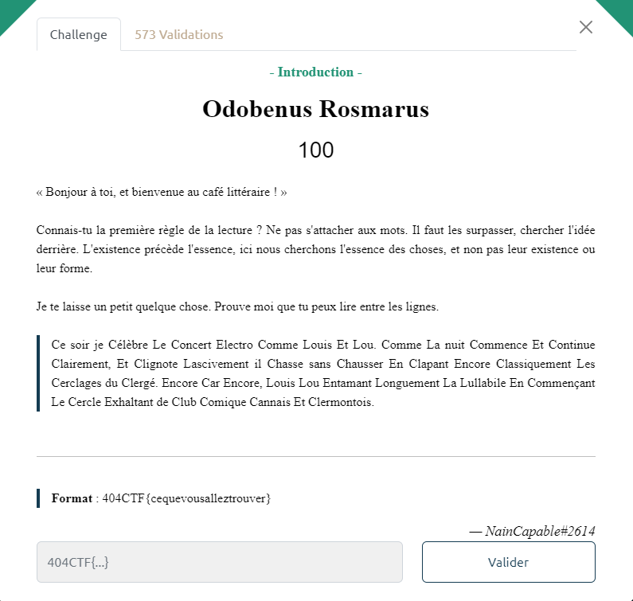

# Write-Up 404-CTF : Odobenus Rosmarus

__Catégorie :__ Stéganographie - Introduction

**Enoncé :**



**Résolution :**

Pour ce challenge d'introduction à la stéganographie, nous devons trouver le message caché dans un texte.

```
Ce soir je Célèbre Le Concert Electro Comme Louis Et Lou. Comme La nuit Commence Et Continue Clairement, Et Clignote Lascivement il Chasse sans Chausser En Clapant Encore Classiquement Les Cerclages du Clergé. Encore Car Encore, Louis Lou Entamant Longuement La Lullabile En Commençant Le Cercle Exhaltant de Club Comique Cannais Et Clermontois.
```

L'inspiration ne m'est venu qu'à partir du moment où je me suis intéressé au nom du challenge, `Odobenus Rosmarus`, qui est en fait le nom scientifique du morse (l'animal).  
Evidemment, cela fait écho au langage morse utilisé pour encoder des messages.  
Ici, nous pouvons faire le lien avec les lettres écrites en majuscules : C pour court, L pour long et E pour espace.

Un script Python nous permet de convertir ce messages en morse.
```python
import re

msg = "Ce soir je Célèbre Le Concert Electro Comme Louis Et Lou. Comme La nuit Commence Et Continue Clairement, Et Clignote Lascivement il Chasse sans Chausser En Clapant Encore Classiquement Les Cerclages du Clergé. Encore Car Encore, Louis Lou Entamant Longuement La Lullabile En Commençant Le Cercle Exhaltant de Club Comique Cannais Et Clermontois."

regex = re.compile(r"[^CEL]")

line = regex.sub('', msg)
print(line.replace('C', '.').replace('L', '-').replace('E', ' '))
```

On obtient alors la chaine suivante : `..-. .- -.-. .. .-.. . .-.. . -- --- .-. ... .` qui une fois décodée nous donne `FACILELEMORSE`.

**Flag :** `404CTF{FACILELEMORSE}`