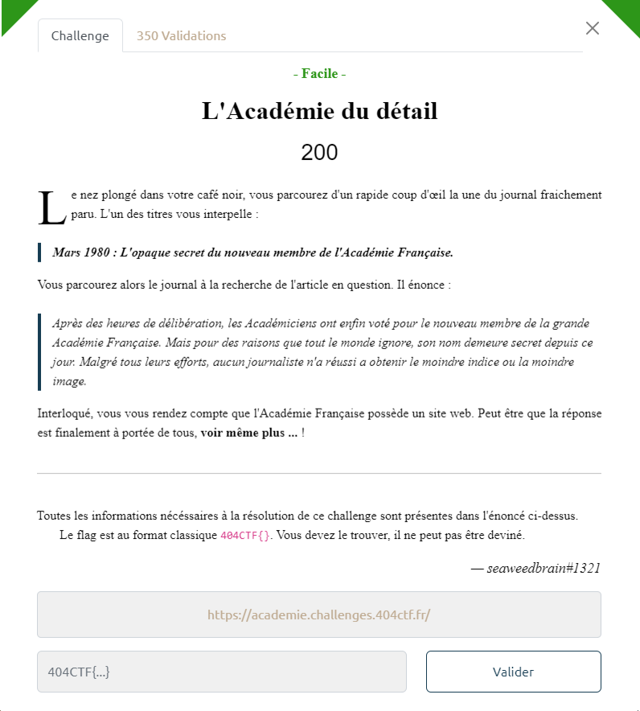
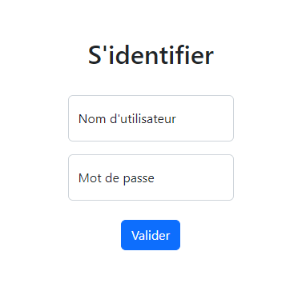
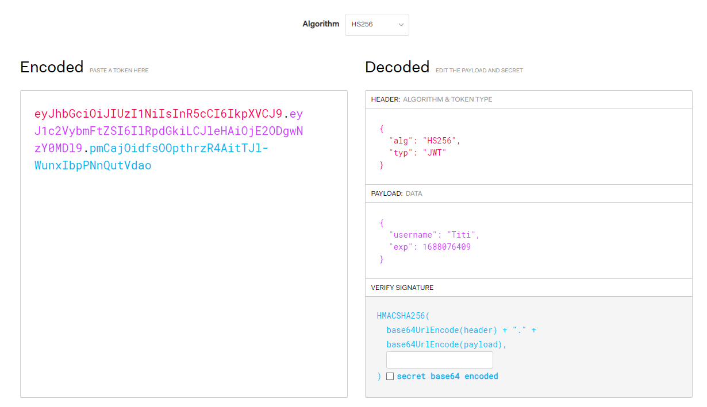
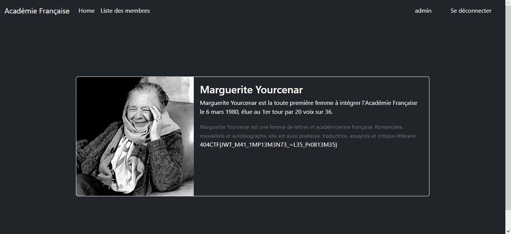

# Write-Up 404-CTF : L'académie du détail

__Catégorie :__ Web - Facile

**Enoncé :**

**Résolution :**

Dans ce challenge, nous arrivons sur la page d'accueil de ce qui semble être le site de l'Académie française.

Ce site ne nous propose pas grand chose, si ce n'est quelques photos, une liste de mots et un endroit pour se connecter.

On peut se connecter sans inscription, donc pas de base de données en perspective ni d'injection, mais on observe que le compte admin est quand même bloqué.

En se connectant avec un compte lambda (par exemple, Titi / 123), on voit qu'un cookie de connexion `access-token` a été mis sur le navigateur. En décodant la base64url du cookie, on voit qu'il s'agit d'un JSON Web Token (JWT). On peut décoder son contenu sur [jwt.io](https://jwt.io).

Dans ce token, on peut voir l'algo de chiffrement ainsi que notre nom d'utilisateur et le secret de chiffrement. Nous pouvons donc forger un token et se faire passer pour l'admin.

Pour ne pas s'embêter avec le secret, on passe l'algorithme de chiffrement à `none` et le nom d'utilisateur à `admin`. On obtient les parties suivantes : `{"alg":"none","typ":"JWT"}` et `{"username":"admin","exp":1688076409}`. En base64url (légèrement différente de la base64 classique), on obtient le JWT suivant : `eyJhbGciOiJub25lIiwidHlwIjoiSldUIn0.eyJ1c2VybmFtZSI6ImFkbWluIiwiZXhwIjoxNjg4MDc2NDA5fQ.`

En remplaçant la valuer de notre cookie `access-token` par ce JWT forgé et en rechargeant la page, on peut accéder à l'onglet liste des membres.

**Flag :** `404CTF{JWT_M41_1MP13M3N73_=L35_Pr0813M35}`
