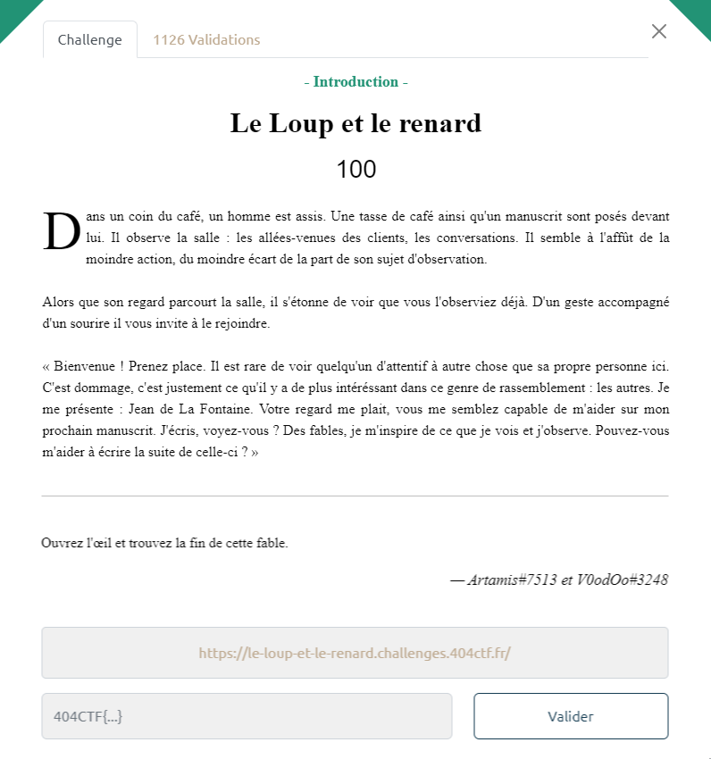
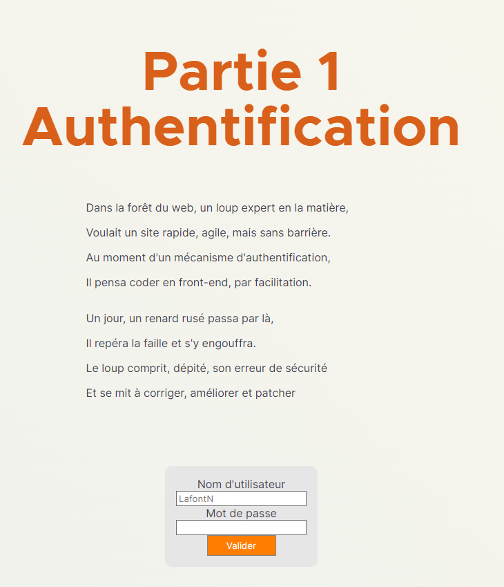
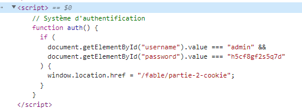
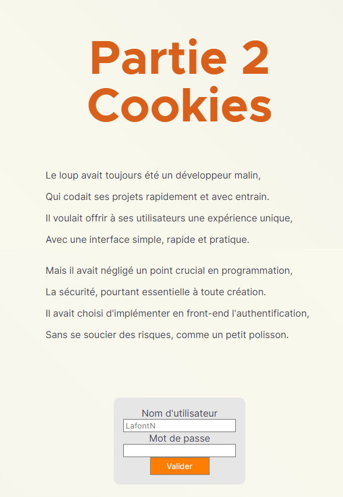
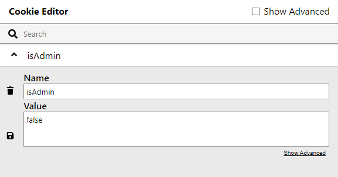
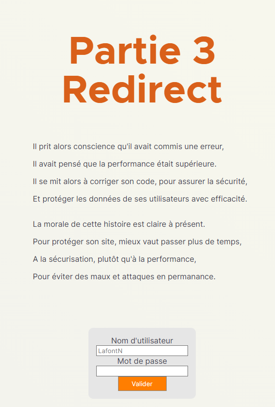
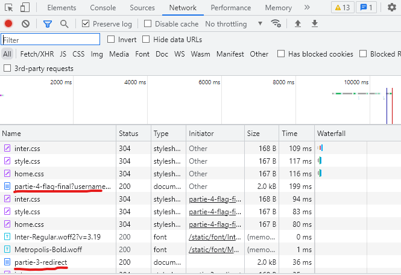
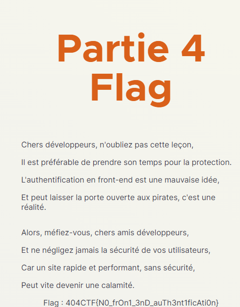

# Write-Up 404-CTF : Le Loup et le renard

__Catégorie :__ Web - Introduction

**Enoncé :**



**Résolution :**

Dans ce challenge, nous avons accès à un joli site web nous proposant une fable inédite de Jean de la Fontaine.


La première partie de ce site nous propose un formulaire d'authentification basique. En allant voir le code source de la page web, on observe une balise \<script\> qui contient le code d'une fonction d'authentification.



En entrant ces identifiants, nous accédons à la deuxième partie du challenge. Cette partie mentionne clairement les cookies.  
En accédant aux cookies du site via la console, on observe un cookie `isAdmin` à `false`. En le passant à `true` et en validant, on arrive à accéder à la partie 3.




La troisième partie du challenge mentionne les redirections. Lorsqu'on essaie de s'authentifier, en regardant dans les communications réseaux de la console, on voit une récupération de la partie 4 mais une redirection vers la page 3.




En utilisant curl, nous pouvons récupérer la page 4 sans exécution du code javascript et donc sans la redirection

```
$ curl https://le-loup-et-le-renard.challenges.404ctf.fr/fable/partie-4-flag-final

<!DOCTYPE html>
<html lang="fr">
....
<script>
  const queryString = window.location.search;
  const urlParams = new URLSearchParams(queryString);
  if (urlParams.has("username") && urlParams.has("password")) {
    const username = urlParams.get("username");
    const password = urlParams.get("password");
    if (!(username === "admin" && password === "Fbqh96BthQ")) {
      document.location = "/fable/partie-3-redirect";
    }
  } else {
    document.location = "/fable/partie-3-redirect";
  }
</script>
</body>
</html>
```

Il y avait bien un script permettant de nous rediriger en cas d'erreur sur les identifiants. Nous pouvons donc rentrer les bons identifiants et accéder à la page 4 contenant le flag.



**Flag :** `404CTF{N0_frOn1_3nD_auTh3nt1ficAti0n}`