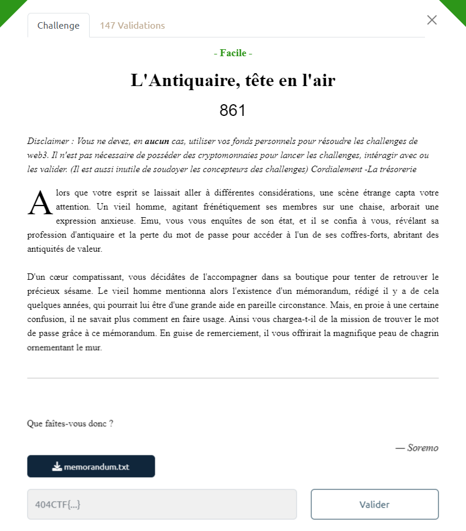
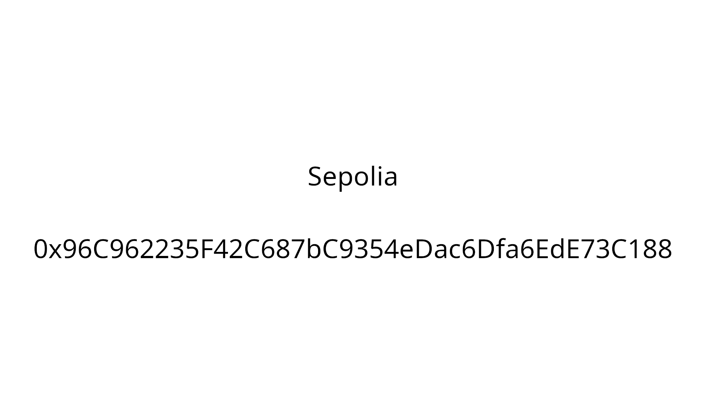

# Write-Up 404-CTF : L'Antiquaire, tête en l'air

__Catégorie :__ Web3 - Facile

**Enoncé :**



**Fichiers :** memorandum.txt

**Résolution :**

Dans ce challenge, nous avons un fichier texte contenant de l'hexadécimal. Il s'agit plus précisément d'un contrat Ethereum compilé.

Mon premier réflexe a été de transformer cet hexadécimal texte en véritable bytecode.

```python
with open("memorandum.txt", "r") as f:
    hex_data = f.readline()

b_data = bytes.fromhex(hex_data)

with open("out", "wb") as f:
    f.write(b_data)
```

Ensuite, en utilisant la commande `strings` sur le binaire obtenu, on observe la présence d'un lien.

```
$ strings out

[...]
/ipfs/bafybeia5g2umnaq5x5bt5drt2jodpsvfiauv5mowjv6mu7q5tmqufmo47i/metadata.json
dipfsX"
N35m
2dsolcC
```

Ce lien est un lien utilisant le protocole pair à pair IPFS (InterPlanetary File System) permettant d'accéder à un contenu précis. En entrant le lien `ipfs://bafybeia5g2umnaq5x5bt5drt2jodpsvfiauv5mowjv6mu7q5tmqufmo47i/metadata.json` dans un navigateur, on accède au fichier `metadata.json` qui contient lui même un lien vers `mystere.png`.



Une recherche Internet sur `Sepolia` nous permet de savoir qu'il s'agit d'un réseau Ethereum. En recherchant l'adresse `0x96C962235F42C687bC9354eDac6Dfa6EdE73C188` sur Etherscan (réseau Sepolia), on retrouve le contrat d'origine.

Dans l'historique des transactions, on peut voir que la première a pour destination `Create: MySecretVault`. En affichant le détail de cette transaction en UTF-8, on observe le flag à la toute fin.

**Flag :** `404CTF{M3M3_P45_13_73MP5_D3_53CH4UFF3r_QU3_C357_D3J4_F1N1!}`