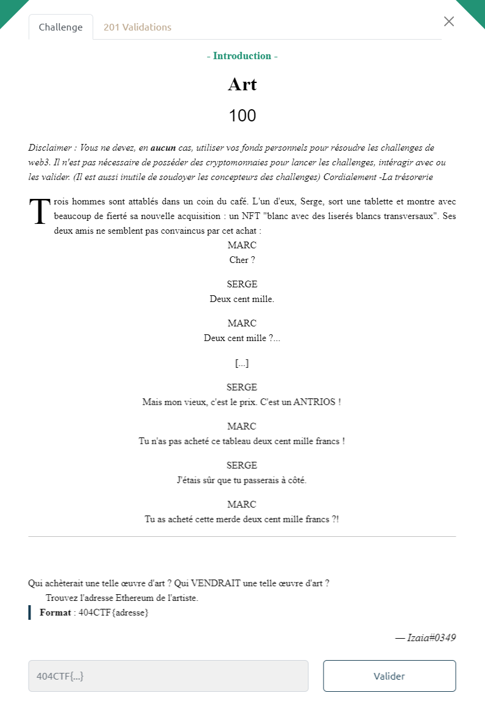
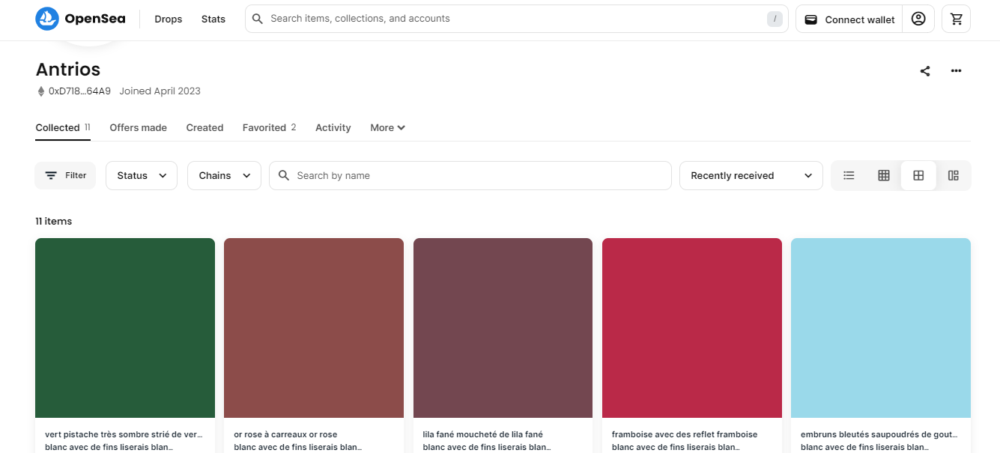

# Write-Up 404-CTF : Art

__Catégorie :__ Web3 - Introduction

**Enoncé :**

**Résolution :**

Dans ce challenge d'introduction au web3, nous devons retrouver l'adresse Ethereum de l'artiste d'un NFT. On sait que cet artiste se nomme Antrios.

En allant sur [OpenSea.io](https://opensea.io/) et en recherchant le nom d'Antrios, on tombe sur le compte d'un artiste, apparemment spécialiste dans la couleur et notamment propriétaire de la collection `"blanc avec de fins liserais blancs transversaux"`

Il nous suffit de récupérer l'adresse pour obtenir le flag.

**Flag :** `404CTF{0xD7186D588Ed2AddF8b260d09B108100f264A64A9}`